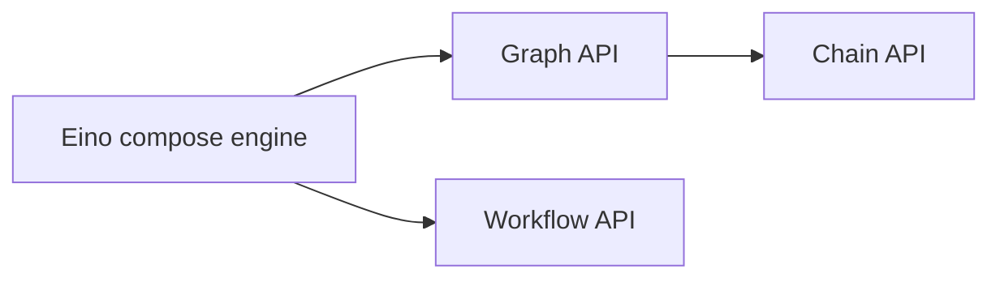

## What Is Eino Workflow?

An orchestration API at the same architectural level as Graph:



Key traits:

- Same capability level as Graph; both orchestrate “LLM-centric information flow”.
  - Node types, streaming, callbacks, options, state, interrupt & checkpoint are consistent.
  - Implements `AnyGraph`; can be added as a child to Graph/Chain/Workflow via `AddGraphNode`.
  - Can host other Graph/Chain/Workflow as children.
- Field-level mapping: node input can be a composition of arbitrary fields from arbitrary predecessors.
  - Natively supports `struct`, `map`, and arbitrarily nested combinations.
- Control flow and data flow can be separated. In Graph, edges carry both; in Workflow, you may split them.
- No cycles (e.g., ChatModel→ToolsNode→ChatModel loops). `NodeTriggerMode` is fixed to `AllPredecessor`.

## Why Workflow?

### Flexible Input/Output Types

For example, you need to orchestrate two lambda nodes containing two "existing business functions f1, f2" with specific struct inputs/outputs suited to business scenarios, each different:

<a href="/img/eino/workflow_existing_biz_func.png" target="_blank"></a>

When orchestrating with Workflow, map f1's output field F1 directly to f2's input field F3, while preserving the original function signatures of f1 and f2. The effect achieved is: **each node's input/output is "determined by the business scenario", without needing to consider "who provides my input and who uses my output"**.

When orchestrating with Graph, due to the "type alignment" requirement, if f1 → f2, then f1's output type and f2's input type need to align. You must choose one of two options:

- Define a new common struct, and change both f1's output type and f2's input type to this common struct. This has costs and may intrude on business logic.
- Change both f1's output type and f2's input type to map. This loses the strong typing alignment characteristic.

### Separate Control and Data Flow

Consider the following scenario:

<a href="/img/eino/workflow_data_control_separate.png" target="_blank"></a>

Node D references certain output fields from A, B, and C simultaneously. The dashed line from A to D is purely "data flow", not carrying "control" information - meaning whether A completes execution does not determine whether D starts execution.

The bold arrow from node D to E represents that node E does not reference any output from node D - it is purely "control flow", not carrying "data". Whether D completes execution determines whether E starts execution, but D's output does not affect E's input.

Other lines in the diagram combine control flow and data flow.

Note that data flow can only be transmitted when a control flow path exists. For example, the A→D data flow depends on the existence of A→branch→B→D or A→branch→C→D control flow. Data flow can only reference outputs from predecessor nodes.

For example, this "cross-node" specific data passing scenario:

<a href="/img/eino/workflow_cross_node_pass_data.png" target="_blank"></a>

In the diagram above, the chat template node's input can be very explicit:

`map[string]any{"prompt": "prompt from START", "context": "retrieved context"}`

In contrast, if using Graph or Chain API, you must choose one of two options:

- Use OutputKey to convert node output types (can't add to START node, so need an extra passthrough node), and the ChatTemplate node's input will include the full output of START and retriever (rather than just the specific fields actually needed).
- Put START node's prompt in state, and ChatTemplate reads from state. This introduces additional state.

## Using Workflow

### Simplest Workflow

START → node → END

<a href="/img/eino/workflow_simple.png" target="_blank"></a>

```go
// creates and invokes a simple workflow with only a Lambda node.
// Since all field mappings are ALL to ALL mappings
// (by using AddInput without field mappings),
// this simple workflow is equivalent to a Graph: START -> lambda -> END.
func main() {
    // create a Workflow, just like creating a Graph
    wf := compose.NewWorkflow[int, string]()

    // add a lambda node to the Workflow, just like adding the lambda to a Graph
    wf.AddLambdaNode("lambda", compose.InvokableLambda(
       func(ctx context.Context, in int) (string, error) {
          return strconv.Itoa(in), nil
       })).
       // add an input to this lambda node from START.
       // this means mapping all output of START to the input of the lambda.
       // the effect of AddInput is to set both a control dependency
       // and a data dependency.
       AddInput(compose.START)

    // obtain the compose.END of the workflow for method chaining
    wf.End().
       // add an input to compose.END,
       // which means 'using ALL output of lambda node as output of END'.
       AddInput("lambda")

    // compile the Workflow, just like compiling a Graph
    run, err := wf.Compile(context.Background())
    if err != nil {
       logs.Errorf("workflow compile error: %v", err)
       return
    }

    // invoke the Workflow, just like invoking a Graph
    result, err := run.Invoke(context.Background(), 1)
    if err != nil {
       logs.Errorf("workflow run err: %v", err)
       return
    }

    logs.Infof("%v", result)
}
```

[Eino example link](https://github.com/cloudwego/eino-examples/blob/main/compose/workflow/1_simple/main.go)

Core APIs:

- `func NewWorkflow[I, O any](opts ...NewGraphOption) *Workflow[I, O]`
  - Creates a new Workflow.
  - Signature is identical to `NewGraph`.
- `func (wf *Workflow[I, O]) AddChatModelNode(key string, chatModel model.BaseChatModel, opts ...GraphAddNodeOpt) *WorkflowNode`
  - Adds a new node to the Workflow.
  - Supported node types are identical to Graph.
  - Unlike Graph's AddXXXNode which returns an error immediately, Workflow defers error handling to the final Compile step.
  - AddXXXNode returns a WorkflowNode, allowing subsequent field mapping operations via method chaining.
- `func (n *WorkflowNode) AddInput(fromNodeKey string, inputs ...*FieldMapping) *WorkflowNode`
  - Adds input field mappings to a WorkflowNode.
  - Returns WorkflowNode for continued method chaining.
- `(wf *Workflow[I, O]) Compile(ctx context.Context, opts ...GraphCompileOption) (Runnable[I, O], error)`
  - Compiles a Workflow.
  - Signature is identical to compiling a Graph.

### Field Mapping

START (struct input) → [parallel lambda c1, c2] → END (map output).

We demonstrate counting occurrences of a substring in two different fields. The workflow input is an Eino `Message` plus a `SubStr`; `c1` counts occurrences in `Content`, `c2` counts occurrences in `ReasoningContent`. The two lambdas run in parallel and map their results to END.

In the diagram below, the workflow's overall input is a message struct, both `c1` and `c2` lambdas have counter struct inputs, both output int, and the workflow's overall output is `map[string]any`:

<a href="/img/eino/workflow_char_counter.png" target="_blank"></a>

```go
// demonstrates the field mapping ability of eino workflow.
func main() {
    type counter struct {
       FullStr string // exported because we will do field mapping for this field
       SubStr  string // exported because we will do field mapping for this field
    }

    // wordCounter is a lambda function that counts occurrences of SubStr within FullStr
    wordCounter := func(ctx context.Context, c counter) (int, error) {
       return strings.Count(c.FullStr, c.SubStr), nil
    }

    type message struct {
       *schema.Message        // exported because we will do field mapping for this field
       SubStr          string // exported because we will do field mapping for this field
    }

    // create a workflow just like a Graph
    wf := compose.NewWorkflow[message, map[string]any]()

    // add lambda c1 just like in Graph
    wf.AddLambdaNode("c1", compose.InvokableLambda(wordCounter)).
       AddInput(compose.START, // add an input from START, specifying 2 field mappings
          // map START's SubStr field to lambda c1's SubStr field
          compose.MapFields("SubStr", "SubStr"),
          // map START's Message's Content field to lambda c1's FullStr field
          compose.MapFieldPaths([]string{"Message", "Content"}, []string{"FullStr"}))

    // add lambda c2 just like in Graph
    wf.AddLambdaNode("c2", compose.InvokableLambda(wordCounter)).
       AddInput(compose.START, // add an input from START, specifying 2 field mappings
          // map START's SubStr field to lambda c2's SubStr field
          compose.MapFields("SubStr", "SubStr"),
          // map START's Message's ReasoningContent field to lambda c2's FullStr field
          compose.MapFieldPaths([]string{"Message", "ReasoningContent"}, []string{"FullStr"}))

    wf.End(). // Obtain the compose.END for method chaining
       // add an input from c1, mapping full output of c1 to the map key 'content_count'
       AddInput("c1", compose.ToField("content_count")).
       // also add an input from c2, mapping full output of c2 to the map key 'reasoning_content_count'
       AddInput("c2", compose.ToField("reasoning_content_count"))

    // compile the workflow just like compiling a Graph
    run, err := wf.Compile(context.Background())
    if err != nil {
       logs.Errorf("workflow compile error: %v", err)
       return
    }

    // invoke the workflow just like invoking a Graph
    result, err := run.Invoke(context.Background(), message{
       Message: &schema.Message{
          Role:             schema.Assistant,
          Content:          "Hello world!",
          ReasoningContent: "I need to say something meaningful",
       },
       SubStr: "o", // would like to count the occurrences of 'o'
    })
    if err != nil {
       logs.Errorf("workflow run err: %v", err)
       return
    }

    logs.Infof("%v", result)
}
```

[Eino example link](https://github.com/cloudwego/eino-examples/blob/main/compose/workflow/2_field_mapping/main.go)

The `AddInput` method accepts 0–n field mappings and can be called multiple times. This means:

- A node can reference any number of fields from a single predecessor’s output.
- A node can reference fields from any number of predecessors.
- A mapping can be whole→field, field→whole, whole→whole, or nested field↔nested field.
- Different mapping types have different APIs:
  - Top-level field → top-level field: `MapFields(string, string)`
  - Whole output → top-level field: `ToField(string)`
  - Top-level field → whole input: `FromField(string)`
  - Nested field → nested field: `MapFieldPaths(FieldPath, FieldPath)`
  - Whole output → nested field: `ToFieldPath(FieldPath)`
  - Nested field → whole input: `FromFieldPath(FieldPath)`
  - Whole output → whole input: `AddInput(fromKey)` with no `FieldMapping`

## Advanced Features

### Data-only Edges (No Control Flow)

Imagine a simple scenario: START → adder node → multiplier node → END. The "multiplier node" multiplies one field from START with the result from the adder node:

<a href="/img/eino/workflow_calculator.png" target="_blank"></a>

In the diagram above, the multiplier node executes after the adder node, meaning the "multiplier node" is controlled by the "adder node". However, the START node does not directly control the "multiplier node"; it only passes data to it. In code, use `AddInputWithOptions(fromNode, fieldMappings, WithNoDirectDependency)` to specify a pure data flow:

```go
func main() {
    type calculator struct {
       Add      []int
       Multiply int
    }

    adder := func(ctx context.Context, in []int) (out int, err error) {
       for _, i := range in {
          out += i
       }
       return out, nil
    }

    type mul struct {
       A int
       B int
    }

    multiplier := func(ctx context.Context, m mul) (int, error) {
       return m.A * m.B, nil
    }

    wf := compose.NewWorkflow[calculator, int]()

    wf.AddLambdaNode("adder", compose.InvokableLambda(adder)).
       AddInput(compose.START, compose.FromField("Add"))

    wf.AddLambdaNode("mul", compose.InvokableLambda(multiplier)).
       AddInput("adder", compose.ToField("A")).
       AddInputWithOptions(compose.START, []*compose.FieldMapping{compose.MapFields("Multiply", "B")},
          // use WithNoDirectDependency to declare a 'data-only' dependency,
          // in this case, START node's execution status will not determine whether 'mul' node can execute.
          // START node only passes one field of its output to 'mul' node.
          compose.WithNoDirectDependency())

    wf.End().AddInput("mul")

    runner, err := wf.Compile(context.Background())
    if err != nil {
       logs.Errorf("workflow compile error: %v", err)
       return
    }

    result, err := runner.Invoke(context.Background(), calculator{
       Add:      []int{2, 5},
       Multiply: 3,
    })
    if err != nil {
       logs.Errorf("workflow run err: %v", err)
       return
    }

    logs.Infof("%d", result)
}
```

[Eino examples link](https://github.com/cloudwego/eino-examples/blob/main/compose/workflow/3_data_only/main.go)

New API introduced in this example:

```go
func (n *WorkflowNode) AddInputWithOptions(fromNodeKey string, inputs []*FieldMapping, opts ...WorkflowAddInputOpt) *WorkflowNode {
    return n.addDependencyRelation(fromNodeKey, inputs, getAddInputOpts(opts))
}
```

And the new Option:

```go
func WithNoDirectDependency() WorkflowAddInputOpt {
    return func(opt *workflowAddInputOpts) {
       opt.noDirectDependency = true
    }
}
```

Combined, these can add pure "data dependency relationships" to nodes.

### Control-only Edges (No Data Flow)

Imagine a "sequential bidding with confidential prices" scenario: START → bidder1 → threshold check → bidder2 → END:

<a href="/img/eino/workflow_auction.png" target="_blank"></a>

In the diagram above, regular lines are "control + data", dashed lines are "data only", and bold lines are "control only". The logic is: input an initial price, bidder1 makes bid1, a branch checks if it's high enough - if so, end directly; otherwise, pass the initial price to bidder2 for bid2, and finally aggregate both bids for output.

After bidder1 bids, an announcement is made: "bidder completed bidding". Note that bidder1→announcer is a bold solid line, "control only", because the amount must be kept confidential when announcing!

The two bold lines from the branch are both "control only" because neither bidder2 nor END depends on data from the branch. In code, use `AddDependency(fromNode)` to specify pure control flow:

```go
func main() {
    bidder1 := func(ctx context.Context, in float64) (float64, error) {
       return in + 1.0, nil
    }

    bidder2 := func(ctx context.Context, in float64) (float64, error) {
       return in + 2.0, nil
    }

    announcer := func(ctx context.Context, in any) (any, error) {
        logs.Infof("bidder1 had lodged his bid!")
        return nil, nil
    }
    
    wf := compose.NewWorkflow[float64, map[string]float64]()
    
    wf.AddLambdaNode("b1", compose.InvokableLambda(bidder1)).
        AddInput(compose.START)
    
    // just add a node to announce bidder1 had lodged his bid!
    // It should be executed strictly after bidder1, so we use `AddDependency("b1")`.
    // Note that `AddDependency()` will only form control relationship,
    // but not data passing relationship.
    wf.AddLambdaNode("announcer", compose.InvokableLambda(announcer)).
        AddDependency("b1")
    
    // add a branch just like adding branch in Graph.
    wf.AddBranch("b1", compose.NewGraphBranch(func(ctx context.Context, in float64) (string, error) {
        if in > 5.0 {
           return compose.END, nil
        }
        return "b2", nil
    }, map[string]bool{compose.END: true, "b2": true}))
    
    wf.AddLambdaNode("b2", compose.InvokableLambda(bidder2)).
        // b2 executes strictly after b1 (through branch dependency),
        // but does not rely on b1's output,
        // which means b2 depends on b1 conditionally,
        // but no data passing between them.
        AddInputWithOptions(compose.START, nil, compose.WithNoDirectDependency())

    wf.End().AddInput("b1", compose.ToField("bidder1")).
       AddInput("b2", compose.ToField("bidder2"))

    runner, err := wf.Compile(context.Background())
    if err != nil {
       logs.Errorf("workflow compile error: %v", err)
       return
    }

    result, err := runner.Invoke(context.Background(), 3.0)
    if err != nil {
       logs.Errorf("workflow run err: %v", err)
       return
    }

    logs.Infof("%v", result)
}
```

[Eino examples link](https://github.com/cloudwego/eino-examples/blob/main/compose/workflow/4_control_only_branch/main.go)

New API introduced in this example:

```go
func (n *WorkflowNode) AddDependency(fromNodeKey string) *WorkflowNode {
    return n.addDependencyRelation(fromNodeKey, nil, &workflowAddInputOpts{dependencyWithoutInput: _true_})
}
```

You can use `AddDependency` to specify pure "control dependency relationships" for nodes.

### Branch

In the example above, we added a branch in almost the same way as with the Graph API:

```go
// add a branch just like adding branch in Graph.
    wf.AddBranch("b1", compose.NewGraphBranch(func(ctx context.Context, in float64) (string, error) {
       if in > 5.0 {
          return compose.END, nil
       }
       return "b2", nil
    }, map[string]bool{compose.END: true, "b2": true}))
```

Branch semantics are the same as Graph's AllPredecessor mode:

- There is exactly one 'fromNode', meaning a branch can only have one predecessor control node.
- Can be single-select (`NewGraphBranch`) or multi-select (`NewGraphMultiBranch`).
- Selected branches can execute. Unselected branches are marked as skip.
- A node can only execute when all incoming edges are complete (success or skip), and at least one edge succeeded. (Like END in the example above)
- If all incoming edges of a node are skip, all outgoing edges of that node are automatically marked as skip.

Additionally, there is one key difference between workflow branch and graph branch:

- Graph branch is always "control and data combined"; the downstream node's input of a branch is always the output of the branch's fromNode.
- Workflow branch is always "control only"; the downstream node's input is specified via `AddInputWithOptions`.

Related API:

```go
func (wf *Workflow[I, O]) AddBranch(fromNodeKey string, branch *GraphBranch) *WorkflowBranch {
    wb := &WorkflowBranch{
       fromNodeKey: fromNodeKey,
       GraphBranch: branch,
    }

    wf.workflowBranches = append(wf.workflowBranches, wb)
    return wb
}
```

Signature is almost identical to `Graph.AddBranch`, allowing you to add a branch to the workflow.

### Static Values

Let's modify the "bidding" example above by giving bidder1 and bidder2 each a static "budget" configuration:

<a href="/img/eino/workflow_auction_static_values_en.png" target="_blank"></a>

budget1 and budget2 will be injected into bidder1 and bidder2's inputs as "static values" respectively. Use the `SetStaticValue` method to configure static values for workflow nodes:

```go
func main() {
    type bidInput struct {
       Price  float64
       Budget float64
    }

    bidder := func(ctx context.Context, in bidInput) (float64, error) {
       if in.Price >= in.Budget {
          return in.Budget, nil
       }

       return in.Price + rand.Float64()*in.Budget, nil
    }

    wf := compose.NewWorkflow[float64, map[string]float64]()

    wf.AddLambdaNode("b1", compose.InvokableLambda(bidder)).
       AddInput(compose.START, compose.ToField("Price")).
       // set 'Budget' field to 3.0 for b1
       SetStaticValue([]string{"Budget"}, 3.0)

    // add a branch just like adding branch in Graph.
    wf.AddBranch("b1", compose.NewGraphBranch(func(ctx context.Context, in float64) (string, error) {
       if in > 5.0 {
          return compose.END, nil
       }
       return "b2", nil
    }, map[string]bool{compose.END: true, "b2": true}))

    wf.AddLambdaNode("b2", compose.InvokableLambda(bidder)).
       // b2 executes strictly after b1, but does not rely on b1's output,
       // which means b2 depends on b1, but no data passing between them.
       AddDependency("b1").
       AddInputWithOptions(compose.START, []*compose.FieldMapping{compose.ToField("Price")}, compose.WithNoDirectDependency()).
       // set 'Budget' field to 4.0 for b2
       SetStaticValue([]string{"Budget"}, 4.0)

    wf.End().AddInput("b1", compose.ToField("bidder1")).
       AddInput("b2", compose.ToField("bidder2"))

    runner, err := wf.Compile(context.Background())
    if err != nil {
       logs.Errorf("workflow compile error: %v", err)
       return
    }

    result, err := runner.Invoke(context.Background(), 3.0)
    if err != nil {
       logs.Errorf("workflow run err: %v", err)
       return
    }

    logs.Infof("%v", result)
}
```

[Eino examples link](https://github.com/cloudwego/eino-examples/blob/main/compose/workflow/5_static_values/main.go)

Related API:

```go
func (n *WorkflowNode) SetStaticValue(path FieldPath, value any) *WorkflowNode {
    n.staticValues[path.join()] = value
    return n
}
```

Use this method to set static values on specified fields of Workflow nodes.

### Streaming Effects

Returning to the previous "character counting" example, if our workflow's input is no longer a single message but a message stream, and our counting function can count each message chunk in the stream separately and return a "count stream":

<a href="/img/eino/workflow_stream.png" target="_blank"></a>

We make some modifications to the previous example:

- Change `InvokableLambda` to `TransformableLambda`, so it can consume streams and produce streams.
- Change the `SubStr` in the input to a static value, injected into c1 and c2.
- Change the Workflow's overall input to `*schema.Message`.
- Call the workflow using Transform, passing a stream containing 2 `*schema.Message`.

The completed code:

```go
// demonstrates the stream field mapping ability of eino workflow.
// It's modified from 2_field_mapping.
func main() {
    type counter struct {
       FullStr string // exported because we will do field mapping for this field
       SubStr  string // exported because we will do field mapping for this field
    }

    // wordCounter is a transformable lambda function that
    // counts occurrences of SubStr within FullStr for each chunk.
    wordCounter := func(ctx context.Context, c *schema.StreamReader[counter]) (
       *schema.StreamReader[int], error) {
       var subStr, cachedStr string
       return schema.StreamReaderWithConvert(c, func(co counter) (int, error) {
          if len(co.SubStr) > 0 {
             // static values will not always come in the first chunk,
             // so before the static value (SubStr) comes in,
             // we need to cache the full string
             subStr = co.SubStr
             fullStr := cachedStr + co.FullStr
             cachedStr = ""
             return strings.Count(fullStr, subStr), nil
          }

          if len(subStr) > 0 {
             return strings.Count(co.FullStr, subStr), nil
          }
          cachedStr += co.FullStr
          return 0, schema.ErrNoValue
       }), nil
    }

    // create a workflow just like a Graph
    wf := compose.NewWorkflow[*schema.Message, map[string]int]()

    // add lambda c1 just like in Graph
    wf.AddLambdaNode("c1", compose.TransformableLambda(wordCounter)).
       AddInput(compose.START, // add an input from START, specifying 2 field mappings
          // map START's Message's Content field to lambda c1's FullStr field
          compose.MapFields("Content", "FullStr")).
       // we can set static values even if the input will be stream
       SetStaticValue([]string{"SubStr"}, "o")

    // add lambda c2 just like in Graph
    wf.AddLambdaNode("c2", compose.TransformableLambda(wordCounter)).
       AddInput(compose.START, // add an input from START, specifying 2 field mappings
          // map START's Message's ReasoningContent field to lambda c1's FullStr field
          compose.MapFields("ReasoningContent", "FullStr")).
       SetStaticValue([]string{"SubStr"}, "o")

    wf.End(). // Obtain the compose.END for method chaining
       // add an input from c1,
       // mapping full output of c1 to the map key 'content_count'
       AddInput("c1", compose.ToField("content_count")).
       // also add an input from c2,
       // mapping full output of c2 to the map key 'reasoning_content_count'
       AddInput("c2", compose.ToField("reasoning_content_count"))

    // compile the workflow just like compiling a Graph
    run, err := wf.Compile(context.Background())
    if err != nil {
       logs.Errorf("workflow compile error: %v", err)
       return
    }

    // call the workflow using Transform just like calling a Graph with Transform
    result, err := run.Transform(context.Background(),
       schema.StreamReaderFromArray([]*schema.Message{
          {
             Role:             schema.Assistant,
             ReasoningContent: "I need to say something meaningful",
          },
          {
             Role:    schema.Assistant,
             Content: "Hello world!",
          },
       }))
    if err != nil {
       logs.Errorf("workflow run err: %v", err)
       return
    }

    var contentCount, reasoningCount int
    for {
       chunk, err := result.Recv()
       if err != nil {
          if err == io.EOF {
             result.Close()
             break
          }

          logs.Errorf("workflow receive err: %v", err)
          return
       }

       logs.Infof("%v", chunk)

       contentCount += chunk["content_count"]
       reasoningCount += chunk["reasoning_content_count"]
    }

    logs.Infof("content count: %d", contentCount)
    logs.Infof("reasoning count: %d", reasoningCount)
}
```

[Eino examples link](https://github.com/cloudwego/eino-examples/blob/main/compose/workflow/6_stream_field_map/main.go)

Based on the example above, we summarize some characteristics of workflow streaming:

- Still 100% Eino stream: four paradigms (invoke, stream, collect, transform), automatically converted, copied, concatenated, and merged by the Eino framework.
- Field mapping configuration doesn't require special handling for streams: regardless of whether the actual input/output is a stream, the `AddInput` syntax is the same. The Eino framework handles stream-based mapping.
- Static values don't require special handling for streams: even if the actual input is a stream, you can use `SetStaticValue` the same way. The Eino framework will place static values in the input stream, but not necessarily in the first chunk read.

### Field Mapping Scenarios

#### Type Alignment

Workflow follows the same type alignment rules as Graph, except the alignment granularity changes from complete input/output alignment to alignment between mapped field pairs. Specifically:

- Identical types: passes compile-time validation and will definitely align.
- Different types but upstream can be assigned to downstream (e.g., upstream is a concrete type, downstream is `any`): passes compile-time validation and will definitely align.
- Upstream cannot be assigned to downstream (e.g., upstream is `int`, downstream is `string`): compile error.
- Upstream may be assignable to downstream (e.g., upstream is `any`, downstream is `int`): cannot be determined at compile time, deferred to runtime. At runtime, the actual upstream type is extracted and checked. If upstream cannot be assigned to downstream, an error is thrown.

#### Merge Scenarios

Merge refers to situations where a node's input is mapped from multiple `FieldMapping`s:

- Mapping to multiple different fields: supported
- Mapping to the same single field: not supported
- Mapping to the whole input while also having mappings to specific fields: conflict, not supported

#### Nested `map[string]any`

For example, this mapping: `ToFieldPath([]string{"a","b"})`, where the target node's input type is `map[string]any`, the mapping order is:

1. First level "a": result is `map[string]any{"a": nil}`
2. Second level "b": result is `map[string]any{"a": map[string]any{"b": x}}`

As you can see, at the second level, the Eino framework automatically replaces `any` with the actual `map[string]any`.

#### CustomExtractor

In some scenarios, standard field mapping semantics cannot support the requirement. For example, if upstream is `[]int` and you want to extract the first element to map to downstream, use `WithCustomExtractor`:

```go
t.Run("custom extract from array element", func(t *testing.T) {
    wf := NewWorkflow[[]int, map[string]int]()
    wf.End().AddInput(_START_, ToField("a", WithCustomExtractor(func(input any) (any, error) {
       return input.([]int)[0], nil
    })))
    r, err := wf.Compile(context.Background())
    assert.NoError(t, err)
    result, err := r.Invoke(context.Background(), []int{1, 2})
    assert.NoError(t, err)
    assert.Equal(t, map[string]int{"a": 1}, result)
})
```

When using `WithCustomExtractor`, all compile-time type alignment checks cannot be performed and can only be deferred to runtime validation.

### Constraints

- Map key restrictions: only `string`, or string alias (types that can be converted to `string`).
- Unsupported CompileOptions:
  - `WithNodeTriggerMode`, because it's fixed to `AllPredecessor`.
  - `WithMaxRunSteps`, because there are no cycles.
- If the mapping source is a Map Key, the Map must contain this key. However, if the mapping source is a Stream, Eino cannot determine whether this key appears at least once across all frames in the stream, so validation cannot be performed for Streams.
- If the mapping source field or target field belongs to a struct, these fields must be exported, because reflection is used internally.
- Nil mapping source: generally supported, only errors when the mapping target cannot be nil, such as basic types (int, etc.).

## Real-world Usage

### Coze-Studio Workflow

[Coze-Studio](https://github.com/coze-dev/coze-studio) open source version's workflow engine is built on the Eino Workflow orchestration framework. See: [11. Adding New Workflow Node Types (Backend)](https://github.com/coze-dev/coze-studio/wiki/11.-%E6%96%B0%E5%A2%9E%E5%B7%A5%E4%BD%9C%E6%B5%81%E8%8A%82%E7%82%B9%E7%B1%BB%E5%9E%8B%EF%BC%88%E5%90%8E%E7%AB%AF%EF%BC%89)
