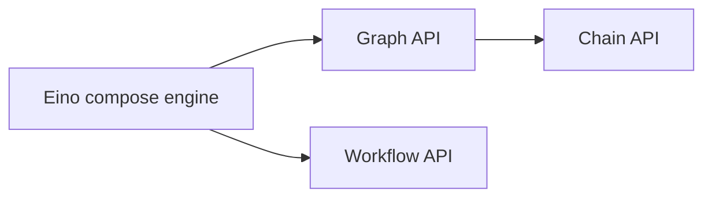

## What Is Eino Workflow?

An orchestration API at the same architectural level as Graph:



Key traits:

- Same capability level as Graph; both orchestrate “LLM-centric information flow”.
  - Node types, streaming, callbacks, options, state, interrupt & checkpoint are consistent.
  - Implements `AnyGraph`; can be added as a child to Graph/Chain/Workflow via `AddGraphNode`.
  - Can host other Graph/Chain/Workflow as children.
- Field-level mapping: node input can be a composition of arbitrary fields from arbitrary predecessors.
  - Natively supports `struct`, `map`, and arbitrarily nested combinations.
- Control flow and data flow can be separated. In Graph, edges carry both; in Workflow, you may split them.
- No cycles (e.g., ChatModel→ToolsNode→ChatModel loops). `NodeTriggerMode` is fixed to `AllPredecessor`.

## Why Workflow?

### Flexible Input/Output Types

Easily orchestrate existing business functions with unique `struct` inputs/outputs and map fields directly between them, preserving original signatures without forcing common types or `map[string]any` everywhere.

<a href="/img/eino/workflow_existing_biz_func.png" target="_blank"></a>

### Separate Control and Data Flow

<a href="/img/eino/workflow_data_control_separate.png" target="_blank"></a>

- Dashed lines denote data-only edges; no execution dependency (A’s completion doesn’t gate D’s start).
- Bold arrows denote control-only edges; no data transfer (D’s completion gates E’s start but E doesn’t read D’s outputs).
- Other edges combine control and data.

Data transfers require the existence of a control path; a node can only read from predecessors.

Example: cross-node data passing in Workflow vs Graph/Chain. In Workflow, a ChatTemplate can take exactly `{"prompt": ..., "context": ...}` from START and a Retriever; in Graph/Chain this either requires heavy map wrapping or state usage.

<a href="/img/eino/workflow_cross_node_pass_data.png" target="_blank"></a>

## Using Workflow

### Simplest Workflow

START → node → END

<a href="/img/eino/workflow_simple.png" target="_blank"></a>

```go
// creates and invokes a simple workflow with only a Lambda node.
// Since all field mappings are ALL to ALL mappings
// (by using AddInput without field mappings),
// this simple workflow is equivalent to a Graph: START -> lambda -> END.
func main() {
    wf := compose.NewWorkflow[int, string]()
    wf.AddLambdaNode("lambda", compose.InvokableLambda(func(ctx context.Context, in int) (string, error) {
        return strconv.Itoa(in), nil
    })).AddInput(compose.START)
    wf.End().AddInput("lambda")
    run, err := wf.Compile(context.Background())
    if err != nil { logs.Errorf("workflow compile error: %v", err); return }
    result, err := run.Invoke(context.Background(), 1)
    if err != nil { logs.Errorf("workflow run err: %v", err); return }
    logs.Infof("%v", result)
}
```

Core APIs:

- `NewWorkflow[I, O](...)` — same as `NewGraph`
- `AddXXXNode(key, comp, ...) *WorkflowNode` — same node types as Graph; returns `WorkflowNode` for chaining
- `(*WorkflowNode).AddInput(fromKey string, inputs ...*FieldMapping) *WorkflowNode` — add field mappings
- `Compile(ctx, ...) (Runnable[I, O], error)` — same signature as Graph

### Field Mapping

START (struct input) → [parallel lambda c1, c2] → END (map output).

We demonstrate counting occurrences of a substring in two different fields. The workflow input is an Eino `Message` plus a `SubStr`; `c1` counts occurrences in `Content`, `c2` counts occurrences in `ReasoningContent`. The two lambdas run in parallel and map their results to END:

<a href="/img/eino/workflow_char_counter.png" target="_blank"></a>

```go
// demonstrates the field mapping ability of eino workflow.
func main() {
    type counter struct {
       FullStr string // exported because we will do field mapping for this field
       SubStr  string // exported because we will do field mapping for this field
    }

    // wordCounter is a lambda function that counts occurrences of SubStr within FullStr
    wordCounter := func(ctx context.Context, c counter) (int, error) {
       return strings.Count(c.FullStr, c.SubStr), nil
    }

    type message struct {
       *schema.Message        // exported because we will do field mapping for this field
       SubStr          string // exported because we will do field mapping for this field
    }

    // create a workflow just like a Graph
    wf := compose.NewWorkflow[message, map[string]any]()

    // add lambda c1 just like in Graph
    wf.AddLambdaNode("c1", compose.InvokableLambda(wordCounter)).
       AddInput(compose.START, // add an input from START, specifying 2 field mappings
          // map START's SubStr field to lambda c1's SubStr field
          compose.MapFields("SubStr", "SubStr"),
          // map START's Message's Content field to lambda c1's FullStr field
          compose.MapFieldPaths([]string{"Message", "Content"}, []string{"FullStr"}))

    // add lambda c2 just like in Graph
    wf.AddLambdaNode("c2", compose.InvokableLambda(wordCounter)).
       AddInput(compose.START, // add an input from START, specifying 2 field mappings
          // map START's SubStr field to lambda c2's SubStr field
          compose.MapFields("SubStr", "SubStr"),
          // map START's Message's ReasoningContent field to lambda c2's FullStr field
          compose.MapFieldPaths([]string{"Message", "ReasoningContent"}, []string{"FullStr"}))

    wf.End(). // Obtain the compose.END for method chaining
       // add an input from c1, mapping full output of c1 to the map key 'content_count'
       AddInput("c1", compose.ToField("content_count")).
       // also add an input from c2, mapping full output of c2 to the map key 'reasoning_content_count'
       AddInput("c2", compose.ToField("reasoning_content_count"))

    // compile the workflow just like compiling a Graph
    run, err := wf.Compile(context.Background())
    if err != nil {
       logs.Errorf("workflow compile error: %v", err)
       return
    }

    // invoke the workflow just like invoking a Graph
    result, err := run.Invoke(context.Background(), message{
       Message: &schema.Message{
          Role:             schema.Assistant,
          Content:          "Hello world!",
          ReasoningContent: "I need to say something meaningful",
       },
       SubStr: "o", // would like to count the occurrences of 'o'
    })
    if err != nil {
       logs.Errorf("workflow run err: %v", err)
       return
    }

    logs.Infof("%v", result)
}
```

Eino example link: https://github.com/cloudwego/eino-examples/blob/main/compose/workflow/2_field_mapping/main.go

The `AddInput` method accepts 0–n field mappings and can be called multiple times. This means:

- A node can reference any number of fields from a single predecessor’s output.
- A node can reference fields from any number of predecessors.
- A mapping can be whole→field, field→whole, whole→whole, or nested field↔nested field.
- Different mapping types have different APIs:
  - Top-level field → top-level field: `MapFields(string, string)`
  - Whole output → top-level field: `ToField(string)`
  - Top-level field → whole input: `FromField(string)`
  - Nested field → nested field: `MapFieldPaths(FieldPath, FieldPath)`
  - Whole output → nested field: `ToFieldPath(FieldPath)`
  - Nested field → whole input: `FromFieldPath(FieldPath)`
  - Whole output → whole input: `AddInput(fromKey)` with no `FieldMapping`

## Advanced Features

### Data-only Edges

Imagine: START → adder → multiplier → END. The multiplier consumes one field from START and the adder’s result:

<a href="/img/eino/workflow_calculator.png" target="_blank"></a>

Use `AddInputWithOptions(fromNode, fieldMappings, WithNoDirectDependency)` to declare pure data dependencies:

```go
func main() {
    type calculator struct {
       Add      []int
       Multiply int
    }

    adder := func(ctx context.Context, in []int) (out int, err error) {
       for _, i := range in {
          out += i
       }
       return out, nil
    }

    type mul struct {
       A int
       B int
    }

    multiplier := func(ctx context.Context, m mul) (int, error) {
       return m.A * m.B, nil
    }

    wf := compose.NewWorkflow[calculator, int]()

    wf.AddLambdaNode("adder", compose.InvokableLambda(adder)).
       AddInput(compose.START, compose.FromField("Add"))

    wf.AddLambdaNode("mul", compose.InvokableLambda(multiplier)).
       AddInput("adder", compose.ToField("A")).
       AddInputWithOptions(compose.START, []*compose.FieldMapping{compose.MapFields("Multiply", "B")},
          // use WithNoDirectDependency to declare a 'data-only' dependency,
          // in this case, START node's execution status will not determine whether 'mul' node can execute.
          // START node only passes one field of its output to 'mul' node.
          compose.WithNoDirectDependency())

    wf.End().AddInput("mul")

    runner, err := wf.Compile(context.Background())
    if err != nil {
       logs.Errorf("workflow compile error: %v", err)
       return
    }

    result, err := runner.Invoke(context.Background(), calculator{
       Add:      []int{2, 5},
       Multiply: 3,
    })
    if err != nil {
       logs.Errorf("workflow run err: %v", err)
       return
    }

    logs.Infof("%d", result)
}
```

Eino examples link: https://github.com/cloudwego/eino-examples/blob/main/compose/workflow/3_data_only/main.go

New API:

```go
func (n *WorkflowNode) AddInputWithOptions(fromNodeKey string, inputs []*FieldMapping, opts ...WorkflowAddInputOpt) *WorkflowNode {
    return n.addDependencyRelation(fromNodeKey, inputs, getAddInputOpts(opts))
}
```

### Control-only Edges

Consider a “sequential bidding, prices kept confidential” scenario: START → bidder1 → branch → bidder2 → END.

<a href="/img/eino/workflow_auction.png" target="_blank"></a>

Bold lines are control-only edges. After bidder1 bids, we announce completion without passing the bid amount. Use `AddDependency(fromNode)` to declare control without data:

```go
func main() {
    bidder1 := func(ctx context.Context, in float64) (float64, error) {
       return in + 1.0, nil
    }

    bidder2 := func(ctx context.Context, in float64) (float64, error) {
       return in + 2.0, nil
    }

    announcer := func(ctx context.Context, in any) (any, error) {
        logs.Infof("bidder1 had lodged his bid!")
        return nil, nil
    }
    
    wf := compose.NewWorkflow[float64, map[string]float64]()
    
    wf.AddLambdaNode("b1", compose.InvokableLambda(bidder1)).
        AddInput(compose.START)
    
    // just add a node to announce bidder1 had lodged his bid!
    // It should be executed strictly after bidder1, so we use `AddDependency("b1")`.
    // Note that `AddDependency()` will only form control relationship,
    // but not data passing relationship.
    wf.AddLambdaNode("announcer", compose.InvokableLambda(announcer)).
        AddDependency("b1")
    
    // add a branch just like adding branch in Graph.
    wf.AddBranch("b1", compose.NewGraphBranch(func(ctx context.Context, in float64) (string, error) {
        if in > 5.0 {
           return compose.END, nil
        }
        return "b2", nil
    }, map[string]bool{compose.END: true, "b2": true}))
    
    wf.AddLambdaNode("b2", compose.InvokableLambda(bidder2)).
        // b2 executes strictly after b1 (through branch dependency),
        // but does not rely on b1's output,
        // which means b2 depends on b1 conditionally,
        // but no data passing between them.
        AddInputWithOptions(compose.START, nil, compose.WithNoDirectDependency())

    wf.End().AddInput("b1", compose.ToField("bidder1")).
       AddInput("b2", compose.ToField("bidder2"))

    runner, err := wf.Compile(context.Background())
    if err != nil {
       logs.Errorf("workflow compile error: %v", err)
       return
    }

    result, err := runner.Invoke(context.Background(), 3.0)
    if err != nil {
       logs.Errorf("workflow run err: %v", err)
       return
    }

    logs.Infof("%v", result)
}
```

Eino examples link: https://github.com/cloudwego/eino-examples/blob/main/compose/workflow/4_control_only_branch/main.go

New API:

```go
func (n *WorkflowNode) AddDependency(fromNodeKey string) *WorkflowNode {
    return n.addDependencyRelation(fromNodeKey, nil, &workflowAddInputOpts{dependencyWithoutInput: true})
}
```

### Branch

Add branches similarly to Graph, with Workflow branches carrying control only; data for branch targets is mapped via `AddInput*`:

```go
wf.AddBranch("b1", compose.NewGraphBranch(func(ctx context.Context, in float64) (string, error) {
   if in > 5.0 { return compose.END, nil }
   return "b2", nil
}, map[string]bool{compose.END: true, "b2": true}))
```

Branch semantics in Workflow (AllPredecessor mode) mirror Graph:

- Exactly one `fromNode` per branch
- Single-select (`NewGraphBranch`) or multi-select (`NewGraphMultiBranch`)
- Selected targets execute; unselected targets are marked skipped
- A node executes only when all incoming edges finish (success or skip) and at least one succeeded
- If all incoming edges are skip, all outgoing edges are auto-marked skip

Workflow branches differ from Graph: Workflow branches are control-only; branch targets must declare their input mappings via `AddInput*`.

API:

```go
func (wf *Workflow[I, O]) AddBranch(fromNodeKey string, branch *GraphBranch) *WorkflowBranch {
    wb := &WorkflowBranch{
       fromNodeKey: fromNodeKey,
       GraphBranch: branch,
    }

    wf.workflowBranches = append(wf.workflowBranches, wb)
    return wb
}
```

### Static Values

Inject constants into node inputs via `SetStaticValue(fieldPath, value)`.

<a href="/img/eino/workflow_auction_static_values_en.png" target="_blank"></a>

```go
func main() {
    type bidInput struct {
       Price  float64
       Budget float64
    }

    bidder := func(ctx context.Context, in bidInput) (float64, error) {
       if in.Price >= in.Budget {
          return in.Budget, nil
       }

       return in.Price + rand.Float64()*in.Budget, nil
    }

    wf := compose.NewWorkflow[float64, map[string]float64]()

    wf.AddLambdaNode("b1", compose.InvokableLambda(bidder)).
       AddInput(compose.START, compose.ToField("Price")).
       // set 'Budget' field to 3.0 for b1
       SetStaticValue([]string{"Budget"}, 3.0)

    // add a branch just like adding branch in Graph.
    wf.AddBranch("b1", compose.NewGraphBranch(func(ctx context.Context, in float64) (string, error) {
       if in > 5.0 {
          return compose.END, nil
       }
       return "b2", nil
    }, map[string]bool{compose.END: true, "b2": true}))

    wf.AddLambdaNode("b2", compose.InvokableLambda(bidder)).
       // b2 executes strictly after b1, but does not rely on b1's output,
       // which means b2 depends on b1, but no data passing between them.
       AddDependency("b1").
       AddInputWithOptions(compose.START, []*compose.FieldMapping{compose.ToField("Price")}, compose.WithNoDirectDependency()).
       // set 'Budget' field to 4.0 for b2
       SetStaticValue([]string{"Budget"}, 4.0)

    wf.End().AddInput("b1", compose.ToField("bidder1")).
       AddInput("b2", compose.ToField("bidder2"))

    runner, err := wf.Compile(context.Background())
    if err != nil {
       logs.Errorf("workflow compile error: %v", err)
       return
    }

    result, err := runner.Invoke(context.Background(), 3.0)
    if err != nil {
       logs.Errorf("workflow run err: %v", err)
       return
    }

    logs.Infof("%v", result)
}
```

Eino examples link: https://github.com/cloudwego/eino-examples/blob/main/compose/workflow/5_static_values/main.go

API:

```go
func (n *WorkflowNode) SetStaticValue(path FieldPath, value any) *WorkflowNode {
    n.staticValues[path.join()] = value
    return n
}
```

### Streaming Effects

Return to the “character counting” example, but now the workflow input is a stream of messages and the counting function returns a stream of counts:

<a href="/img/eino/workflow_stream.png" target="_blank"></a>

Changes:

- Use `TransformableLambda` to consume and produce streams
- Make `SubStr` a static value injected into both `c1` and `c2`
- Workflow input type becomes `*schema.Message`
- Call the workflow via `Transform` with a stream of two messages

```go
// demonstrates the stream field mapping ability of eino workflow.
// It's modified from 2_field_mapping.
func main() {
    type counter struct {
       FullStr string // exported because we will do field mapping for this field
       SubStr  string // exported because we will do field mapping for this field
    }

    // wordCounter is a transformable lambda function that
    // counts occurrences of SubStr within FullStr for each chunk.
    wordCounter := func(ctx context.Context, c *schema.StreamReader[counter]) (
       *schema.StreamReader[int], error) {
       var subStr, cachedStr string
       return schema.StreamReaderWithConvert(c, func(co counter) (int, error) {
          if len(co.SubStr) > 0 {
             // static values will not always come in the first chunk,
             // so before the static value (SubStr) comes in,
             // we need to cache the full string
             subStr = co.SubStr
             fullStr := cachedStr + co.FullStr
             cachedStr = ""
             return strings.Count(fullStr, subStr), nil
          }

          if len(subStr) > 0 {
             return strings.Count(co.FullStr, subStr), nil
          }
          cachedStr += co.FullStr
          return 0, schema.ErrNoValue
       }), nil
    }

    // create a workflow just like a Graph
    wf := compose.NewWorkflow[*schema.Message, map[string]int]()

    // add lambda c1 just like in Graph
    wf.AddLambdaNode("c1", compose.TransformableLambda(wordCounter)).
       AddInput(compose.START, // add an input from START, specifying 2 field mappings
          // map START's Message's Content field to lambda c1's FullStr field
          compose.MapFields("Content", "FullStr")).
       // we can set static values even if the input will be stream
       SetStaticValue([]string{"SubStr"}, "o")

    // add lambda c2 just like in Graph
    wf.AddLambdaNode("c2", compose.TransformableLambda(wordCounter)).
       AddInput(compose.START, // add an input from START, specifying 2 field mappings
          // map START's Message's ReasoningContent field to lambda c1's FullStr field
          compose.MapFields("ReasoningContent", "FullStr")).
       SetStaticValue([]string{"SubStr"}, "o")

    wf.End(). // Obtain the compose.END for method chaining
       // add an input from c1,
       // mapping full output of c1 to the map key 'content_count'
       AddInput("c1", compose.ToField("content_count")).
       // also add an input from c2,
       // mapping full output of c2 to the map key 'reasoning_content_count'
       AddInput("c2", compose.ToField("reasoning_content_count"))

    // compile the workflow just like compiling a Graph
    run, err := wf.Compile(context.Background())
    if err != nil {
       logs.Errorf("workflow compile error: %v", err)
       return
    }

    // call the workflow using Transform just like calling a Graph with Transform
    result, err := run.Transform(context.Background(),
       schema.StreamReaderFromArray([]*schema.Message{
          {
             Role:             schema.Assistant,
             ReasoningContent: "I need to say something meaningful",
          },
          {
             Role:    schema.Assistant,
             Content: "Hello world!",
          },
       }))
    if err != nil {
       logs.Errorf("workflow run err: %v", err)
       return
    }

    var contentCount, reasoningCount int
    for {
       chunk, err := result.Recv()
       if err != nil {
          if err == io.EOF {
             result.Close()
             break
          }

          logs.Errorf("workflow receive err: %v", err)
          return
       }

        logs.Infof("%v", chunk)

        contentCount += chunk["content_count"]
        reasoningCount += chunk["reasoning_content_count"]
    }

    logs.Infof("content count: %d", contentCount)
    logs.Infof("reasoning count: %d", reasoningCount)
}
```

Eino examples link: https://github.com/cloudwego/eino-examples/blob/main/compose/workflow/6_stream_field_map/main.go

Characteristics of streaming in Workflow:

- Still 100% Eino stream: invoke/stream/collect/transform auto converted, copied, concatenated and merged by the framework
- Field mappings need no special stream handling; Eino performs mapping over streams transparently
- Static values need no special stream handling; they are injected into the input stream and may arrive after the first chunk

### Field Mapping Scenarios

#### Type Alignment

- Identical types: passes compile and aligns at runtime
- Different types but upstream assignable to downstream (e.g., upstream concrete type, downstream `any`): passes compile and aligns at runtime
- Upstream not assignable to downstream (e.g., upstream `int`, downstream `string`): compile error
- Upstream may be assignable only at runtime (e.g., upstream `any`, downstream `int`): compile defers; runtime checks actual upstream type and errors if not assignable

#### Merge Scenarios

Merging applies when a node’s input is mapped from multiple `FieldMapping`s:

- Map to multiple different fields: supported
- Map to the same single field: not supported
- Map whole input along with field mappings: conflict, not supported

#### Nested `map[string]any`

For mappings like `ToFieldPath([]string{"a","b"})` where the target input type is `map[string]any`, the framework ensures nested maps are created:

1. Level "a": `map[string]any{"a": nil}`
2. Level "b": `map[string]any{"a": map[string]any{"b": x}}`

At the second level, Eino replaces `any` with the actual `map[string]any` as needed.

#### CustomExtractor

When standard field mapping semantics cannot express the intent (e.g., source is `[]int` and you need the first element), use `WithCustomExtractor`:

```go
t.Run("custom extract from array element", func(t *testing.T) {
    wf := compose.NewWorkflow[[]int, map[string]int]()
    wf.End().AddInput(compose.START, compose.ToField("a", compose.WithCustomExtractor(func(input any) (any, error) {
       return input.([]int)[0], nil
    })))
    r, err := wf.Compile(context.Background())
    assert.NoError(t, err)
    result, err := r.Invoke(context.Background(), []int{1, 2})
    assert.NoError(t, err)
    assert.Equal(t, map[string]int{"a": 1}, result)
})
```

With `WithCustomExtractor`, compile-time type alignment checks cannot be performed and are deferred to runtime.

### Constraints

- Map key restrictions: only `string`, or string aliases convertible to `string`
- Unsupported compile options:
  - `WithNodeTriggerMode` (fixed `AllPredecessor`)
  - `WithMaxRunSteps` (no cycles)
- If the mapping source is a map key, the key must exist. For streams, existence across chunks cannot be verified ahead of time.
- For struct fields as mapping sources or targets, fields must be exported (reflection is used internally).
- Nil sources are generally supported; errors when the target cannot be nil (e.g., basic types).

## Real-world Usage

Coze‑Studio’s open source workflow engine is built on Eino Workflow. See: https://github.com/coze-dev/coze-studio/wiki/11.-%E6%96%B0%E5%A2%9E%E5%B7%A5%E4%BD%9C%E6%B5%81%E8%8A%82%E7%82%B9%E7%B1%BB%E5%9E%8B%EF%BC%88%E5%90%8E%E7%AB%AF%EF%BC%89
