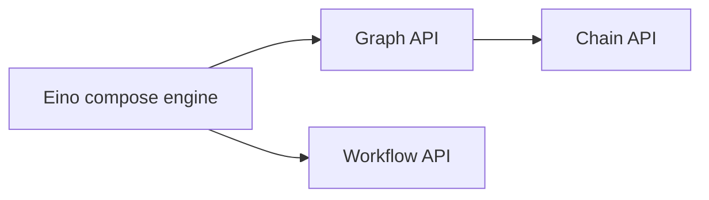

## What is Eino Workflow

It's a set of orchestration APIs at the same architectural level as Graph API:


```mermaid
flowchart LR
  E[Eino compose engine]
  G[Graph API]
  W[Workflow API]
  C[Chain API]
  E --> G
  E --> W
  G --> C
```

Essential characteristics:

- Has the same level of capability as Graph API, both are suitable framework tools for orchestrating "information flow around large models".
  - Maintains consistency in node types, stream processing, callback, option, state, interrupt & checkpoint, etc.
  - Implements AnyGraph interface, can be added as a sub-graph to parent Graph/Chain/Workflow through AddGraphNode.
  - Can also add other Graph/Chain/Workflow as its own sub-graphs.
- Field-level mapping capability: A node's input can be composed of any output fields from any predecessor nodes.
  - Natively supports struct, map, and mutual mapping between structs and maps of any nesting level.
- Separation of control flow and data flow: Graph's Edge determines both execution order and data transfer. In Workflow, they can be transferred together or separately.
- Does not support cycles (i.e., loops like chatmodel->toolsNode->chatmodel in react agent). NodeTriggerMode is fixed to AllPredecessor.

## Why Use Workflow

### Flexible Input and Output Types

For example, when orchestrating two lambda nodes containing two "existing business functions f1, f2", whose input and output types are specific structs matching business scenarios, each different:

<a href="/img/eino/workflow_existing_biz_func.png" target="_blank"></a>

When orchestrating with Workflow, map f1's output field F1 directly to f2's input field F3, while keeping f1, f2's original function signatures. The effect achieved is: **Each node is "business scenario determines input and output", no need to consider "who gives me input, and who uses my output"**.

When orchestrating with Graph, due to the "type alignment" requirement, if f1 -> f2, then f1's output type and f2's input type need to be aligned, requiring one of two choices:

- Define a new common struct, change both f1's output type and f2's input type to this common struct. Has cost, may intrude on business logic.
- Change both f1's output type and f2's input type to map. Loses the strong type alignment characteristic.

### Separation of Control Flow and Data Flow

Look at the following scenario:

<a href="/img/eino/workflow_data_control_separate.png" target="_blank"></a>

Node D simultaneously references certain output fields from A, B, C. The dashed line from A to D is purely "data flow", not transmitting "control" information, meaning A's execution status doesn't determine whether D can start executing.

The thick arrow from node D to E represents pure "control flow", not transmitting "data". Meaning D's completion status determines whether E starts executing, but D's output doesn't affect E's input.

Other lines in the figure combine control flow and data flow.

Note that the premise for data flow transfer is that a control flow must exist. For example, the data flow from A->D depends on control flow from A->branch->B->D or A->branch->C->D existing. Data flow can only reference predecessor nodes' outputs.

For example, this scenario of "cross-node" transferring specific data:

<a href="/img/eino/workflow_cross_node_pass_data.png" target="_blank"></a>

In the figure above, the chat template node's input can be very explicit:

`map[string]any{"prompt": "prompt from START", "context": "retrieved context"}`

In contrast, if using Graph or Chain API, one of two choices is needed:

- Use OutputKey to convert node output type (can't add to START node, so need to add extra passthrough node). ChatTemplate node's input will include full output from START and retriever (not just the actually needed fields).
- Put START node's prompt in state, ChatTemplate reads from state. Additionally introduces state.

## How to Use Workflow

### Simplest Workflow

START -> node -> END

<a href="/img/eino/workflow_simple.png" target="_blank"></a>

```go
// creates and invokes a simple workflow with only a Lambda node.
// Since all field mappings are ALL to ALL mappings
// (by using AddInput without field mappings),
// this simple workflow is equivalent to a Graph: START -> lambda -> END.
func main() {
    // create a Workflow, just like creating a Graph
    wf := compose.NewWorkflow[int, string]()

    // add a lambda node to the Workflow, just like adding the lambda to a Graph
    wf.AddLambdaNode("lambda", compose.InvokableLambda(
       func(ctx context.Context, in int) (string, error) {
          return strconv.Itoa(in), nil
       })).
       // add an input to this lambda node from START.
       // this means mapping all output of START to the input of the lambda.
       // the effect of AddInput is to set both a control dependency
       // and a data dependency.
       AddInput(compose.START)

    // obtain the compose.END of the workflow for method chaining
    wf.End().
       // add an input to compose.END,
       // which means 'using ALL output of lambda node as output of END'.
       AddInput("lambda")

    // compile the Workflow, just like compiling a Graph
    run, err := wf.Compile(context.Background())
    if err != nil {
       logs.Errorf("workflow compile error: %v", err)
       return
    }

    // invoke the Workflow, just like invoking a Graph
    result, err := run.Invoke(context.Background(), 1)
    if err != nil {
       logs.Errorf("workflow run err: %v", err)
       return
    }

    logs.Infof("%v", result)
}
```

[Eino example link](https://github.com/cloudwego/eino-examples/blob/main/compose/workflow/1_simple/main.go)

Core APIs:

- `func NewWorkflow[I, O any](opts ...NewGraphOption) *Workflow[I, O]`
  - Build a new Workflow.
  - Signature completely identical to `NewGraph`.
- `func (wf *Workflow[I, O]) AddChatModelNode(key string, chatModel model.BaseChatModel, opts ...GraphAddNodeOpt) *WorkflowNode `
  - Add a new node to Workflow.
  - Node types that can be added are completely identical to Graph.
  - Difference from Graph's AddXXXNode is that Workflow doesn't return error immediately, but handles and returns errors uniformly at final Compile.
  - AddXXXNode returns a WorkflowNode, subsequent operations like adding field mappings to the Node are done directly with Method Chaining
- `func (n *WorkflowNode) AddInput(fromNodeKey string, inputs ...*FieldMapping) *WorkflowNode`
  - Add input field mappings to a WorkflowNode
  - Returns WorkflowNode, can continue Method Chaining.
- `(wf *Workflow[I, O]) Compile(ctx context.Context, opts ...GraphCompileOption) (Runnable[I, O], error)`
  - Compile a Workflow.
  - Signature completely identical to Compile Graph.

### Field Mapping

START (input struct) -> [parallel lambda1, lambda2] -> END (output map).

Let's use an example of "counting character occurrences in a string". The workflow overall inputs an eino Message and a sub string, gives Message.Content to a counter c1, gives Message.ReasoningContent to another counter c2, calculates sub string occurrence counts in parallel, then maps them to END respectively:

<a href="/img/eino/workflow_char_counter.png" target="_blank"></a>

In the figure above, workflow's overall input is a message struct, c1 and c2 lambdas' inputs are both counter struct, outputs are both int, workflow's overall output is map[string]any. Code as follows:

```go
// demonstrates the field mapping ability of eino workflow.
func main() {
    type counter struct {
       FullStr string // exported because we will do field mapping for this field
       SubStr  string // exported because we will do field mapping for this field
    }

    // wordCounter is a lambda function that count occurrences of SubStr within FullStr
    wordCounter := func(ctx context.Context, c counter) (int, error) {
       return strings.Count(c.FullStr, c.SubStr), nil
    }

    type message struct {
       *schema.Message        // exported because we will do field mapping for this field
       SubStr          string // exported because we will do field mapping for this field
    }

    // create a workflow just like a Graph
    wf := compose.NewWorkflow[message, map[string]any]()

    // add lambda c1 just like in Graph
    wf.AddLambdaNode("c1", compose.InvokableLambda(wordCounter)).
       AddInput(compose.START, // add an input from START, specifying 2 field mappings
          // map START's SubStr field to lambda c1's SubStr field
          compose.MapFields("SubStr", "SubStr"),
          // map START's Message's Content field to lambda c1's FullStr field
          compose.MapFieldPaths([]string{"Message", "Content"}, []string{"FullStr"}))

    // add lambda c2 just like in Graph
    wf.AddLambdaNode("c2", compose.InvokableLambda(wordCounter)).
       AddInput(compose.START, // add an input from START, specifying 2 field mappings
          // map START's SubStr field to lambda c1's SubStr field
          compose.MapFields("SubStr", "SubStr"),
          // map START's Message's ReasoningContent field to lambda c1's FullStr field
          compose.MapFieldPaths([]string{"Message", "ReasoningContent"}, []string{"FullStr"}))

    wf.End(). // Obtain the compose.END for method chaining
       // add an input from c1,
       // mapping full output of c1 to the map key 'content_count'
       AddInput("c1", compose.ToField("content_count")).
       // also add an input from c2,
       // mapping full output of c2 to the map key 'reasoning_content_count'
       AddInput("c2", compose.ToField("reasoning_content_count"))

    // compile the workflow just like compiling a Graph
    run, err := wf.Compile(context.Background())
    if err != nil {
       logs.Errorf("workflow compile error: %v", err)
       return
    }

    // invoke the workflow just like invoking a Graph
    result, err := run.Invoke(context.Background(), message{
       Message: &schema.Message{
          Role:             schema.Assistant,
          Content:          "Hello world!",
          ReasoningContent: "I need to say something meaningful",
       },
       SubStr: "o", // would like to count the occurrences of 'o'
    })
    if err != nil {
       logs.Errorf("workflow run err: %v", err)
       return
    }

    logs.Infof("%v", result)
}
```

[Eino example code link](https://github.com/cloudwego/eino-examples/blob/main/compose/workflow/2_field_mapping/main.go)

The main information from this example is that the `AddInput` method can pass 0-n field mapping rules, and can call `AddInput` multiple times. This means:

- A node can reference any number of fields from one predecessor node's output.
- A node can reference fields from any number of predecessor nodes.
- A mapping can be "whole to field", "field to whole", "whole to whole", or mapping between nested fields.
- Different types above have different APIs to express the mapping:
  - Top-level field to top-level field: `MapFields(string, string)`
  - Full output to top-level field: `ToField(string)`
  - Top-level field to full input: `FromField(string)`
  - Nested field to nested field: `MapFieldPaths(FieldPath, FieldPath)`, needed when either upstream or downstream is nested
  - Full output to nested field: `ToFieldPath(FieldPath)`
  - Nested field to full input: `FromFieldPath(FieldPath)`
  - Full output to full input: Just use `AddInput`, no need to pass `FieldMapping`

## Advanced Features

### Data Flow Only, No Control Flow

Imagine a simple scenario: START -> add node -> multiply node -> END. Where "multiply node" multiplies a field from START with the result from add node:

<a href="/img/eino/workflow_calculator.png" target="_blank"></a>

In the figure above, multiply node executes after add node, i.e., "multiply node" is controlled by "add node". But START node doesn't directly control "multiply node", only passes data over. In code, use `AddInputWithOptions(fromNode, fieldMappings, WithNoDirectDependency)` to specify pure data flow:

```go
func main() {
    type calculator struct {
       Add      []int
       Multiply int
    }

    adder := func(ctx context.Context, in []int) (out int, err error) {
       for _, i := range in {
          out += i
       }
       return out, nil
    }

    type mul struct {
       A int
       B int
    }

    multiplier := func(ctx context.Context, m mul) (int, error) {
       return m.A * m.B, nil
    }

    wf := compose.NewWorkflow[calculator, int]()

    wf.AddLambdaNode("adder", compose.InvokableLambda(adder)).
       AddInput(compose.START, compose.FromField("Add"))

    wf.AddLambdaNode("mul", compose.InvokableLambda(multiplier)).
       AddInput("adder", compose.ToField("A")).
       AddInputWithOptions(compose.START, []*compose.FieldMapping{compose.MapFields("Multiply", "B")},
          // use WithNoDirectDependency to declare a 'data-only' dependency,
          // in this case, START node's execution status will not determine whether 'mul' node can execute.
          // START node only passes one field of its output to 'mul' node.
          compose.WithNoDirectDependency())

    wf.End().AddInput("mul")

    runner, err := wf.Compile(context.Background())
    if err != nil {
       logs.Errorf("workflow compile error: %v", err)
       return
    }

    result, err := runner.Invoke(context.Background(), calculator{
       Add:      []int{2, 5},
       Multiply: 3,
    })
    if err != nil {
       logs.Errorf("workflow run err: %v", err)
       return
    }

    logs.Infof("%d", result)
}
```

[Eino examples code link](https://github.com/cloudwego/eino-examples/blob/main/compose/workflow/3_data_only/main.go)

New API introduced in this example:

```go
func (n *WorkflowNode) AddInputWithOptions(fromNodeKey string, inputs []*FieldMapping, opts ...WorkflowAddInputOpt) *WorkflowNode {
    return n.addDependencyRelation(fromNodeKey, inputs, getAddInputOpts(opts))
}
```

And new Option:

```go
func WithNoDirectDependency() WorkflowAddInputOpt {
    return func(opt *workflowAddInputOpts) {
       opt.noDirectDependency = true
    }
}
```

Combined, can add pure "data dependency relationship" to nodes.

### Control Flow Only, No Data Flow

Imagine an "sequential bidding, but price confidential" scenario: START -> bidder 1 -> is qualified -> bidder 2 -> END:

<a href="/img/eino/workflow_auction.png" target="_blank"></a>

In the figure above, normal lines are "control + data", dashed lines are "data only", bold lines are "control only". Logic is: input an initial price, bidder 1 gives bid 1, branch judges if it's high enough, if high enough then end directly, otherwise give initial price to bidder 2, give bid 2, finally summarize bids 1 and 2 for output.

After bidder 1 gives bid, announce "bidder completed bidding". Note bidder1->announcer is bold line, "control only", because the price must be kept confidential when announcing!

Both bold lines from branch are "control only", because neither bidder2 nor END depends on data from branch. In code, use `AddDependency(fromNode)` to specify pure control flow:

```go
func main() {
    bidder1 := func(ctx context.Context, in float64) (float64, error) {
       return in + 1.0, nil
    }

    bidder2 := func(ctx context.Context, in float64) (float64, error) {
       return in + 2.0, nil
    }

    announcer := func(ctx context.Context, in any) (any, error) {
        logs.Infof("bidder1 had lodged his bid!")
        return nil, nil
    }
    
    wf := compose.NewWorkflow[float64, map[string]float64]()
    
    wf.AddLambdaNode("b1", compose.InvokableLambda(bidder1)).
        AddInput(compose.START)
    
    // just add a node to announce bidder1 had lodged his bid!
    // It should be executed strictly after bidder1, so we use `AddDependency("b1")`.
    // Note that `AddDependency()` will only form control relationship,
    // but not data passing relationship.
    wf.AddLambdaNode("announcer", compose.InvokableLambda(announcer)).
        AddDependency("b1")
    
    // add a branch just like adding branch in Graph.
    wf.AddBranch("b1", compose.NewGraphBranch(func(ctx context.Context, in float64) (string, error) {
        if in > 5.0 {
           return compose.END, nil
        }
        return "b2", nil
    }, map[string]bool{compose.END: true, "b2": true}))
    
    wf.AddLambdaNode("b2", compose.InvokableLambda(bidder2)).
        // b2 executes strictly after b1 (through branch dependency),
        // but does not rely on b1's output,
        // which means b2 depends on b1 conditionally,
        // but no data passing between them.
        AddInputWithOptions(compose.START, nil, compose.WithNoDirectDependency())

    wf.End().AddInput("b1", compose.ToField("bidder1")).
       AddInput("b2", compose.ToField("bidder2"))

    runner, err := wf.Compile(context.Background())
    if err != nil {
       logs.Errorf("workflow compile error: %v", err)
       return
    }

    result, err := runner.Invoke(context.Background(), 3.0)
    if err != nil {
       logs.Errorf("workflow run err: %v", err)
       return
    }

    logs.Infof("%v", result)
}
```

[Eino examples code link](https://github.com/cloudwego/eino-examples/blob/main/compose/workflow/4_control_only_branch/main.go)

New API introduced in this example:

```go
func (n *WorkflowNode) AddDependency(fromNodeKey string) *WorkflowNode {
    return n.addDependencyRelation(fromNodeKey, nil, &workflowAddInputOpts{dependencyWithoutInput: _true_})
}
```

Can specify pure "control dependency relationship" for nodes through AddDependency.

### Branch

In the example above, we added a branch in almost exactly the same way as Graph API:

```go
// add a branch just like adding branch in Graph.
    wf.AddBranch("b1", compose.NewGraphBranch(func(ctx context.Context, in float64) (string, error) {
       if in > 5.0 {
          return compose.END, nil
       }
       return "b2", nil
    }, map[string]bool{compose.END: true, "b2": true}))
```

Branch semantics are the same as branch semantics in Graph's AllPredecessor mode:

- Has one and only one 'fromNode', i.e., a branch's preceding control node can only be one.
- Can single-select (NewGraphBranch), can multi-select (NewGraphMultiBranch).
- Branch-selected branches are executable. Unselected branches are marked as skip.
- A node can only execute when all incoming edges are complete (success or skip), and at least one edge succeeds. (Like END in the example above)
- If all incoming edges of a node are skip, all outgoing edges of this node are automatically marked as skip.

Meanwhile, workflow branch has one core difference from graph branch:

- Graph branch is always "control and data combined", branch downstream node's input is always branch fromNode's output.
- Workflow branch is always "control only", branch downstream node's input is specified through AddInputWithOptions.

New API involved:

```go
func (wf *Workflow[I, O]) AddBranch(fromNodeKey string, branch *GraphBranch) *WorkflowBranch {
    wb := &WorkflowBranch{
       fromNodeKey: fromNodeKey,
       GraphBranch: branch,
    }

    wf.workflowBranches = append(wf.workflowBranches, wb)
    return wb
}
```

Signature almost completely identical to Graph.AddBranch, can add a branch to workflow.

### Static Values

Let's modify the "bidding" example above, giving bidders 1 and 2 each a "budget" static configuration:

<a href="/img/eino/workflow_auction_static_values_en.png" target="_blank"></a>

budget1 and budget2 will be injected into bidder1 and bidder2's inputs as "static values" respectively. Use the `SetStaticValue` method to configure static values for workflow nodes:

```go
func main() {
    type bidInput struct {
       Price  float64
       Budget float64
    }

    bidder := func(ctx context.Context, in bidInput) (float64, error) {
       if in.Price >= in.Budget {
          return in.Budget, nil
       }

       return in.Price + rand.Float64()*in.Budget, nil
    }

    wf := compose.NewWorkflow[float64, map[string]float64]()

    wf.AddLambdaNode("b1", compose.InvokableLambda(bidder)).
       AddInput(compose.START, compose.ToField("Price")).
       // set 'Budget' field to 3.0 for b1
       SetStaticValue([]string{"Budget"}, 3.0)

    // add a branch just like adding branch in Graph.
    wf.AddBranch("b1", compose.NewGraphBranch(func(ctx context.Context, in float64) (string, error) {
       if in > 5.0 {
          return compose.END, nil
       }
       return "b2", nil
    }, map[string]bool{compose.END: true, "b2": true}))

    wf.AddLambdaNode("b2", compose.InvokableLambda(bidder)).
       // b2 executes strictly after b1, but does not rely on b1's output,
       // which means b2 depends on b1, but no data passing between them.
       AddDependency("b1").
       AddInputWithOptions(compose.START, []*compose.FieldMapping{compose.ToField("Price")}, compose.WithNoDirectDependency()).
       // set 'Budget' field to 4.0 for b2
       SetStaticValue([]string{"Budget"}, 4.0)

    wf.End().AddInput("b1", compose.ToField("bidder1")).
       AddInput("b2", compose.ToField("bidder2"))

    runner, err := wf.Compile(context.Background())
    if err != nil {
       logs.Errorf("workflow compile error: %v", err)
       return
    }

    result, err := runner.Invoke(context.Background(), 3.0)
    if err != nil {
       logs.Errorf("workflow run err: %v", err)
       return
    }

    logs.Infof("%v", result)
}
```

[Eino examples code link](https://github.com/cloudwego/eino-examples/blob/main/compose/workflow/5_static_values/main.go)

New API involved here:

```go
func (n *WorkflowNode) SetStaticValue(path FieldPath, value any) *WorkflowNode {
    n.staticValues[path.join()] = value
    return n
}
```

Set static values on specified fields of Workflow nodes through this method.

### Streaming Effect

Going back to the previous "character counting" example, if our workflow's input is no longer a single message, but a message stream, and our counting function can count each message chunk in the stream separately and return a "count stream":

<a href="/img/eino/workflow_stream.png" target="_blank"></a>

We make some modifications to the previous example:

- Change InvokableLambda to TransformableLambda, so it can consume streams and produce streams.
- Change SubStr in input to static value, injected into c1 and c2.
- Change Workflow's overall input to *schema.Message.
- Call workflow with Transform method, passing a stream containing 2 *schema.Messages.

Completed code:

```go
// demonstrates the stream field mapping ability of eino workflow.
// It's modified from 2_field_mapping.
func main() {
    type counter struct {
       FullStr string // exported because we will do field mapping for this field
       SubStr  string // exported because we will do field mapping for this field
    }

    // wordCounter is a transformable lambda function that
    // count occurrences of SubStr within FullStr, for each trunk.
    wordCounter := func(ctx context.Context, c *schema.StreamReader[counter]) (
       *schema.StreamReader[int], error) {
       var subStr, cachedStr string
       return schema.StreamReaderWithConvert(c, func(co counter) (int, error) {
          if len(co.SubStr) > 0 {
             // static values will not always come in the first chunk,
             // so before the static value (SubStr) comes in,
             // we need to cache the full string
             subStr = co.SubStr
             fullStr := cachedStr + co.FullStr
             cachedStr = ""
             return strings.Count(fullStr, subStr), nil
          }

          if len(subStr) > 0 {
             return strings.Count(co.FullStr, subStr), nil
          }
          cachedStr += co.FullStr
          return 0, schema.ErrNoValue
       }), nil
    }

    // create a workflow just like a Graph
    wf := compose.NewWorkflow[*schema.Message, map[string]int]()

    // add lambda c1 just like in Graph
    wf.AddLambdaNode("c1", compose.TransformableLambda(wordCounter)).
       AddInput(compose.START, // add an input from START, specifying 2 field mappings
          // map START's Message's Content field to lambda c1's FullStr field
          compose.MapFields("Content", "FullStr")).
       // we can set static values even if the input will be stream
       SetStaticValue([]string{"SubStr"}, "o")

    // add lambda c2 just like in Graph
    wf.AddLambdaNode("c2", compose.TransformableLambda(wordCounter)).
       AddInput(compose.START, // add an input from START, specifying 2 field mappings
          // map START's Message's ReasoningContent field to lambda c1's FullStr field
          compose.MapFields("ReasoningContent", "FullStr")).
       SetStaticValue([]string{"SubStr"}, "o")

    wf.End(). // Obtain the compose.END for method chaining
       // add an input from c1,
       // mapping full output of c1 to the map key 'content_count'
       AddInput("c1", compose.ToField("content_count")).
       // also add an input from c2,
       // mapping full output of c2 to the map key 'reasoning_content_count'
       AddInput("c2", compose.ToField("reasoning_content_count"))

    // compile the workflow just like compiling a Graph
    run, err := wf.Compile(context.Background())
    if err != nil {
       logs.Errorf("workflow compile error: %v", err)
       return
    }

    // call the workflow using Transform just like calling a Graph with Transform
    result, err := run.Transform(context.Background(),
       schema.StreamReaderFromArray([]*schema.Message{
          {
             Role:             schema.Assistant,
             ReasoningContent: "I need to say something meaningful",
          },
          {
             Role:    schema.Assistant,
             Content: "Hello world!",
          },
       }))
    if err != nil {
       logs.Errorf("workflow run err: %v", err)
       return
    }

    var contentCount, reasoningCount int
    for {
       chunk, err := result.Recv()
       if err != nil {
          if err == io.EOF {
             result.Close()
             break
          }

          logs.Errorf("workflow receive err: %v", err)
          return
       }

       logs.Infof("%v", chunk)

       contentCount += chunk["content_count"]
       reasoningCount += chunk["reasoning_content_count"]
    }

    logs.Infof("content count: %d", contentCount)
    logs.Infof("reasoning count: %d", reasoningCount)
}
```

[Eino examples code link](https://github.com/cloudwego/eino-examples/blob/main/compose/workflow/6_stream_field_map/main.go)

Based on the example above, we summarize some characteristics of workflow streaming:

- Still 100% Eino stream: Four paradigms (invoke, stream, collect, transform), automatically converted, copied, concatenated, merged by Eino framework.
- Field mapping configuration doesn't need special handling for streams: Whether actual input/output is a stream or not, AddInput is written the same way, Eino framework handles stream-based mapping.
- Static values don't need special handling for streams: Even if actual input is a stream, SetStaticValue works the same way. Eino framework puts static values in input stream, but not necessarily in the first chunk read.

### Field Mapping Scenarios

#### Type Alignment

Workflow follows the same type alignment rules as Graph, just the alignment granularity changes from complete input/output alignment to type alignment between paired mapped fields. Specifically:

- Types completely identical, will pass Compile validation, alignment is guaranteed.
- Types different, but upstream can be Assigned to downstream (e.g., upstream is concrete type, downstream is Any), will pass Compile validation, alignment is guaranteed.
- Upstream cannot be Assigned to downstream (e.g., upstream is int, downstream is string), will report error at Compile.
- Upstream may be Assignable to downstream (e.g., upstream is Any, downstream is int), cannot be determined at Compile, will be postponed to runtime, when upstream's actual type is extracted, then judge. At this point if it's determined upstream cannot be Assigned to downstream, an error will be thrown.

#### Merge Scenarios

Merge refers to cases where a node's input maps from multiple `FieldMappings`.

- Mapping to multiple different fields: Supported
- Mapping to the same field: Not supported
- Mapping to whole, while also mapping to field: Conflict, not supported

#### Nested map[string]any

For example this mapping: `ToFieldPath([]string{"a","b"})`, target node's input type is `map[string]any`, mapping order is:

1. First level "a", result at this point is `map[string]any{"a": nil}`
2. Second level "b", result at this point is `map[string]any{"a": map[string]any{"b": x}}`

As you can see, at the second level, Eino framework automatically replaced any with actual `map[string]any`

#### CustomExtractor

Some scenarios where standard field mapping semantics cannot support, like upstream is []int, want to extract first element to map to downstream, we use `WithCustomExtractor`:

```go
t.Run("custom extract from array element", func(t *testing.T) {
    wf := NewWorkflow[[]int, map[string]int]()
    wf.End().AddInput(_START_, ToField("a", WithCustomExtractor(func(input any) (any, error) {
       return input.([]int)[0], nil
    })))
    r, err := wf.Compile(context.Background())
    assert.NoError(t, err)
    result, err := r.Invoke(context.Background(), []int{1, 2})
    assert.NoError(t, err)
    assert.Equal(t, map[string]int{"a": 1}, result)
})
```

When using WithCustomExtractor, all Compile-time type alignment validation cannot be performed, can only be postponed to runtime validation.

### Some Constraints

- Map Key restriction: Only supports string, or string alias (type that can convert to string).
- Unsupported CompileOptions:
  - `WithNodeTriggerMode`, because it's fixed to `AllPredecessor`.
  - `WithMaxRunSteps`, because there won't be cycles.
- If mapping source is Map Key, requires the Map to have this key. But if mapping source is Stream, Eino cannot determine if all frames in the stream have this key at least once, so cannot validate for Stream.
- If mapping source field or target field belongs to struct, requires these fields to be exported, because reflection is used internally.
- Mapping source is nil: Generally supported, only reports error when mapping target cannot possibly be nil, such as when target is basic type (int, etc.).

## Practical Applications

### Coze-Studio Workflow

[Coze-Studio](https://github.com/coze-dev/coze-studio) open source version's workflow engine is based on Eino Workflow orchestration framework. See: [11. Adding New Workflow Node Types (Backend)](https://github.com/coze-dev/coze-studio/wiki/11.-%E6%96%B0%E5%A2%9E%E5%B7%A5%E4%BD%9C%E6%B5%81%E8%8A%82%E7%82%B9%E7%B1%BB%E5%9E%8B%EF%BC%88%E5%90%8E%E7%AB%AF%EF%BC%89)
