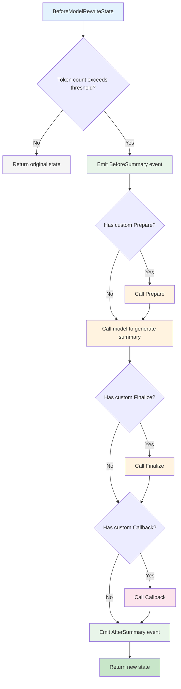

## Overview

The Summarization middleware automatically compresses conversation history when the token count exceeds a configured threshold. This helps maintain context continuity in long conversations while staying within the model's token limits.

> 💡
> This middleware was introduced in [v0.8.0.Beta](https://github.com/cloudwego/eino/releases/tag/v0.8.0-beta.1).

## Quick Start

```go
import (
    "context"
    "github.com/cloudwego/eino/adk/middlewares/summarization"
)

// Create middleware with minimal configuration
mw, err := summarization.New(ctx, &summarization.Config{
    Model: yourChatModel,  // Required: model used for generating summaries
})
if err != nil {
    // Handle error
}

// Use with ChatModelAgent
agent, err := adk.NewChatModelAgent(ctx, &adk.ChatModelAgentConfig{
    Model:       yourChatModel,
    Middlewares: []adk.ChatModelAgentMiddleware{mw},
})
```

## Configuration Options

<table>
<tr><td>Field</td><td>Type</td><td>Required</td><td>Default</td><td>Description</td></tr>
<tr><td>Model</td><td>model.BaseChatModel</td><td>Yes</td><td><li></li></td><td>Chat model used for generating summaries</td></tr>
<tr><td>ModelOptions</td><td>[]model.Option</td><td>No</td><td><li></li></td><td>Options passed to the model when generating summaries</td></tr>
<tr><td>TokenCounter</td><td>TokenCounterFunc</td><td>No</td><td>~4 chars/token</td><td>Custom token counting function</td></tr>
<tr><td>Trigger</td><td>*TriggerCondition</td><td>No</td><td>190,000 tokens</td><td>Condition to trigger summarization</td></tr>
<tr><td>Instruction</td><td>string</td><td>No</td><td>Built-in prompt</td><td>Custom summarization instruction</td></tr>
<tr><td>TranscriptFilePath</td><td>string</td><td>No</td><td><li></li></td><td>Full conversation transcript file path</td></tr>
<tr><td>Prepare</td><td>PrepareFunc</td><td>No</td><td><li></li></td><td>Custom preprocessing function before summary generation</td></tr>
<tr><td>Finalize</td><td>FinalizeFunc</td><td>No</td><td><li></li></td><td>Custom post-processing function for final messages</td></tr>
<tr><td>Callback</td><td>CallbackFunc</td><td>No</td><td><li></li></td><td>Called after Finalize to observe state changes (read-only)</td></tr>
<tr><td>EmitInternalEvents</td><td>bool</td><td>No</td><td>false</td><td>Whether to emit internal events</td></tr>
<tr><td>PreserveUserMessages</td><td>*PreserveUserMessages</td><td>No</td><td>Enabled: true</td><td>Whether to preserve original user messages in summary</td></tr>
</table>

### TriggerCondition Structure

```go
type TriggerCondition struct {
    // ContextTokens triggers summarization when total token count exceeds this threshold
    ContextTokens int
}
```

### PreserveUserMessages Structure

```go
type PreserveUserMessages struct {
    // Enabled whether to enable user message preservation
    Enabled bool
    
    // MaxTokens maximum tokens for preserved user messages
    // Only preserves the most recent user messages until this limit is reached
    // Defaults to 1/3 of TriggerCondition.ContextTokens
    MaxTokens int
}
```

### Configuration Examples

**Custom Token Threshold**

```go
mw, err := summarization.New(ctx, &summarization.Config{
    Model: yourChatModel,
    Trigger: &summarization.TriggerCondition{
        ContextTokens: 100000,  // Trigger at 100k tokens
    },
})
```

**Custom Token Counter**

```go
mw, err := summarization.New(ctx, &summarization.Config{
    Model: yourChatModel,
    TokenCounter: func(ctx context.Context, input *summarization.TokenCounterInput) (int, error) {
        // Use your tokenizer
        return yourTokenizer.Count(input.Messages)
    },
})
```

**Set Transcript File Path**

```go
mw, err := summarization.New(ctx, &summarization.Config{
    Model:              yourChatModel,
    TranscriptFilePath: "/path/to/transcript.txt",
})
```

**Custom Finalize Function**

```go
mw, err := summarization.New(ctx, &summarization.Config{
    Model: yourChatModel,
    Finalize: func(ctx context.Context, originalMessages []adk.Message, summary adk.Message) ([]adk.Message, error) {
        // Custom logic to build final messages
        return []adk.Message{
            schema.SystemMessage("Your system prompt"),
            summary,
        }, nil
    },
})
```

**Using Callback to Observe State Changes/Store**

```go
mw, err := summarization.New(ctx, &summarization.Config{
    Model: yourChatModel,
    Callback: func(ctx context.Context, before, after adk.ChatModelAgentState) error {
        log.Printf("Summarization completed: %d messages -> %d messages", 
            len(before.Messages), len(after.Messages))
        return nil
    },
})
```

**Control User Message Preservation**

```go
mw, err := summarization.New(ctx, &summarization.Config{
    Model: yourChatModel,
    PreserveUserMessages: &summarization.PreserveUserMessages{
        Enabled:   true,
        MaxTokens: 50000, // Preserve up to 50k tokens of user messages
    },
})
```

## How It Works



## Internal Events

When EmitInternalEvents is set to true, the middleware emits events at key points:

<table>
<tr><td>Event Type</td><td>Trigger Timing</td><td>Carried Data</td></tr>
<tr><td>ActionTypeBeforeSummary</td><td>Before generating summary</td><td>Original message list</td></tr>
<tr><td>ActionTypeAfterSummary</td><td>After completing summary</td><td>Final message list</td></tr>
</table>

**Usage Example**

```go
mw, err := summarization.New(ctx, &summarization.Config{
    Model:              yourChatModel,
    EmitInternalEvents: true,
})

// Listen for events in your event handler
```

## Best Practices

1. **Set TranscriptFilePath**: It's recommended to always provide a conversation transcript file path so the model can reference the original conversation when needed.
2. **Adjust Token Threshold**: Adjust `Trigger.MaxTokens` based on the model's context window size. Generally recommended to set it to 80-90% of the model's limit.
3. **Custom Token Counter**: In production environments, it's recommended to implement a custom `TokenCounter` that matches the model's tokenizer for accurate counting.
