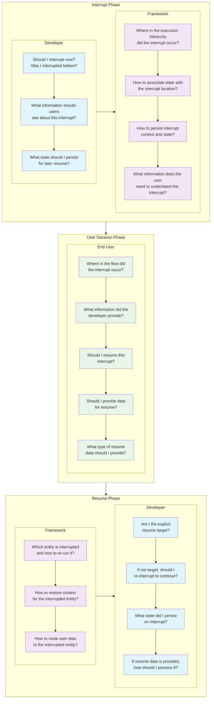
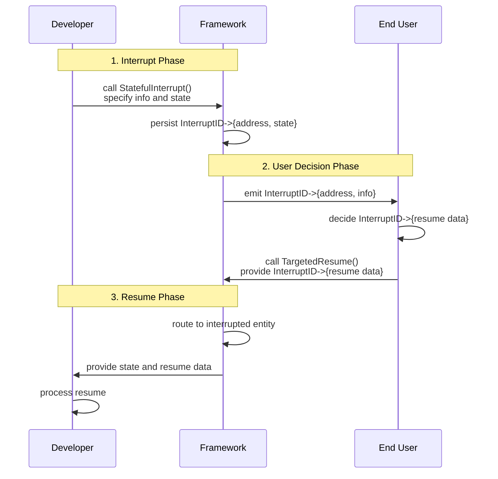
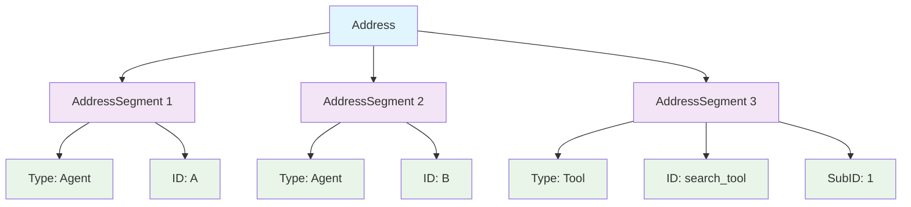
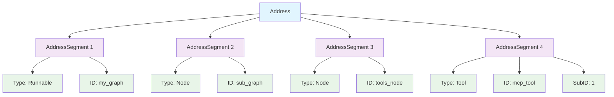

## Overview

This document provides technical details of Eino's human-in-the-loop (Human-in-the-Loop, HITL) framework architecture, focusing on the interrupt/resume mechanism and the underlying addressing system.

## Human-in-the-Loop Requirements

The following diagram illustrates the key questions each component must answer during the interrupt/resume process. Understanding these requirements is key to grasping the rationale behind the architecture design.



Therefore, our goals are:

1. Help developers answer the above questions as easily as possible.
2. Help end users answer the above questions as easily as possible.
3. Enable the framework to answer the above questions automatically and out-of-the-box.

## Quick Start

We demonstrate the functionality with a simple ticket booking Agent that asks the user for "confirmation" before actually completing the booking. The user can "approve" or "reject" the booking operation. The complete code for this example is at: [https://github.com/cloudwego/eino-examples/tree/main/adk/human-in-the-loop/1_approval](https://github.com/cloudwego/eino-examples/tree/main/adk/human-in-the-loop/1_approval)

1. Create a ChatModelAgent and configure a Tool for booking tickets.

```go
import (
    "context"
    "fmt"
    "log"

    "github.com/cloudwego/eino/adk"
    "github.com/cloudwego/eino/components/tool"
    "github.com/cloudwego/eino/components/tool/utils"
    "github.com/cloudwego/eino/compose"

    "github.com/cloudwego/eino-examples/adk/common/model"
    tool2 "github.com/cloudwego/eino-examples/adk/common/tool"
)

func NewTicketBookingAgent() adk.Agent {
    ctx := context.Background()

    type bookInput struct {
       Location             string `json:"location"`
       PassengerName        string `json:"passenger_name"`
       PassengerPhoneNumber string `json:"passenger_phone_number"`
    }

    getWeather, err := utils.InferTool(
       "BookTicket",
       "this tool can book ticket of the specific location",
       func(ctx context.Context, input bookInput) (output string, err error) {
          return "success", nil
       })
    if err != nil {
       log.Fatal(err)
    }

    a, err := adk.NewChatModelAgent(ctx, &adk.ChatModelAgentConfig{
       Name:        "TicketBooker",
       Description: "An agent that can book tickets",
       Instruction: `You are an expert ticket booker.
Based on the user's request, use the "BookTicket" tool to book tickets.`,
       Model: model.NewChatModel(),
       ToolsConfig: adk.ToolsConfig{
          ToolsNodeConfig: compose.ToolsNodeConfig{
             Tools: []tool.BaseTool{
                // InvokableApprovableTool is a tool decorator provided by eino-examples
                // that adds "approval interrupt" functionality to any InvokableTool
                &tool2.InvokableApprovableTool{InvokableTool: getWeather},
             },
          },
       },
    })
    if err != nil {
       log.Fatal(fmt.Errorf("failed to create chatmodel: %w", err))
    }

    return a
}
```

2. Create a Runner, configure CheckPointStore, and run with a CheckPointID. Eino uses CheckPointStore to save the Agent's running state when interrupted. Here we use InMemoryStore, which saves in memory. In actual use, a distributed store like Redis is recommended. Additionally, Eino uses CheckPointID to uniquely identify and link the "before interrupt" and "after interrupt" runs (or multiple runs).

```go
a := NewTicketBookingAgent()
runner := adk.NewRunner(ctx, adk.RunnerConfig{
    EnableStreaming: true, // you can disable streaming here
    Agent:           a,

    // provide a CheckPointStore for eino to persist the execution state of the agent for later resumption.
    // Here we use an in-memory store for simplicity.
    // In the real world, you can use a distributed store like Redis to persist the checkpoints.
    CheckPointStore: store.NewInMemoryStore(),
})
iter := runner.Query(ctx, "book a ticket for Martin, to Beijing, on 2025-12-01, the phone number is 1234567. directly call tool.", adk.WithCheckPointID("1"))
```

3. Get the interrupt information from AgentEvent `event.Action.Interrupted.InterruptContexts[0].Info`, which here is "preparing to book which train for whom, do you approve". You will also get an InterruptID (`event.Action.Interrupted.InterruptContexts[0].ID`), which the Eino framework uses to identify "where the interrupt occurred". Here it's printed directly to the terminal; in actual use, it may need to be returned as an HTTP response to the frontend.

```go
var lastEvent *adk.AgentEvent
for {
    event, ok := iter.Next()
    if !ok {
       break
    }
    if event.Err != nil {
       log.Fatal(event.Err)
    }

    prints.Event(event)

    lastEvent = event
}

// this interruptID is crucial 'locator' for Eino to know where the interrupt happens,
// so when resuming later, you have to provide this same `interruptID` along with the approval result back to Eino
interruptID := lastEvent.Action.Interrupted.InterruptContexts[0].ID
```

4. Show the interrupt information to the user and receive the user's response, such as "approve". In this example, everything is displayed to and received from the user on the local terminal. In actual applications, a ChatBot might be used for input/output.

```go
var apResult *tool.ApprovalResult
for {
    scanner := bufio.NewScanner(os.Stdin)
    fmt.Print("your input here: ")
    scanner.Scan()
    fmt.Println()
    nInput := scanner.Text()
    if strings.ToUpper(nInput) == "Y" {
       apResult = &tool.ApprovalResult{Approved: true}
       break
    } else if strings.ToUpper(nInput) == "N" {
       // Prompt for reason when denying
       fmt.Print("Please provide a reason for denial: ")
       scanner.Scan()
       reason := scanner.Text()
       fmt.Println()
       apResult = &tool.ApprovalResult{Approved: false, DisapproveReason: &reason}
       break
    }

    fmt.Println("invalid input, please input Y or N")
}
```

Sample output:

```json
name: TicketBooker
path: [{TicketBooker}]
tool name: BookTicket
arguments: {"location":"Beijing","passenger_name":"Martin","passenger_phone_number":"1234567"}

name: TicketBooker
path: [{TicketBooker}]
tool 'BookTicket' interrupted with arguments '{"location":"Beijing","passenger_name":"Martin","passenger_phone_number":"1234567"}', waiting for your approval, please answer with Y/N

your input here: Y
```

5. Call Runner.ResumeWithParams, passing the same InterruptID and the data for resumption, which here is "approve". In this example, the initial `Runner.Query` and subsequent `Runner.ResumeWithParams` are in the same instance. In real scenarios, it might be two requests from a ChatBot frontend hitting two different server instances. As long as the CheckPointID is the same both times and the CheckPointStore configured for the Runner is distributed storage, Eino can achieve cross-instance interrupt resumption.

```go
// here we directly resumes right in the same instance where the original `Runner.Query` happened.
// In the real world, the original `Runner.Run/Query` and the subsequent `Runner.ResumeWithParams`
// can happen in different processes or machines, as long as you use the same `CheckPointID`,
// and you provided a distributed `CheckPointStore` when creating the `Runner` instance.
iter, err := runner.ResumeWithParams(ctx, "1", &adk.ResumeParams{
    Targets: map[string]any{
       interruptID: apResult,
    },
})
if err != nil {
    log.Fatal(err)
}
for {
    event, ok := iter.Next()
    if !ok {
       break
    }

    if event.Err != nil {
       log.Fatal(event.Err)
    }

    prints.Event(event)
}
```

Complete sample output:

```yaml
name: TicketBooker
path: [{TicketBooker}]
tool name: BookTicket
arguments: {"location":"Beijing","passenger_name":"Martin","passenger_phone_number":"1234567"}

name: TicketBooker
path: [{TicketBooker}]
tool 'BookTicket' interrupted with arguments '{"location":"Beijing","passenger_name":"Martin","passenger_phone_number":"1234567"}', waiting for your approval, please answer with Y/N

your input here: Y

name: TicketBooker
path: [{TicketBooker}]
tool response: success

name: TicketBooker
path: [{TicketBooker}]
answer: The ticket for Martin to Beijing on 2025-12-01 has been successfully booked. If you need any more assistance, feel free
 to ask!
```

### More Examples

- Review and Edit Mode: Allows human review and in-place editing of tool call parameters before execution. [https://github.com/cloudwego/eino-examples/tree/main/adk/human-in-the-loop/2_review-and-edit](https://github.com/cloudwego/eino-examples/tree/main/adk/human-in-the-loop/2_review-and-edit)
- Feedback Loop Mode: Iterative improvement mode where the agent generates content and humans provide qualitative feedback for improvement. [https://github.com/cloudwego/eino-examples/tree/main/adk/human-in-the-loop/3_feedback-loop](https://github.com/cloudwego/eino-examples/tree/main/adk/human-in-the-loop/3_feedback-loop)
- Follow-up Mode: Proactive mode where the agent identifies insufficient tool output and requests clarification or next steps. [https://github.com/cloudwego/eino-examples/tree/main/adk/human-in-the-loop/4_follow-up](https://github.com/cloudwego/eino-examples/tree/main/adk/human-in-the-loop/4_follow-up)
- Interrupt within supervisor architecture: [https://github.com/cloudwego/eino-examples/tree/main/adk/human-in-the-loop/5_supervisor](https://github.com/cloudwego/eino-examples/tree/main/adk/human-in-the-loop/5_supervisor)
- Interrupt within plan-execute-replan architecture: [https://github.com/cloudwego/eino-examples/tree/main/adk/human-in-the-loop/6_plan-execute-replan](https://github.com/cloudwego/eino-examples/tree/main/adk/human-in-the-loop/6_plan-execute-replan)
- Interrupt within deep-agents architecture: [https://github.com/cloudwego/eino-examples/tree/main/adk/human-in-the-loop/7_deep-agents](https://github.com/cloudwego/eino-examples/tree/main/adk/human-in-the-loop/7_deep-agents)
- Interrupt when a sub-agent of supervisor is plan-execute-replan: [https://github.com/cloudwego/eino-examples/tree/main/adk/human-in-the-loop/8_supervisor-plan-execute](https://github.com/cloudwego/eino-examples/tree/main/adk/human-in-the-loop/8_supervisor-plan-execute)

## Architecture Overview

The following flowchart illustrates the high-level interrupt/resume flow:

```mermaid
flowchart TD
    U[End User]
    
    subgraph R [Runner]
        Run
        Resume
    end
    
    U -->|Initial Input| Run
    U -->|Resume Data| Resume
    
    subgraph E [(Arbitrarily Nested) Entities]
        Agent
        Tool
        ...
    end
    
    subgraph C [Run Context]
        Address
        InterruptState
        ResumeData
    end
    
    Run -->|any number of transfer / call| E
    R <-->|persist/restore| C
    Resume -->|replay transfer / call| E
    C -->|auto assigned to| E
```

The following sequence diagram shows the time-ordered interaction flow between the three main participants:



## ADK Package APIs

The ADK package provides high-level abstractions for building interruptible agents with human-in-the-loop capabilities.

### 1. APIs for Interrupting

#### `Interrupt`

Creates a basic interrupt action. Use when an agent needs to pause execution to request external input or intervention, but does not need to save any internal state for resumption.

```go
func Interrupt(ctx context.Context, info any) *AgentEvent
```

**Parameters:**

- `ctx`: The context of the running component.
- `info`: User-facing data describing the reason for the interrupt.

**Returns:** `*AgentEvent` with an interrupt action.

**Example:**

```go
// Inside an agent's Run method:

// Create a simple interrupt to request clarification.
return adk.Interrupt(ctx, "User query is unclear, please clarify.")
```

---

#### `StatefulInterrupt`

Creates an interrupt action while saving the agent's internal state. Use when an agent has internal state that must be restored to continue correctly.

```go
func StatefulInterrupt(ctx context.Context, info any, state any) *AgentEvent
```

**Parameters:**

- `ctx`: The context of the running component.
- `info`: User-facing data describing the interrupt.
- `state`: The agent's internal state object, which will be serialized and stored.

**Returns:** `*AgentEvent` with an interrupt action.

**Example:**

```go
// Inside an agent's Run method:

// Define the state to save.
type MyAgentState struct {
    ProcessedItems int
    CurrentTopic   string
}

currentState := &MyAgentState{
    ProcessedItems: 42,
    CurrentTopic:   "HITL",
}

// Interrupt and save current state.
return adk.StatefulInterrupt(ctx, "Need user feedback before continuing", currentState)
```

---

#### `CompositeInterrupt`

Creates an interrupt action for components that coordinate multiple sub-components. It combines interrupts from one or more child agents into a single, cohesive interrupt. Any agent containing child agents (e.g., custom `Sequential` or `Parallel` agents) uses this to propagate their children's interrupts.

```go
func CompositeInterrupt(ctx context.Context, info any, state any, 
    subInterruptSignals ...*InterruptSignal) *AgentEvent
```

**Parameters:**

- `ctx`: The context of the running component.
- `info`: User-facing data describing the coordinator's own interrupt reason.
- `state`: The coordinator agent's own state (e.g., the index of the interrupted child agent).
- `subInterruptSignals`: A variadic list of `InterruptSignal` objects from interrupted child agents.

**Returns:** `*AgentEvent` with an interrupt action.

**Example:**

```go
// In a custom sequential agent running two child agents...
subAgent1 := &myInterruptingAgent{}
subAgent2 := &myOtherAgent{}

// If subAgent1 returns an interrupt event...
subInterruptEvent := subAgent1.Run(ctx, input)

// The parent agent must capture it and wrap it in CompositeInterrupt.
if subInterruptEvent.Action.Interrupted != nil {
    // The parent agent can add its own state, like which child agent was interrupted.
    parentState := map[string]int{"interrupted_child_index": 0}
    
    // Bubble up the interrupt.
    return adk.CompositeInterrupt(ctx, 
        "A child agent needs attention", 
        parentState, 
        subInterruptEvent.Action.Interrupted.internalInterrupted,
    )
}
```

### 2. APIs for Getting Interrupt Information

#### `InterruptInfo` and `InterruptCtx`

When agent execution is interrupted, the `AgentEvent` contains structured interrupt information. The `InterruptInfo` struct contains a list of `InterruptCtx` objects, each representing an interrupt point in the hierarchy.

`InterruptCtx` provides a complete, user-facing context for a single resumable interrupt point.

```go
type InterruptCtx struct {
    // ID is the unique, fully qualified address of the interrupt point, used for targeted resume.
    // For example: "agent:A;node:graph_a;tool:tool_call_123"
    ID string

    // Address is a structured sequence of AddressSegment segments leading to the interrupt point.
    Address Address

    // Info is the user-facing information associated with the interrupt, provided by the component that triggered it.
    Info any

    // IsRootCause indicates whether the interrupt point is the exact root cause of the interrupt.
    IsRootCause bool

    // Parent points to the context of the parent component in the interrupt chain (nil for top-level interrupts).
    Parent *InterruptCtx
}
```

The following example shows how to access this information:

```go
// At the application layer, after an interrupt:
if event.Action != nil && event.Action.Interrupted != nil {
    interruptInfo := event.Action.Interrupted
    
    // Get a flat list of all interrupt points
    interruptPoints := interruptInfo.InterruptContexts 
    
    for _, point := range interruptPoints {
        // Each point contains a unique ID, user-facing info, and its hierarchical address
        fmt.Printf("Interrupt ID: %s, Address: %s, Info: %v\n", point.ID, point.Address.String(), point.Info)
    }
}
```

### 3. APIs for End User Resume

#### `(*Runner).ResumeWithParams`

Continues interrupted execution from a checkpoint using the "explicit targeted resume" strategy. This is the most common and powerful way to resume, allowing you to target specific interrupt points and provide data for them.

When using this method:

- Components whose addresses are in the `ResumeParams.Targets` map will be explicit targets.
- Interrupted components whose addresses are not in the `ResumeParams.Targets` map must re-interrupt themselves to preserve their state.

```go
func (r *Runner) ResumeWithParams(ctx context.Context, checkPointID string, 
    params *ResumeParams, opts ...AgentRunOption) (*AsyncIterator[*AgentEvent], error)
```

**Parameters:**

- `ctx`: The context for resumption.
- `checkPointID`: The identifier of the checkpoint to resume from.
- `params`: Interrupt parameters containing a mapping from interrupt IDs to resume data. These IDs can point to any interruptible component throughout the execution graph.
- `opts`: Additional run options.

**Returns:** An async iterator of agent events.

**Example:**

```go
// After receiving an interrupt event...
interruptID := interruptEvent.Action.Interrupted.InterruptContexts[0].ID

// Prepare data for the specific interrupt point.
resumeData := map[string]any{
    interruptID: "This is the clarification you requested.",
}

// Resume execution with targeted data.
resumeIterator, err := runner.ResumeWithParams(ctx, "my-checkpoint-id", &ResumeParams{Targets: resumeData})
if err != nil {
    // Handle error
}

// Process events from the resume iterator
for event := range resumeIterator.Events() {
    if event.Err != nil {
        // Handle event error
        break
    }
    // Process agent event
    fmt.Printf("Event: %+v\n", event)
}
```

### 4. APIs for Developer Resume

#### `ResumeInfo` Struct

`ResumeInfo` holds all the information needed to resume an interrupted agent execution. It is created by the framework and passed to the agent's `Resume` method.

```go
type ResumeInfo struct {
    // WasInterrupted indicates whether this agent had an interrupt in the previous Runner run.
    WasInterrupted bool

    // InterruptState holds the state saved via StatefulInterrupt or CompositeInterrupt.
    InterruptState any

    // IsResumeTarget indicates whether this agent is a specific target of ResumeWithParams.
    IsResumeTarget bool

    // ResumeData holds the data provided by the user for this agent.
    ResumeData any

    // ... other fields
}
```

**Example:**

```go
import (
    "context"
    "errors"
    "fmt"
    
    "github.com/cloudwego/eino/adk"
)

// Inside an agent's Resume method:
func (a *myAgent) Resume(ctx context.Context, info *adk.ResumeInfo, opts ...adk.AgentRunOption) *adk.AsyncIterator[*adk.AgentEvent] {
    if !info.WasInterrupted {
        // Already entered the Resume method, must have WasInterrupted = true
        return adk.NewAsyncIterator([]*adk.AgentEvent{{Err: errors.New("not an interrupt")}}, nil)
    }

    if !info.IsResumeTarget {
        // This agent is not a specific target, so it must re-interrupt to preserve its state.
        return adk.StatefulInterrupt(ctx, "Waiting for another part of the workflow to be resumed", info.InterruptState)
    }

    // This agent is the target. Process the resume data.
    if info.ResumeData != nil {
        userInput, ok := info.ResumeData.(string)
        if ok {
            // Process user input and continue execution
            fmt.Printf("Received user input: %s\n", userInput)
            // Update agent state based on user input
            a.currentState.LastUserInput = userInput
        }
    }
    
    // Continue normal execution logic
    return a.Run(ctx, &adk.AgentInput{Input: "resumed execution"})
}
```

## Compose Package APIs

The `compose` package provides low-level building blocks for creating complex, interruptible workflows.

### 1. APIs for Interrupting

#### `Interrupt`

Creates a special error that signals the execution engine to interrupt the current run at the component's specific address and save a checkpoint. This is the standard way for a single, non-composite component to signal a resumable interrupt.

```go
func Interrupt(ctx context.Context, info any) error
```

**Parameters:**

- `ctx`: The context of the running component, used to retrieve the current execution address.
- `info`: User-facing information about the interrupt. This information is not persisted but is exposed to the calling application via `InterruptCtx`.

---

#### `StatefulInterrupt`

Similar to `Interrupt`, but also saves the component's internal state. The state is saved in the checkpoint and provided back to the component via `GetInterruptState` on resume.

```go
func StatefulInterrupt(ctx context.Context, info any, state any) error
```

**Parameters:**

- `ctx`: The context of the running component.
- `info`: User-facing information about the interrupt.
- `state`: The internal state that the interrupted component needs to persist.

---

#### `CompositeInterrupt`

Creates a special error representing a composite interrupt. It is designed for "composite" nodes (like `ToolsNode`) or any component that coordinates multiple independent, interruptible sub-processes. It bundles multiple child interrupt errors into a single error that the engine can deconstruct into a flat list of resumable points.

```go
func CompositeInterrupt(ctx context.Context, info any, state any, errs ...error) error
```

**Parameters:**

- `ctx`: The context of the running composite node.
- `info`: User-facing information for the composite node itself (can be `nil`).
- `state`: The state of the composite node itself (can be `nil`).
- `errs`: A list of errors from sub-processes. These can be `Interrupt`, `StatefulInterrupt`, or nested `CompositeInterrupt` errors.

**Example:**

```go
// A node that runs multiple processes in parallel.
var errs []error
for _, process := range processes {
    subCtx := compose.AppendAddressSegment(ctx, "process", process.ID)
    _, err := process.Run(subCtx)
    if err != nil {
        errs = append(errs, err)
    }
}

// If any sub-process interrupts, bundle them together.
if len(errs) > 0 {
    // The composite node can save its own state, e.g., which processes have completed.
    return compose.CompositeInterrupt(ctx, "Parallel execution needs input", parentState, errs...)
}
```

### 2. APIs for Getting Interrupt Information

#### `ExtractInterruptInfo`

Extracts a structured `InterruptInfo` object from an error returned by a `Runnable`'s `Invoke` or `Stream` method. This is the primary way for applications to get a list of all interrupt points after execution pauses.

```go
composeInfo, ok := compose.ExtractInterruptInfo(err)
if ok {
    // Access interrupt contexts
    interruptContexts := composeInfo.InterruptContexts
}
```

**Example:**

```go
// After calling a graph that interrupts...
_, err := graph.Invoke(ctx, "initial input")

if err != nil {
    interruptInfo, isInterrupt := compose.ExtractInterruptInfo(err)
    if isInterrupt {
        fmt.Printf("Execution was interrupted by %d interrupt points.\n", len(interruptInfo.InterruptContexts))
        // Now you can inspect interruptInfo.InterruptContexts to decide how to resume.
    }
}
```

### 3. APIs for End User Resume

#### `Resume`

Prepares the context for an "explicit targeted resume" operation by targeting one or more components without providing data. This is useful when the resume action itself is the signal.

```go
func Resume(ctx context.Context, interruptIDs ...string) context.Context
```

**Example:**

```go
// After an interrupt, we get two interrupt IDs: id1 and id2.
// We want to resume both without providing specific data.
resumeCtx := compose.Resume(context.Background(), id1, id2)

// Pass this context to the next Invoke/Stream call.
// In the components corresponding to id1 and id2, GetResumeContext will return isResumeFlow = true.
```

---

#### `ResumeWithData`

Prepares a context to resume a single specific component with data. It is a convenience wrapper around `BatchResumeWithData`.

```go
func ResumeWithData(ctx context.Context, interruptID string, data any) context.Context
```

**Example:**

```go
// Resume a single interrupt point with specific data.
resumeCtx := compose.ResumeWithData(context.Background(), interruptID, "This is the specific data you requested.")

// Pass this context to the next Invoke/Stream call.
```

---

#### `BatchResumeWithData`

This is the core function for preparing a resume context. It injects a mapping of resume targets (interrupt IDs) and their corresponding data into the context. Components whose interrupt IDs exist as keys will receive `isResumeFlow = true` when calling `GetResumeContext`.

```go
func BatchResumeWithData(ctx context.Context, resumeData map[string]any) context.Context
```

**Example:**

```go
// Resume multiple interrupt points at once, each with different data.
resumeData := map[string]any{
    "interrupt-id-1": "Data for the first point.",
    "interrupt-id-2": 42, // Data can be any type.
    "interrupt-id-3": nil, // Equivalent to using Resume() for this ID.
}

resumeCtx := compose.BatchResumeWithData(context.Background(), resumeData)

// Pass this context to the next Invoke/Stream call.
```

### 4. APIs for Developer Resume

#### `GetInterruptState`

Provides a type-safe way to check and retrieve the persisted state from a previous interrupt. This is the primary function for components to learn about their past state.

```go
func GetInterruptState[T any](ctx context.Context) (wasInterrupted bool, hasState bool, state T)
```

**Return values:**

- `wasInterrupted`: `true` if the node was part of a previous interrupt.
- `hasState`: `true` if state was provided and successfully converted to type `T`.
- `state`: The typed state object.

**Example:**

```go
// Inside a lambda or tool's execution logic:
wasInterrupted, hasState, state := compose.GetInterruptState[*MyState](ctx)

if wasInterrupted {
    fmt.Println("This component was interrupted in a previous run.")
    if hasState {
        fmt.Printf("Restored state: %+v\n", state)
    } 
} else {
    // This is the first time this component is running in this execution.
}
```

---

#### `GetResumeContext`

Checks if the current component is a target of a resume operation and retrieves any user-provided data. This is typically called after `GetInterruptState` confirms the component was interrupted.

```go
func GetResumeContext[T any](ctx context.Context) (isResumeFlow bool, hasData bool, data T)
```

**Return values:**

- `isResumeFlow`: `true` if the component was explicitly targeted by the resume call. If `false`, the component must re-interrupt to preserve its state.
- `hasData`: `true` if data was provided for this component.
- `data`: The typed data provided by the user.

**Example:**

```go
// Inside a lambda or tool's execution logic, after checking GetInterruptState:
wasInterrupted, _, oldState := compose.GetInterruptState[*MyState](ctx)

if wasInterrupted {
    isTarget, hasData, resumeData := compose.GetResumeContext[string](ctx)
    if isTarget {
        // This component is the target, continue execution logic.
        if hasData {
            fmt.Printf("Resuming with user data: %s\n", resumeData)
        }
        // Complete work using restored state and resume data
        result := processWithStateAndData(state, resumeData)
        return result, nil
    } else {
        // This component is not the target, so it must re-interrupt.
        return compose.StatefulInterrupt(ctx, "Waiting for another component to be resumed", oldState)
    }
}
```

## Underlying Architecture: Addressing System

### The Need for Addresses

The addressing system is designed to solve three fundamental needs in effective human-in-the-loop interaction:

1. **State Attachment**: To attach local state to interrupt points, we need a stable, unique locator for each interrupt point.
2. **Targeted Resume**: To provide targeted resume data for specific interrupt points, we need a way to precisely identify each point.
3. **Interrupt Localization**: To tell end users exactly where in the execution hierarchy the interrupt occurred.

### How Addresses Meet These Needs

The address system meets these needs through three key properties:

- **Stability**: Addresses remain consistent across multiple executions, ensuring the same interrupt point can be reliably identified.
- **Uniqueness**: Each interrupt point has a unique address, enabling precise targeting during resume.
- **Hierarchical Structure**: Addresses provide a clear hierarchical path showing exactly where in the execution flow the interrupt occurred.

### Address Structure and Segment Types

#### `Address` Structure

```go
type Address struct {
    Segments []AddressSegment
}

type AddressSegment struct {
    Type  AddressSegmentType
    ID    string
    SubID string
}
```

#### Address Structure Diagram

The following diagrams illustrate the hierarchical structure of `Address` and its `AddressSegment` from both ADK and Compose perspectives:

**ADK Layer Perspective** (Simplified, Agent-centric view):



**Compose Layer Perspective** (Detailed, full hierarchy view):



### Layer-Specific Address Segment Types

#### ADK Layer Segment Types

The ADK layer provides a simplified, agent-centric abstraction of the execution hierarchy:

```go
type AddressSegmentType = core.AddressSegmentType

const (
    AddressSegmentAgent AddressSegmentType = "agent"
    AddressSegmentTool  AddressSegmentType = "tool"
)
```

**Key Features:**

- **Agent Segment**: Represents agent-level execution segments (typically omits `SubID`).
- **Tool Segment**: Represents tool-level execution segments (`SubID` is used to ensure uniqueness).
- **Simplified View**: Abstracts away underlying complexity for agent developers.
- **Example Path**: `Agent:A → Agent:B → Tool:search_tool:1`

#### Compose Layer Segment Types

The `compose` layer provides fine-grained control and visibility over the entire execution hierarchy:

```go
type AddressSegmentType = core.AddressSegmentType

const (
    AddressSegmentRunnable AddressSegmentType = "runnable"  // Graph, Workflow, or Chain
    AddressSegmentNode     AddressSegmentType = "node"      // Individual graph nodes
    AddressSegmentTool     AddressSegmentType = "tool"      // Specific tool calls
)
```

**Key Features:**

- **Runnable Segment**: Represents top-level executables (Graph, Workflow, Chain).
- **Node Segment**: Represents individual nodes in the execution graph.
- **Tool Segment**: Represents specific tool calls within a `ToolsNode`.
- **Detailed View**: Provides full visibility into the execution hierarchy.
- **Example Path**: `Runnable:my_graph → Node:sub_graph → Node:tools_node → Tool:mcp_tool:1`

### Extensibility and Design Principles

The address segment type system is designed to be **extensible**. Framework developers can add new segment types to support additional execution modes or custom components while maintaining backward compatibility.

**Key Design Principle**: The ADK layer provides simplified, agent-centric abstractions, while the `compose` layer handles the full complexity of the execution hierarchy. This layered approach allows developers to work at the abstraction level that suits their needs.

## Backward Compatibility

The human-in-the-loop framework maintains full backward compatibility with existing code. All previous interrupt and resume patterns will continue to work as before, while providing enhanced functionality through the new addressing system.

### 1. Graph Interrupt Compatibility

Previous graph interrupt flows using the deprecated `NewInterruptAndRerunErr` or `InterruptAndRerun` in nodes/tools will continue to be supported, but require one critical additional step: **error wrapping**.

Since these functions are unaware of the new addressing system, it is the responsibility of the component calling them to capture the error and wrap the address information into it using the `WrapInterruptAndRerunIfNeeded` helper function. This is typically done inside the composite node (like the official ToolsNode) that calls the legacy component.

> **Note**: If you choose **not** to use `WrapInterruptAndRerunIfNeeded`, the original behavior of these functions will be preserved. End users can still use `ExtractInterruptInfo` to get information from the error as before. However, since the resulting interrupt context will lack the correct address, the new targeted resume APIs will not be available for that specific interrupt point. To fully enable the new address-aware functionality, wrapping is required.

```go
// 1. A legacy tool using deprecated interrupt
func myLegacyTool(ctx context.Context, input string) (string, error) {
    // ... tool logic
    // This error is not address-aware.
    return "", compose.NewInterruptAndRerunErr("Requires user approval")
}

// 2. A composite node calling the legacy tool
var legacyToolNode = compose.InvokableLambda(func(ctx context.Context, input string) (string, error) {
    out, err := myLegacyTool(ctx, input)
    if err != nil {
        // Critical: The caller must wrap the error to add the address.
        // The "tool:legacy_tool" segment will be appended to the current address.
        segment := compose.AddressSegment{Type: "tool", ID: "legacy_tool"}
        return "", compose.WrapInterruptAndRerunIfNeeded(ctx, segment, err)
    }
    return out, nil
})

// 3. End user code can now see the full address.
_, err := graph.Invoke(ctx, input)
if err != nil {
    interruptInfo, exists := compose.ExtractInterruptInfo(err)
    if exists {
        // The interrupt context will now have a correct, fully qualified address.
        fmt.Printf("Interrupt Address: %s\n", interruptInfo.InterruptContexts[0].Address.String())
    }
}
```

### 2. Compatibility with Static Interrupts Added at Compile Time

Static interrupts added via `WithInterruptBeforeNodes` or `WithInterruptAfterNodes` continue to work, but the way state is handled has been improved.

When a static interrupt is triggered, an `InterruptCtx` is generated with an address pointing to the graph (or subgraph) where the interrupt was defined. The key is that the `InterruptCtx.Info` field now directly exposes the graph's state.

This enables a more direct and intuitive workflow:

1. The end user receives the `InterruptCtx` and can inspect the graph's live state via the `.Info` field.
2. They can directly modify this state object.
3. They can then pass the modified graph state object back via `ResumeWithData` and `InterruptCtx.ID` to resume execution.

This new pattern often eliminates the need for the old `WithStateModifier` option, although it remains available for full backward compatibility.

```go
// 1. Define a graph with its own local state
type MyGraphState struct {
    SomeValue string
}

g := compose.NewGraph[string, string](compose.WithGenLocalState(func(ctx context.Context) *MyGraphState {
    return &MyGraphState{SomeValue: "initial"}
}))
// ... add nodes 1 and 2 to the graph ...

// 2. Compile the graph with a static interrupt point
// This will interrupt the graph itself after the "node_1" node completes.
graph, err := g.Compile(ctx, compose.WithInterruptAfterNodes([]string{"node_1"}))

// 3. Run the graph, which will trigger the static interrupt
_, err = graph.Invoke(ctx, "start")

// 4. Extract the interrupt context and the graph's state
interruptInfo, isInterrupt := compose.ExtractInterruptInfo(err)
if isInterrupt {
    interruptCtx := interruptInfo.InterruptContexts[0]

    // The .Info field exposes the graph's current state
    graphState, ok := interruptCtx.Info.(*MyGraphState)
    if ok {
        // 5. Directly modify the state
        fmt.Printf("Original state value: %s\n", graphState.SomeValue) // Prints "initial"
        graphState.SomeValue = "a-new-value-from-user"

        // 6. Resume by passing back the modified state object
        resumeCtx := compose.ResumeWithData(context.Background(), interruptCtx.ID, graphState)
        result, err := graph.Invoke(resumeCtx, "start")
        // ... execution will continue, and node_2 will now see the modified state.
    }
}
```

### 3. Agent Interrupt Compatibility

Compatibility with legacy agents is maintained at the data structure level, ensuring that old agent implementations continue to work within the new framework. The key lies in how the `adk.InterruptInfo` and `adk.ResumeInfo` structs are populated.

**For End Users (Application Layer):**

When receiving an interrupt from an agent, the `adk.InterruptInfo` struct will have both populated:

- The new, structured `InterruptContexts` field.
- The legacy `Data` field, which will contain the original interrupt information (e.g., `ChatModelAgentInterruptInfo` or `WorkflowInterruptInfo`).

This allows end users to gradually migrate their application logic to use the richer `InterruptContexts` while still having access to the old `Data` field when needed.

**For Agent Developers:**

When a legacy agent's `Resume` method is called, the `adk.ResumeInfo` struct it receives still contains the now-deprecated embedded `InterruptInfo` field. This field is populated with the same legacy data structures, allowing agent developers to maintain their existing resume logic without immediately updating to the new address-aware APIs.

```go
// --- End User Perspective ---

// After an agent run, you receive an interrupt event.
if event.Action != nil && event.Action.Interrupted != nil {
    interruptInfo := event.Action.Interrupted

    // 1. New way: Access structured interrupt contexts
    if len(interruptInfo.InterruptContexts) > 0 {
        fmt.Printf("New structured context available: %+v\n", interruptInfo.InterruptContexts[0])
    }

    // 2. Old way (still works): Access the legacy Data field
    if chatInterrupt, ok := interruptInfo.Data.(*adk.ChatModelAgentInterruptInfo); ok {
        fmt.Printf("Legacy ChatModelAgentInterruptInfo still accessible.\n")
        // ... logic using the old struct
    }
}

// --- Agent Developer Perspective ---

// Inside a legacy agent's Resume method:
func (a *myLegacyAgent) Resume(ctx context.Context, info *adk.ResumeInfo) *adk.AsyncIterator[*adk.AgentEvent] {
    // The deprecated embedded InterruptInfo field will still be populated.
    // This allows old resume logic to continue working.
    if info.InterruptInfo != nil {
        if chatInterrupt, ok := info.InterruptInfo.Data.(*adk.ChatModelAgentInterruptInfo); ok {
            // ... existing resume logic relying on the old ChatModelAgentInterruptInfo struct
            fmt.Println("Resuming based on legacy InterruptInfo.Data field.")
        }
    }
    
    // ... continue execution
}
```

### Migration Advantages

- **Preserve Legacy Behavior**: Existing code will continue to work as it did. Old interrupt patterns will not cause crashes, but they also won't automatically gain new address-aware capabilities without modification.
- **Gradual Adoption**: Teams can selectively enable new features on a case-by-case basis. For example, you can wrap legacy interrupts with `WrapInterruptAndRerunIfNeeded` only in workflows where you need targeted resume.
- **Enhanced Functionality**: The new addressing system provides richer structured context (`InterruptCtx`) for all interrupts, while the old data fields are still populated for full compatibility.
- **Flexible State Management**: For static graph interrupts, you can choose modern, direct state modification via the `.Info` field, or continue using the old `WithStateModifier` option.

This backward compatibility model ensures a smooth transition for existing users while providing a clear path to adopting the new human-in-the-loop features.
