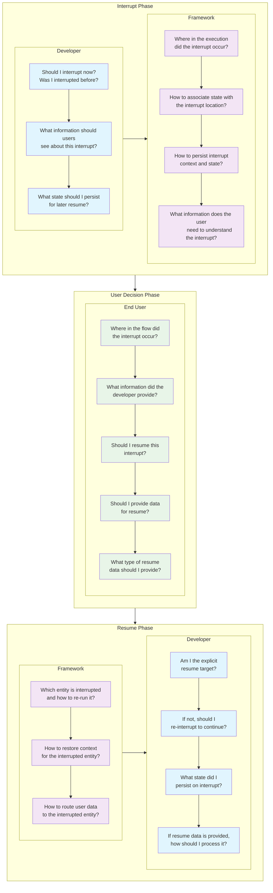
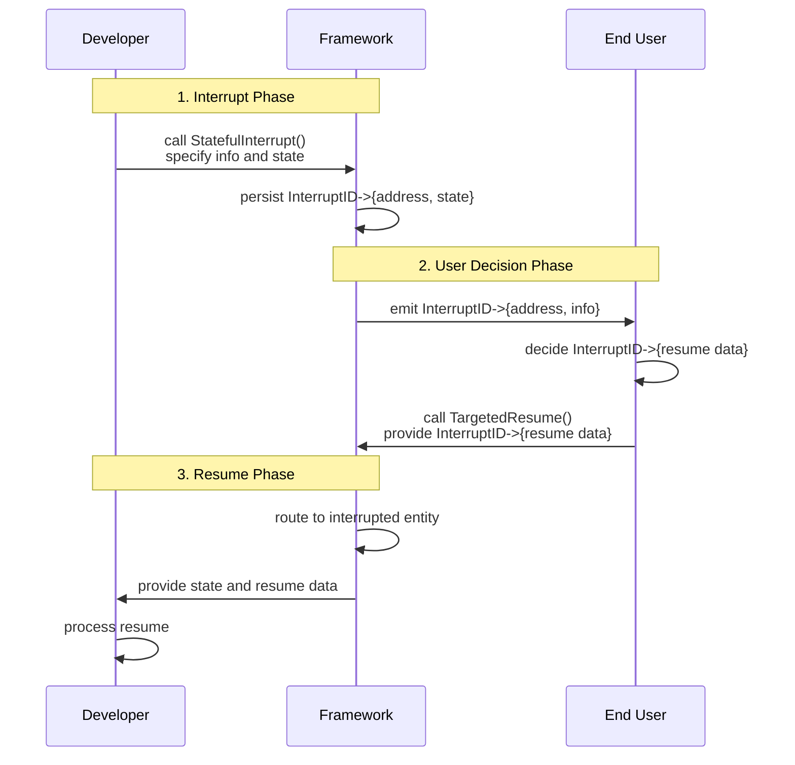
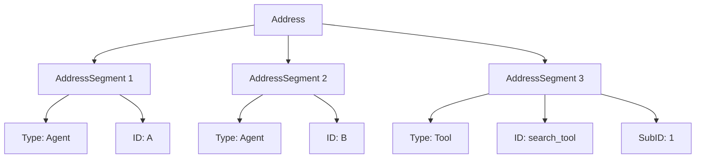
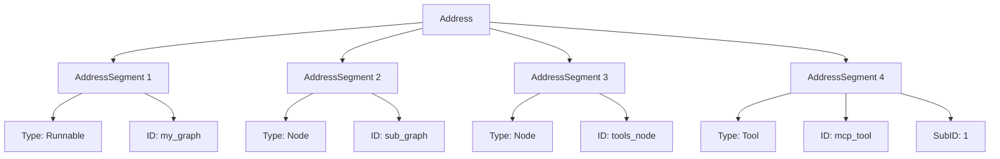

## Overview

Eino’s HITL framework provides robust interrupt/resume and an addressing system to route user approvals or inputs back to the exact interruption point.

Covers:

- Developer: when to interrupt, what to persist, what to expose
- Framework: where interruption happens, how to persist context/state
- User: where interruption occurred, whether/how to resume, what data to provide

## Quick Start

Example: a ticket‑booking `ChatModelAgent` that pauses for user approval before calling a booking tool.

1) Create a `ChatModelAgent` with an approvable tool (decorator adds approval interrupt):

```go
getWeather := &tool2.InvokableApprovableTool{InvokableTool: baseBookTool}
a, _ := adk.NewChatModelAgent(ctx, &adk.ChatModelAgentConfig{ /* model + getWeather tool */ })
```

2) Create a `Runner` with `CheckPointStore`, run with `WithCheckPointID("1")`:

```go
runner := adk.NewRunner(ctx, adk.RunnerConfig{ Agent: a, EnableStreaming: true, CheckPointStore: store.NewInMemoryStore() })
iter := runner.Query(ctx, "book a ticket for Martin...", adk.WithCheckPointID("1"))
```

3) Read `event.Action.Interrupted`; capture `interruptID` and show user info; collect approval result.

```go
interruptID := lastEvent.Action.Interrupted.InterruptContexts[0].ID
```

4) Resume with parameters mapping `interruptID` → approval result:

```go
iter, err := runner.ResumeWithParams(ctx, "1", &adk.ResumeParams{ Targets: map[string]any{ interruptID: approvalResult } })
```

For production, use a distributed store (e.g., Redis) and expose interrupt context via your API/UI.

## APIs

- Create interrupts: `adk.Interrupt`, `adk.StatefulInterrupt`, `adk.CompositeInterrupt`
- Access interrupt info: `InterruptInfo` with a flat list of `InterruptCtx{ID, Address, Info, IsRootCause, Parent}`
- Resume: `(*Runner).ResumeWithParams(ctx, checkPointID, params)` and `ResumeInfo` for agents
- Compose‑level helpers: `compose.Interrupt`, `compose.StatefulInterrupt`, `compose.CompositeInterrupt`, `compose.ExtractInterruptInfo`, and resume context helpers

Examples repository: https://github.com/cloudwego/eino-examples/pull/125 and the HITL series under `adk/human-in-the-loop`.

## HITL Needs

The following diagram illustrates the key questions each party must answer during interrupt/resume. Understanding these needs explains the architecture design choices.



Goals:

1. Help developers answer these questions easily
2. Help end users answer these questions easily
3. Enable the framework to answer these questions automatically and out‑of‑the‑box

## Quickstart (Full)

We demonstrate a ticket‑booking agent that pauses for user approval before booking. Full code: https://github.com/cloudwego/eino-examples/tree/main/adk/human-in-the-loop/1_approval

1) Create a `ChatModelAgent` and configure a booking tool wrapped with approval interrupt:

```go
import (
    "context"
    "fmt"
    "log"

    "github.com/cloudwego/eino/adk"
    "github.com/cloudwego/eino/components/tool"
    "github.com/cloudwego/eino/components/tool/utils"
    "github.com/cloudwego/eino/compose"

    "github.com/cloudwego/eino-examples/adk/common/model"
    tool2 "github.com/cloudwego/eino-examples/adk/common/tool"
)

func NewTicketBookingAgent() adk.Agent {
    ctx := context.Background()

    type bookInput struct {
       Location             string `json:"location"`
       PassengerName        string `json:"passenger_name"`
       PassengerPhoneNumber string `json:"passenger_phone_number"`
    }

    getWeather, err := utils.InferTool(
       "BookTicket",
       "this tool can book ticket of the specific location",
       func(ctx context.Context, input bookInput) (output string, err error) {
          return "success", nil
       })
    if err != nil {
       log.Fatal(err)
    }

    a, err := adk.NewChatModelAgent(ctx, &adk.ChatModelAgentConfig{
       Name:        "TicketBooker",
       Description: "An agent that can book tickets",
       Instruction: `You are an expert ticket booker.
Based on the user's request, use the "BookTicket" tool to book tickets.`,
       Model: model.NewChatModel(),
       ToolsConfig: adk.ToolsConfig{
          ToolsNodeConfig: compose.ToolsNodeConfig{
             Tools: []tool.BaseTool{
                // InvokableApprovableTool is a decorator from eino-examples
                // that adds approval interrupt to any InvokableTool
                &tool2.InvokableApprovableTool{InvokableTool: getWeather},
             },
          },
       },
    })
    if err != nil {
       log.Fatal(fmt.Errorf("failed to create chatmodel: %w", err))
    }

    return a
}
```

2) Create a Runner, configure `CheckPointStore`, run with a `CheckPointID`:

```go
a := NewTicketBookingAgent()
runner := adk.NewRunner(ctx, adk.RunnerConfig{
    EnableStreaming: true, // you can disable streaming here
    Agent:           a,

    // provide a CheckPointStore for eino to persist the execution state of the agent for later resumption.
    // Here we use an in-memory store for simplicity.
    // In the real world, you can use a distributed store like Redis to persist the checkpoints.
    CheckPointStore: store.NewInMemoryStore(),
})
iter := runner.Query(ctx, "book a ticket for Martin, to Beijing, on 2025-12-01, the phone number is 1234567. directly call tool.", adk.WithCheckPointID("1"))
```

3) Capture interrupt info and `interruptID`:

```go
var lastEvent *adk.AgentEvent
for {
    event, ok := iter.Next()
    if !ok {
       break
    }
    if event.Err != nil {
       log.Fatal(event.Err)
    }

    prints.Event(event)

    lastEvent = event
}

// this interruptID is crucial 'locator' for Eino to know where the interrupt happens,
// so when resuming later, you have to provide this same `interruptID` along with the approval result back to Eino
interruptID := lastEvent.Action.Interrupted.InterruptContexts[0].ID
```

4) Show interrupt info to the user and collect approval:

```go
var apResult *tool.ApprovalResult
for {
    scanner := bufio.NewScanner(os.Stdin)
    fmt.Print("your input here: ")
    scanner.Scan()
    fmt.Println()
    nInput := scanner.Text()
    if strings.ToUpper(nInput) == "Y" {
       apResult = &tool.ApprovalResult{Approved: true}
       break
    } else if strings.ToUpper(nInput) == "N" {
       // Prompt for reason when denying
       fmt.Print("Please provide a reason for denial: ")
       scanner.Scan()
       reason := scanner.Text()
       fmt.Println()
       apResult = &tool.ApprovalResult{Approved: false, DisapproveReason: &reason}
       break
    }

    fmt.Println("invalid input, please input Y or N")
}
```

Sample output:

```json
name: TicketBooker
path: [{TicketBooker}]
tool name: BookTicket
arguments: {"location":"Beijing","passenger_name":"Martin","passenger_phone_number":"1234567"}

name: TicketBooker
path: [{TicketBooker}]
tool 'BookTicket' interrupted with arguments '{"location":"Beijing","passenger_name":"Martin","passenger_phone_number":"1234567"}', waiting for your approval, please answer with Y/N

your input here: Y
```

5) Resume with `Runner.ResumeWithParams`, mapping `interruptID` to approval result:

```go
// here we directly resumes right in the same instance where the original `Runner.Query` happened.
// In the real world, the original `Runner.Run/Query` and the subsequent `Runner.ResumeWithParams`
// can happen in different processes or machines, as long as you use the same `CheckPointID`,
// and you provided a distributed `CheckPointStore` when creating the `Runner` instance.
iter, err := runner.ResumeWithParams(ctx, "1", &adk.ResumeParams{
    Targets: map[string]any{
       interruptID: apResult,
    },
})
if err != nil {
    log.Fatal(err)
}
for {
    event, ok := iter.Next()
    if !ok {
       break
    }

    if event.Err != nil {
       log.Fatal(event.Err)
    }

    prints.Event(event)
}
```

Full sample output:

```yaml
name: TicketBooker
path: [{TicketBooker}]
tool name: BookTicket
arguments: {"location":"Beijing","passenger_name":"Martin","passenger_phone_number":"1234567"}

name: TicketBooker
path: [{TicketBooker}]
tool 'BookTicket' interrupted with arguments '{"location":"Beijing","passenger_name":"Martin","passenger_phone_number":"1234567"}', waiting for your approval, please answer with Y/N

your input here: Y

name: TicketBooker
path: [{TicketBooker}]
tool response: success

name: TicketBooker
path: [{TicketBooker}]
answer: The ticket for Martin to Beijing on 2025-12-01 has been successfully booked. If you need any more assistance, feel free
 to ask!
```

## Architecture Overview

High‑level interrupt/resume flow:

```mermaid
flowchart TD
    U[End User]
    
    subgraph R [Runner]
        Run
        Resume
    end
    
    U -->|Initial Input| Run
    U -->|Resume Data| Resume
    
    subgraph E [(nested) Entities]
        Agent
        Tool
        ...
    end
    
    subgraph C [Run Context]
        Address
        InterruptState
        ResumeData
    end
    
    Run -->|any number of transfer / call| E
    R <-->|persist/restore| C
    Resume -->|replay transfer / call| E
    C -->|auto assigned to| E
```

Time‑ordered interactions:



## ADK Package APIs

### 1) Interrupt APIs

#### `Interrupt`

```go
func Interrupt(ctx context.Context, info any) *AgentEvent
```

#### `StatefulInterrupt`

```go
func StatefulInterrupt(ctx context.Context, info any, state any) *AgentEvent
```

#### `CompositeInterrupt`

```go
func CompositeInterrupt(ctx context.Context, info any, state any, 
    subInterruptSignals ...*InterruptSignal) *AgentEvent
```

### 2) Accessing Interrupt Info

`InterruptInfo` contains a list of `InterruptCtx` entries (one per interrupt point):

```go
type InterruptCtx struct {
    ID      string   // fully qualified address for targeted resume
    Address Address  // structured address segments
    Info    any      // user-facing information
    IsRootCause bool
    Parent  *InterruptCtx
}
```

### 3) User‑Directed Resume

```go
func (r *Runner) ResumeWithParams(ctx context.Context, checkPointID string, 
    params *ResumeParams, opts ...AgentRunOption) (*AsyncIterator[*AgentEvent], error)
```

### 4) Developer‑Side Resume

`ResumeInfo` holds all necessary information:

```go
type ResumeInfo struct {
    WasInterrupted bool
    InterruptState any
    IsResumeTarget bool
    ResumeData     any
    // ... other fields
}
```

## Compose Package APIs

### Interrupt Helpers

```go
func Interrupt(ctx context.Context, info any) error
func StatefulInterrupt(ctx context.Context, info any, state any) error
func CompositeInterrupt(ctx context.Context, info any, state any, errs ...error) error
```

### Extracting Interrupt Info

```go
composeInfo, ok := compose.ExtractInterruptInfo(err)
if ok {
    interruptContexts := composeInfo.InterruptContexts
}
```

### Resume Context Helpers

```go
func Resume(ctx context.Context, interruptIDs ...string) context.Context
func ResumeWithData(ctx context.Context, interruptID string, data any) context.Context
func BatchResumeWithData(ctx context.Context, resumeData map[string]any) context.Context
```

### Developer‑Side Helpers

```go
func GetInterruptState[T any](ctx context.Context) (wasInterrupted bool, hasState bool, state T)
func GetResumeContext[T any](ctx context.Context) (isResumeFlow bool, hasData bool, data T)
```

## Underlying Architecture: Addressing System

### Address Needs

1) Attach local state to interruption points (stable, unique locator)
2) Targeted resume (precise identification)
3) Interrupt localization (explain to end users)

### Address Structure

```go
type Address struct {
    Segments []AddressSegment
}

type AddressSegment struct {
    Type  AddressSegmentType
    ID    string
    SubID string
}
```

ADK‑level view (agent‑centric simplified):



Compose‑level view (full hierarchy):



ADK segment types:

```go
type AddressSegmentType = core.AddressSegmentType

const (
    AddressSegmentAgent AddressSegmentType = "agent"
    AddressSegmentTool  AddressSegmentType = "tool"
)
```

Compose segment types:

```go
type AddressSegmentType = core.AddressSegmentType

const (
    AddressSegmentRunnable AddressSegmentType = "runnable"
    AddressSegmentNode     AddressSegmentType = "node"
    AddressSegmentTool     AddressSegmentType = "tool"
)
```

## Backward Compatibility

### Graph Interrupt Compatibility

Legacy `NewInterruptAndRerunErr` / `InterruptAndRerun` continue to work with error wrapping to attach addresses:

```go
// 1) legacy tool using deprecated interrupt
func myLegacyTool(ctx context.Context, input string) (string, error) {
    return "", compose.NewInterruptAndRerunErr("requires user approval")
}

// 2) composite node calling legacy tool
var legacyToolNode = compose.InvokableLambda(func(ctx context.Context, input string) (string, error) {
    out, err := myLegacyTool(ctx, input)
    if err != nil {
        segment := compose.AddressSegment{Type: "tool", ID: "legacy_tool"}
        return "", compose.WrapInterruptAndRerunIfNeeded(ctx, segment, err)
    }
    return out, nil
})

// 3) end user can now see full address
_, err := graph.Invoke(ctx, input)
if err != nil {
    interruptInfo, exists := compose.ExtractInterruptInfo(err)
    if exists {
        fmt.Printf("Interrupt Address: %s\n", interruptInfo.InterruptContexts[0].Address.String())
    }
}
```

### Static Interrupts at Compile

`WithInterruptBeforeNodes`/`WithInterruptAfterNodes` remain valid with improved state exposure via `InterruptCtx.Info`:

```go
type MyGraphState struct { SomeValue string }

g := compose.NewGraph[string, string](compose.WithGenLocalState(func(ctx context.Context) *MyGraphState {
    return &MyGraphState{SomeValue: "initial"}
}))
// ... add nodes ...

graph, err := g.Compile(ctx, compose.WithInterruptAfterNodes([]string{"node_1"}))
_, err = graph.Invoke(ctx, "start")

interruptInfo, isInterrupt := compose.ExtractInterruptInfo(err)
if isInterrupt {
    interruptCtx := interruptInfo.InterruptContexts[0]
    graphState, ok := interruptCtx.Info.(*MyGraphState)
    if ok {
        graphState.SomeValue = "a-new-value-from-user"
        resumeCtx := compose.ResumeWithData(context.Background(), interruptCtx.ID, graphState)
        result, err := graph.Invoke(resumeCtx, "start")
        _ = result; _ = err
    }
}
```

### Agent Interrupt Compatibility

End user view and agent developer view remain compatible:

```go
// end user view
if event.Action != nil && event.Action.Interrupted != nil {
    interruptInfo := event.Action.Interrupted
    if len(interruptInfo.InterruptContexts) > 0 {
        fmt.Printf("New structured context available: %+v\n", interruptInfo.InterruptContexts[0])
    }
    if chatInterrupt, ok := interruptInfo.Data.(*adk.ChatModelAgentInterruptInfo); ok {
        fmt.Printf("Legacy ChatModelAgentInterruptInfo still accessible.\n")
    }
}

// agent developer view
func (a *myLegacyAgent) Resume(ctx context.Context, info *adk.ResumeInfo) *adk.AsyncIterator[*adk.AgentEvent] {
    if info.InterruptInfo != nil {
        if chatInterrupt, ok := info.InterruptInfo.Data.(*adk.ChatModelAgentInterruptInfo); ok {
            fmt.Println("Resuming based on legacy InterruptInfo.Data field.")
        }
    }
    // ... continue
}
```

### Migration Advantages

- Preserve legacy behavior while enabling address‑aware features when desired
- Gradual adoption via `WrapInterruptAndRerunIfNeeded`
- Richer `InterruptCtx` contexts with legacy `Data` still populated
- Flexible state management for static graph interrupts

## Implementation Examples

See the eino‑examples repository: https://github.com/cloudwego/eino-examples/pull/125

Examples include:

1) Approval — explicit approval before critical tool calls
2) Review & Edit — human review and in‑place edit of tool call params
3) Feedback Loop — iterative improvement via human feedback
4) Ask for Clarification — proactively request clarification or next step
