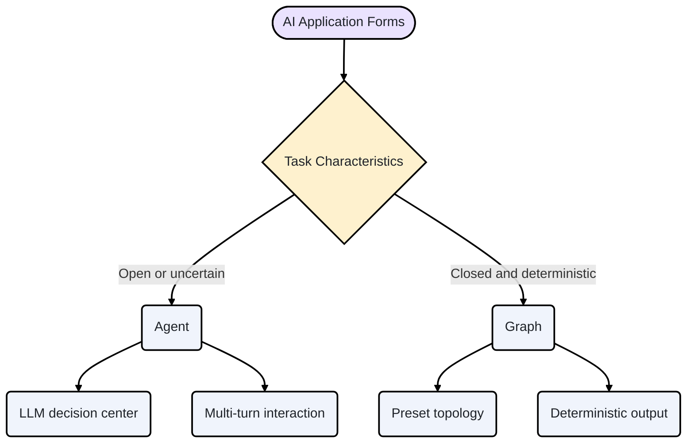
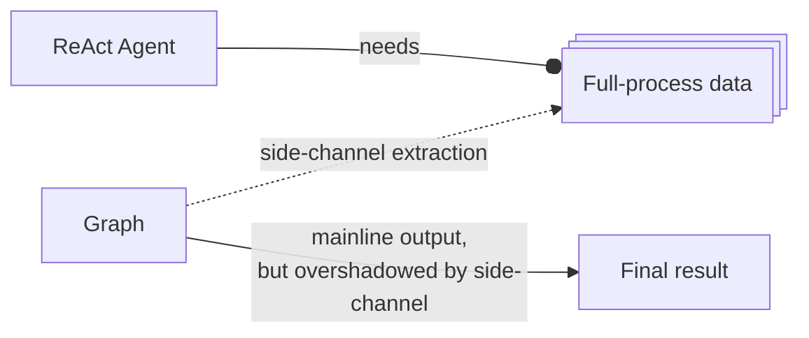
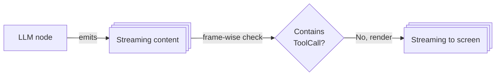
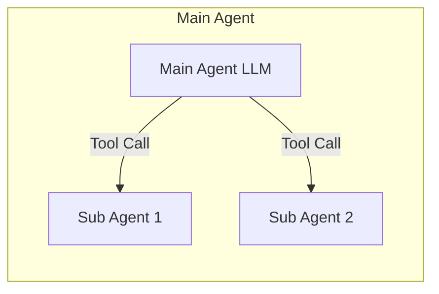
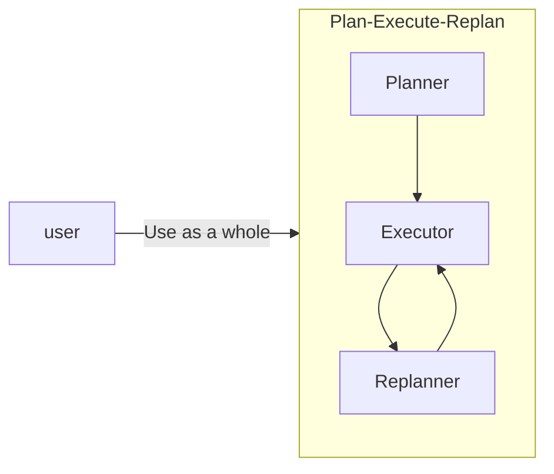
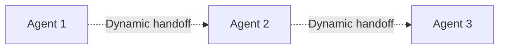
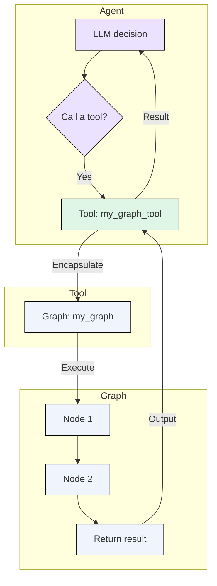

## Introduction: Two Coexisting AI Interaction Paradigms

Many applications integrate different forms of AI capabilities, as shown below:

<a href="/img/eino/eino_ai_app_form.png" target="_blank"></a>




This article explores the differences and connections between Agent and Graph and proposes the best integration point: encapsulate Graphs as Agent Tools. It also offers recommended usage for Eino developers: https://github.com/cloudwego/eino.

## Core Concepts Clarification

### Basic Definitions

- Graph: a developer-predefined flowchart with a clear topology. Nodes can be code functions, API calls, or LLMs; inputs and outputs are typically structured. The core trait is determinism — given the same input, the execution path and final result are predictable.
- Agent: an entity centered on an LLM that can autonomously plan, decide, and execute tasks. It completes goals through dynamic interaction with the environment (Tools, users, other Agents) and exhibits uncertainty in behavior. The core trait is autonomy.
- Tool: any external capability an Agent can call, typically a function or API encapsulating a specific capability. Tools themselves can be sync or async, stateful or stateless; they execute but do not make autonomous decisions.
- Orchestration: the process of organizing and coordinating multiple compute units (nodes, Agents) to work together. In this article, it refers to predefined static flows via Graphs.

### Deep Comparison

<table>
<tr><td>Dimension</td><td>Agent</td><td>Graph</td></tr>
<tr><td>Core driver</td><td>LLM autonomy</td><td>Preset flow</td></tr>
<tr><td>Input</td><td>Unstructured (text/images)</td><td>Structured data</td></tr>
<tr><td>Deliverable</td><td>Process + result</td><td>Focused final result</td></tr>
<tr><td>State</td><td>Long-lived across runs</td><td>Typically stateless per run</td></tr>
<tr><td>Mode</td><td>Often async</td><td>Often sync</td></tr>
</table>


## Historical Perspective: From Determinism to Autonomy

When LangChain first launched in 2022, the LLM world’s API paradigm was OpenAI’s Completions API — a simple “text in, text out” API. LangChain’s early slogan was “connect LLMs to external sources of computation and data”. A typical Chain looked like:

### Pain Points from Mismatch

- Deliverable mismatch: Orchestrated ReAct Agents output only the final result, while applications often care about intermediate process data. Callbacks can extract it — complete enough, but still a patch.



- Runtime mode mismatch: Since orchestration runs synchronously, to “quickly render LLM replies”, nodes inside ReAct Agent orchestration are pushed to be “fast”, mainly within the branching that checks whether the LLM output contains a ToolCall — ideally decide from the first frames. This logic can be customized (e.g., “read streaming output until Content appears, then decide no ToolCall”), but sometimes it still fails, and callbacks are used to manually switch sync→async.



## Exploring Integration Paths: Agent and Graph in Eino

### Multi-Agent and Orchestration

- Hierarchical invocation (Agent as Tool): the most common pattern (see Google ADK’s definitions and examples: https://google.github.io/adk-docs/agents/multi-agents/#c-explicit-invocation-agenttool and https://google.github.io/adk-docs/agents/multi-agents/#hierarchical-task-decomposition). A top-level Agent delegates specific sub-tasks to a special Tool Agent. For example, the main Agent talks to the user; when code execution is needed, it calls a “code executor Agent”. Sub-Agents are usually stateless, do not share memory with the main Agent, and the interaction is a simple function call. There is only one relationship: caller and callee. Conclusion: the Agent-as-Tool multi-agent mode is not the “node handoff” relationship in Graph orchestration.



- Prebuilt flows: for mature collaboration modes such as Plan–Execute–Replan (see LangGraph tutorial: https://langchain-ai.github.io/langgraph/tutorials/plan-and-execute/plan-and-execute/), Agent roles and interaction order are fixed. Frameworks (e.g., Eino adk) expose these patterns as prebuilt multi-agent modes; developers use them directly without wiring sub-Agents manually. Conclusion: Graph orchestration is an implementation detail inside the prebuilt mode and not visible to developers.



- Dynamic collaboration: in more complex scenarios, collaboration is dynamic (see Google ADK definitions and examples: https://google.github.io/adk-docs/agents/multi-agents/#b-llm-driven-delegation-agent-transfer and https://google.github.io/adk-docs/agents/multi-agents/#coordinatordispatcher-pattern), possibly involving bidding, voting, or runtime decisions by a coordinator Agent. The relationship is Agent transfer — full handoff of control from A to B — similar to node handoff in Graphs. But here it can be fully dynamic: not only which Agent to transfer to, but how that decision is made is not preset by developers; it is runtime LLM behavior. This contrasts sharply with the static determinism of Graph orchestration. Conclusion: dynamic multi-agent collaboration is fundamentally different from static Graph orchestration and is better solved at the Agent framework layer.



### Agent as a Graph Node

Agents rely heavily on conversation history (memory) and emit asynchronous, whole-process outputs — this makes them ill-suited as strict Graph nodes that depend solely on upstream structured outputs and synchronous execution.

```mermaid
flowchart LR
  U[Upstream Node]
  A[Agent Node]
  D[Downstream Node]
  M[Memory]

  U-->|Not all inputs<br>come from upstream|A
  M-.->|External state injection|A
  A-->|Whole-process data<br>(to user or LLM)|D
```

Conclusion: treating an Agent as a Graph node is inefficient; prefer LLM nodes or plugin business logic into Agents.

### The Integration Path: Encapsulate Graphs as Agent Tools

The sweet spot: encapsulate structured Graphs as high-quality Tools for Agents. Most Graphs fit Tool semantics well — structured inputs/outputs, stateless per run, synchronous call surface. Expose Graphs as Tools so agents can call deterministic capabilities at the right time, gaining graph benefits (rich component ecosystem, orchestration, streaming, callbacks, interrupt/resume) within agent flows.

Thus, “Agent” and “Graph” achieve dialectical unity.

```go
// NewInvokableGraphTool converts ANY Graph to the `InvokableTool` interface.
func NewInvokableGraphTool[I, O any](graph compose.Graph[I, O],
    name, desc string,
    opts ...compose.GraphCompileOption,
) (*InvokableGraphTool[I, O], error) {
    tInfo, err := utils.GoStruct2ToolInfo[I](name, desc)
    if err != nil { return nil, err }
    return &InvokableGraphTool[I, O]{ graph: graph, compileOptions: opts, tInfo: tInfo }
}

func (g *InvokableGraphTool[I, O]) InvokableRun(ctx context.Context, input string,
    opts ...tool.Option) (output string, err error) {
    // trigger callbacks where needed
    // compile the graph
    // convert input string to I
    // run the graph
    // handle interrupt
    // convert output O to string
}

func (g *InvokableGraphTool[I, O]) Info(_ context.Context) (*schema.ToolInfo, error) {
    return g.tInfo, nil
}
```

### Graph vs Tool Traits

<table>
<tr><td>Dimension</td><td>Graph</td><td>Tool</td></tr>
<tr><td>Input</td><td>Structured</td><td>Structured</td></tr>
<tr><td>Deliverable</td><td>Focused final result</td><td>Focused final result</td></tr>
<tr><td>State</td><td>Stateless per run</td><td>Stateless (from LLM’s view)</td></tr>
<tr><td>Mode</td><td>Synchronous as a whole</td><td>Synchronous from LLM call semantics</td></tr>
</table>

### Graph–Tool–Agent Relationship



Graph–Tool–Agent relationship diagram

## Conclusion

Agents and Graphs are complementary paradigms:

- Graphs provide reliable, deterministic AI functionality — ideal for “feature buttons” and stable backend services.
- Agents deliver autonomy and interactive intelligence — ideal for assistants that plan, act, and collaborate.

The best integration is Graph-as-Tool: build structured Graph capabilities (e.g., full RAG pipeline, analytics flows) and expose them as atomic Agent tools that the agent calls at the right time.

Recommended posture for Eino developers:

- Use eino-compose to write Graphs and encapsulate deterministic business logic.
- Use eino-adk to build Agents with thinking/planning/interaction.
- Expose the former as tools to the latter to achieve 1+1>2.
