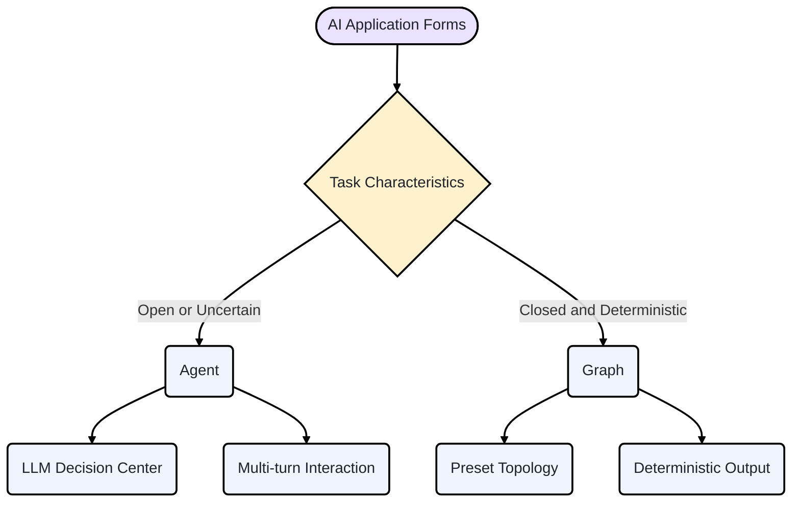
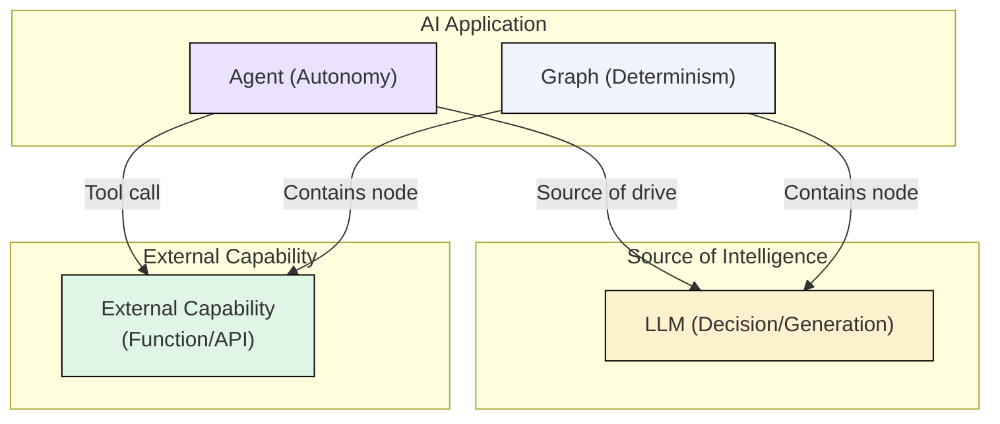
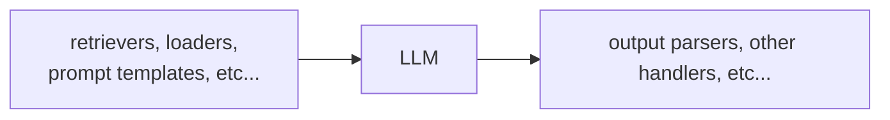
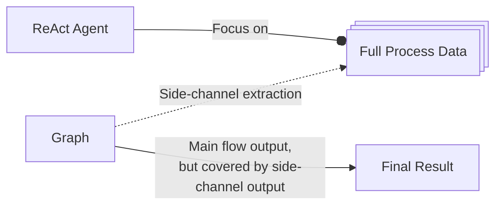
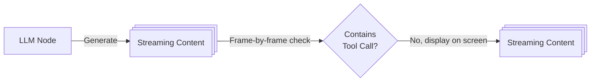
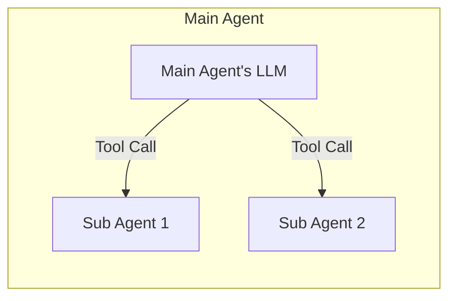
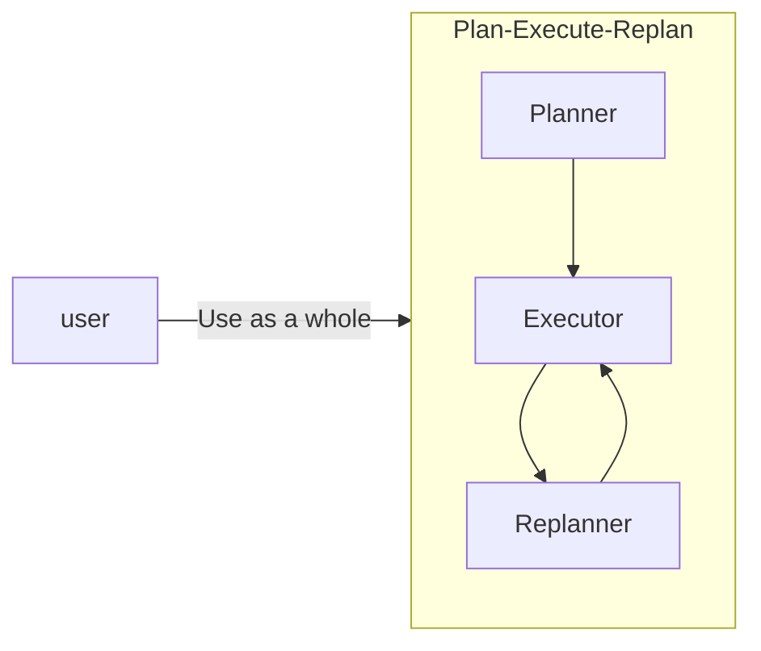
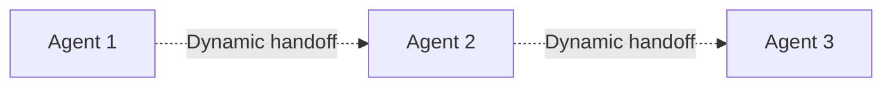
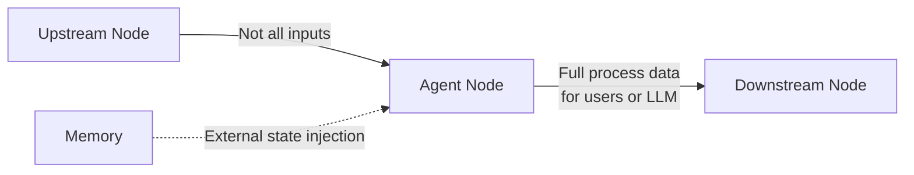
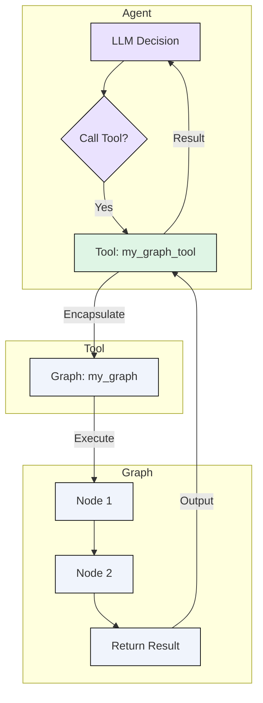

## Introduction: Two Coexisting AI Interaction Paradigms

Many application interfaces integrate different forms of AI capabilities, as shown below:

<a href="/img/eino/eino_ai_app_form.png" target="_blank"></a>

This seemingly simple screenshot represents two forms of "AI applications":

- The "Agent" represented by the "chat box". **Agents use LLM (Large Language Model) as the decision center, autonomously plan and can conduct multi-turn interactions**, naturally suited for handling open-ended, continuous tasks, manifesting as a "dialogue" form.
- The "Graph" represented by "buttons" or "APIs". For example, the "Recording Summary" button above, the Graph behind it is roughly "Recording" -> "LLM understands and summarizes" -> "Save recording" - this kind of fixed process. **The core of Graph lies in the determinism of its process and the closure of tasks**, completing specific goals through predefined nodes and edges, manifesting as a "function" form. For example, video generation is an "API" form AI application:

<a href="/img/eino/eino_complex_workflow_as_api.png" target="_blank"></a>



This article explores in detail the differences and connections between Agent and Graph, two forms of AI applications, proposes that "the best integration point is to encapsulate Graph as Agent's Tool", and provides recommended usage patterns for [Eino](https://github.com/cloudwego/eino) developers.

## Core Concepts Clarification

### Basic Definitions

- **Graph**: A flowchart **predefined** by developers with a clear topology. Its nodes can be code functions, API calls, or LLMs, and inputs and outputs are typically structured. **The core characteristic is "determinism"**, meaning given the same input, the execution path and final output are predictable.
- **Agent**: An entity centered on LLM that can **autonomously plan, decide, and execute** tasks. It completes goals through **dynamic interaction** with the environment (Tools, users, other Agents), and its behavior is uncertain. **The core characteristic is "autonomy"**.
- **Tool**: Any external capability that an Agent can call, typically a **function or API that encapsulates specific functionality**. Tools themselves can be synchronous or asynchronous, stateful or stateless. They are only responsible for execution and do not have autonomous decision-making capabilities.
- **Orchestration**: The process of **organizing and coordinating multiple compute units (nodes, Agents) to work together**. In this article, it specifically refers to predefining static processes through Graphs.

### Deep Comparison

<table>
<tr><td>Dimension</td><td>Agent</td><td>Graph</td></tr>
<tr><td><strong>Core Driver</strong></td><td><strong>LLM Autonomous Decision</strong></td><td><strong>Developer Preset Process</strong></td></tr>
<tr><td><strong>Input</strong></td><td><strong>Unstructured</strong> natural language, images, etc.</td><td><strong>Structured</strong> data</td></tr>
<tr><td><strong>Deliverable</strong></td><td><strong>Process and result equally important</strong></td><td><strong>Focused on final result</strong></td></tr>
<tr><td><strong>State Management</strong></td><td><strong>Long-term, cross-execution</strong></td><td><strong>Single execution, stateless</strong></td></tr>
<tr><td><strong>Runtime Mode</strong></td><td>Tends toward <strong>asynchronous</strong></td><td>Tends toward <strong>synchronous</strong></td></tr>
</table>

Summary: Agent can be considered autonomous, driven overall by LLM, using external capabilities in the form of Tool Calls. Graph is deterministic, connecting external capabilities with a clear topology, while locally utilizing LLM for decision-making/generation.



## Historical Perspective: From Determinism to Autonomy

When the Langchain framework was first released in 2022, the LLM world's API paradigm was still OpenAI's [Completions API](https://platform.openai.com/docs/guides/completions), a simple "text in, text out" API. At launch, Langchain's slogan was "[connect LLMs to external sources of computation and data](https://blog.langchain.com/langchain-second-birthday/)". A typical "Chain" might look like this:



Subsequently, the [ReAct](https://react-lm.github.io/) (Reasoning and Acting) paradigm was proposed, systematically demonstrating for the first time how LLMs can not only generate text but also interact with the external world through "think-act-observe" loops to solve complex problems. This breakthrough laid the theoretical foundation for Agent's autonomous planning capabilities. Almost simultaneously, OpenAI launched the [ChatCompletions API](https://platform.openai.com/docs/api-reference/chat), driving the transformation of LLM interaction capabilities from "single text input/output" to "multi-turn dialogue". Then [Function Calling](https://platform.openai.com/docs/guides/function-calling) capability emerged, giving LLMs standard capabilities to interact with external functions and APIs. At this point, we could already build "multi-turn dialogue with autonomous external interaction" LLM application scenarios, i.e., Agents. In this context, AI application frameworks saw two important developments:

- Langchain launched Langgraph: Static orchestration evolved from simple input/output Chains to complex topologies. This type of orchestration framework fits well with "Graph" type AI application forms: "arbitrary" structured inputs, with "final result" as the core deliverable, decoupling message history and other state management mechanisms from core orchestration logic, supporting flexible orchestration of various topologies, and various nodes/components represented by LLMs and knowledge bases.
- Agent and Multi-Agent frameworks emerged in large numbers: such as AutoGen, CrewAI, Google ADK, etc. The common thread among these Agent frameworks is attempting to solve problems like "LLM-driven processes", "context passing", "memory management", and "Multi-Agent common patterns", which are different from the "connecting LLMs with external systems in complex processes" problem that orchestration frameworks try to solve.

Even with different positioning, orchestration frameworks can implement ReAct Agents or other Multi-Agent patterns, because "Agent" is a special form of "LLM interacting with external systems", and "LLM-driven processes" can be implemented through "static branch enumeration" and other methods. However, this implementation is essentially a "simulation", like writing code in Word - possible, but not a good fit. Orchestration frameworks were originally designed to manage deterministic Graphs, while the core of Agents is responding to dynamically changing "chains of thought". Forcing the latter to adapt to the former will inevitably produce "mismatches" in deliverables, runtime modes, etc. For example, in actual use, you might encounter some pain points:

- Deliverable mismatch: The output of an orchestrated ReAct Agent is the "final result", while actual applications often focus on various intermediate processes. Callbacks and other solutions can solve this - complete enough, but still a "patch".



- Runtime mode mismatch: Due to synchronous execution, "to display LLM replies to users as quickly as possible", nodes within ReAct Agent orchestration need to be as "fast" as possible. This mainly means that in the branch judgment logic of "whether LLM output contains ToolCall", decisions should be made based on the first packet or first few packets as much as possible. This branch judgment logic can be customized, such as "read streaming output until Content is seen, then determine no ToolCall", but sometimes it cannot completely solve the problem, and callbacks are used as a "side-channel" to manually switch from "synchronous" to "asynchronous".



These pain points stem from the essential differences between the two. A framework designed for deterministic processes (Graph) has difficulty natively supporting an autonomous system (Agent) centered on dynamic "chains of thought".

## Exploring Integration Paths: The Relationship Between Agent and Graph

The goal of the Eino framework is to support both Graph and Agent scenarios. Our evolution path started with Graph and orchestration framework (eino-compose), and introduced relatively independent Agent capabilities (eino-adk) outside the orchestration framework. This may seem like an unnecessary split, as if "Eino as an orchestration framework" and "Eino as an Agent framework" are independent of each other, with development experience not being shareable. The current situation is indeed so, and in the long term the "relatively independent" state will continue, but there will also be deep integration in some areas.

Below we analyze the specific relationship between "Agent" and "Graph" in the Eino framework from three perspectives:

- Multi-Agent orchestration
- Agent as a node
- Graph as a Tool

### Multi-Agent and Orchestration

Although "Agent" and "Graph" have essential differences, are there scenarios that belong to the "intersection" of the two forms, where you can't make a black-or-white choice? A typical scenario is Multi-Agent, where multiple Agents interact in "some way", presenting to users as a complete Agent. Can this "interaction method" be understood as "Graph orchestration"?

Let's observe several mainstream collaboration patterns:

- Hierarchical invocation (Agent as Tool): This is the most common pattern (see Google ADK's [definition](https://google.github.io/adk-docs/agents/multi-agents/#c-explicit-invocation-agenttool) and [examples](https://google.github.io/adk-docs/agents/multi-agents/#hierarchical-task-decomposition)). A top-level Agent delegates specific subtasks to specialized "Tool Agents". For example, a main Agent is responsible for interacting with users, and when code execution is needed, it calls a "code execution Agent". In this pattern, sub-Agents are usually stateless, don't share memory with the main Agent, and their interaction is a simple Function Call. There is only one relationship between the top-level Agent and sub-Agents: caller and callee. Therefore, we can conclude that the Agent as Tool Multi-Agent pattern is not the "node flow" relationship in "Graph orchestration".



- Preset flows: For some mature collaboration patterns, such as "Plan-Execute-Replan" (see Langchain's [example](https://langchain-ai.github.io/langgraph/tutorials/plan-and-execute/plan-and-execute/)), the interaction order and roles between Agents are fixed. Frameworks (like Eino adk) can encapsulate these patterns as "prebuilt Multi-Agent patterns", which developers can use directly without caring about internal details or manually setting up or adjusting the process relationships between sub-Agents. Therefore, we can conclude that for mature collaboration patterns, "Graph orchestration" is an implementation detail encapsulated inside the prebuilt pattern, which developers don't perceive.



- Dynamic collaboration: In more complex scenarios, the collaboration method between Agents is dynamic (see Google ADK's [definition](https://google.github.io/adk-docs/agents/multi-agents/#b-llm-driven-delegation-agent-transfer) and [examples](https://google.github.io/adk-docs/agents/multi-agents/#coordinatordispatcher-pattern)), possibly involving bidding, voting, or runtime decisions by a "coordinator Agent". In this pattern, the relationship between Agents is "Agent transfer", similar to "node flow" in "Graph orchestration" - both are complete handoffs of "control" from A to B. However, this "Agent transfer" can be completely dynamic, with its dynamic nature reflected not only in "which Agents can be transferred to", but also in "how the decision of which Agent to transfer to is made" - neither is preset by developers, but is the LLM's real-time dynamic behavior. This forms a sharp contrast with the static determinism of "Graph orchestration". Therefore, we can conclude that the dynamic collaboration Multi-Agent pattern is fundamentally different from "Graph orchestration" and is better suited for independent solutions at the Agent framework level.



In summary, Multi-Agent collaboration problems can either be solved by reducing dimensions through the "Agent as Tool" pattern, or by frameworks providing fixed patterns, or are essentially completely dynamic collaborations. Their need for "orchestration" is fundamentally different from Graph's static, deterministic process orchestration.

### Agent as a Graph Node

After exploring "the relationship between Multi-Agent and Graph orchestration", we can ask from another angle: Is there a need to use Agents in Graph orchestration? In other words, can an Agent be a "node" in a Graph?

Let's first recall the characteristics of Agent and Graph:

- Agent's input sources are more diverse. Besides receiving structured data from upstream nodes, it heavily depends on its own conversation history (Memory). This forms a sharp contrast with Graph nodes that strictly depend on upstream outputs as the only input.
- Agent's output is asynchronous full-process data. This means other nodes have difficulty using the output of an "Agent node".



Therefore, adding an Agent node to a Graph means forcing an Agent that requires multi-turn interaction, long-term memory, and asynchronous output into a deterministic, synchronously executing Graph node, which is usually inelegant. An Agent's startup can be orchestrated by a Graph, but its internal complex interactions should not block the main flow.

In fact, what we need in a Graph is not a complete Agent node, but a more functionally pure **"LLM node"**. This node is responsible for receiving specific inputs in deterministic processes, completing intent recognition or content generation, and producing structured outputs, thereby injecting intelligence into the process.

At the same time, if a simple "LLM" node really doesn't meet the requirements and an "Agent" is indeed needed, a more appropriate approach might not be to stuff the Agent into a statically predefined Graph, but to add various "plugins" like pre-processing and post-processing to the "Agent", embedding specific business logic inside the Agent.

In summary: Treating an Agent simply as a Graph node is **inefficient**; a better approach is to use LLM nodes, or inject business logic as plugins into Agents.

### The Integration Path: Encapsulating Graph as Agent's Tool

Since direct integration of Agent and Graph at the micro level (nodes) faces difficulties, is there a more elegant way to combine them at the macro level? The answer is yes, and this bridge is "Tool". If we observe the meanings of Graph and Tool, we can find many similarities:

<table>
<tr><td>Dimension</td><td>Graph</td><td>Tool</td></tr>
<tr><td>Input</td><td><strong>Structured data</strong></td><td><strong>Structured data</strong></td></tr>
<tr><td>Deliverable</td><td><strong>Focused on final result</strong></td><td><strong>Focused on final result</strong></td></tr>
<tr><td>State Management</td><td><strong>Single execution, stateless</strong></td><td><strong>Single execution, stateless</strong></td></tr>
<tr><td>Runtime Mode</td><td><strong>Synchronous as a whole</strong></td><td><strong>Tool is synchronous from LLM's perspective</strong></td></tr>
</table>

These similarities mean that "Graph's presentation form matches Tool's requirements very well, so encapsulating Graph as a Tool is intuitive and simple". Therefore, most Graphs are suitable for joining Agents through the Tool mechanism, becoming part of Agent's capabilities. This way, Agents can clearly use most of Graph's capabilities, including efficient orchestration of "arbitrary" business topologies, ecosystem integration of a large number of related components, and supporting framework and governance capabilities (stream processing, callbacks, interrupt/resume, etc.).

The "route debate" between "Agent" and "Graph" achieves dialectical unity.



Graph-Tool-Agent Relationship Diagram

## Conclusion

Agent and Graph are not a route debate, but two complementary AI application paradigms.

- Graph is the cornerstone for building reliable, deterministic AI functionality. It excels at orchestrating complex business logic, data processing pipelines, and API calls into predictable, maintainable workflows. When you need a "feature button" or a stable backend service, Graph is the best choice.
- Agent is the future for achieving general intelligence and autonomous exploration. It centers on LLM, solving open-ended problems through dynamic planning and Tools. When you need an "intelligent assistant" that can converse with people and autonomously complete complex tasks, Agent is the core direction.

The best integration point is to encapsulate Graph as Agent's Tool.

Through this approach, we can fully leverage Graph's powerful capabilities in process orchestration and ecosystem integration to expand Agent's Tool list. A complex Graph application (such as a complete RAG pipeline, a data analysis pipeline) can be simplified into one of Agent's atomic capabilities, dynamically called at the right time.

For Eino developers, this means:

- Use eino-compose to write your Graphs, encapsulating deterministic business logic into "functional modules".
- Use eino-adk to build your Agents, giving them the ability to think, plan, and interact with users.
- Use the former as Tools for the latter, ultimately achieving a "1+1 > 2" effect.

Code example:

```go
// NewInvokableGraphTool converts ANY Graph to the `InvokableTool` interface.
func NewInvokableGraphTool[I, O any](graph compose.Graph[I, O],
    name, desc string,
    opts ...compose.GraphCompileOption,
) (*InvokableGraphTool[I, O], error) {
    tInfo, err := utils.GoStruct2ToolInfo[I](name, desc)
    if err != nil {
       return nil, err
    }

    return &InvokableGraphTool[I, O]{
       graph:          graph,
       compileOptions: opts,
       tInfo:          tInfo,
    }, nil
}

func (g *InvokableGraphTool[I, O]) InvokableRun(ctx context.Context, input string,
    opts ...tool.Option) (output string, err error) {
    // trigger callbacks where needed
    // compile the graph
    // convert input string to I
    // run the graph
    // handle interrupt
    // convert output O to string
}

func (g *InvokableGraphTool[I, O]) Info(_ context.Context) (*schema.ToolInfo, error) {
    return g.tInfo, nil
}
```

[eino-example project link](https://github.com/cloudwego/eino-examples/tree/main/adk/common/tool/graphtool)
