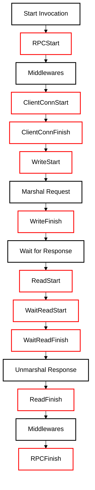
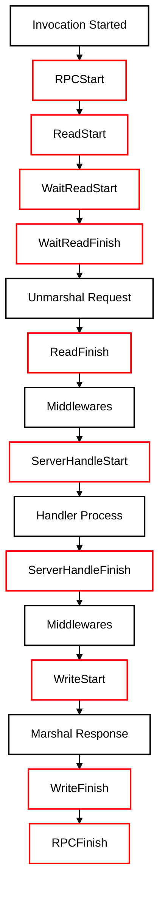

Stats Level:

1. LevelDisabled, disable all events
2. LevelBase, enable basic events
3. LevelDetailed, enable basic events and detailed events.

## Stats Level

Default Stats Level:

1. No tracer is available, LevelDisabled by default
2. At least one tracer is available, LevelDetailed by default

Client tracing stats level control:

```go
import "github.com/cloudwego/kitex/client"
import "github.com/cloudwego/kitex/pkg/stats"
...
baseStats := client.WithStatsLevel(stats.LevelBase)
client, err := echo.NewClient("echo", baseStats)
if err != nil {
	log.Fatal(err)
}
```

Server tracing stats level control:

```go
import "github.com/cloudwego/kitex/server"
import "github.com/cloudwego/kitex/pkg/stats"
...
baseStats := server.WithStatsLevel(stats.LevelBase)
svr, err := echo.NewServer(baseStats)
if err := svr.Run(); err != nil {
	log.Println("server stopped with error:", err)
} else {
	log.Println("server stopped")
}
```

## Stats introduction

Basic Stats Event:

1. RPCStart，（client/server）RPC call start
2. RPCFinish，（client）RPC call finish

Detailed Stats Event(client):

1. ClientConnStart, connection establishment start
2. ClientConnFinish，connection establishment finish
3. WriteStart, request send (serialization including) start
4. WriteFinish, request send (serialization including) finish
5. ReadStart, response receive (deserialization including) start
6. WaitReadStart, response stream read start (`Fast Codec` only)
7. WaitReadFinish, response stream read finish (`Fast Codec` only)
8. ReadFinish, response receive (deserialization including) finish

Detailed Stats Event(server):

1. ReadStart, request receive (deserialization including) start
2. WaitReadStart, request stream read start (`Fast Codec` only)
3. WaitReadFinish, request stream read finish (`Fast Codec` only)
4. ReadFinish, request receive (deserialization including) start
5. ServerHandleStart, handler process start
6. ServerHandleFinish, handler process finish
7. WriteStart, response send (serialization including) start
8. WriteFinish, response send (serialization including) start

Timeline:

client stats events timeline:



server stats events timeline:


