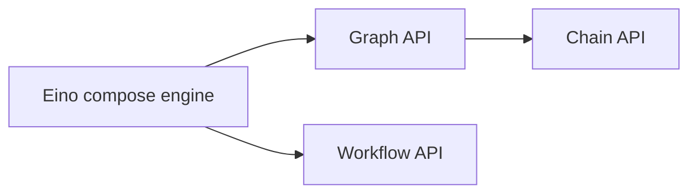

## 什么是 Eino Workflow

是一套编排的 API，与 Graph API 在架构上处于同一层：



本质特点是：

- 与 Graph API 具有同等级别的能力，都是编排“围绕大模型的信息流”的合适框架工具。
  - 在节点类型、流处理、callback、option、state、interrupt & checkpoint 等方面保持一致。
  - 实现 AnyGraph 接口，可以在 AddGraphNode 时作为子图加入上级 Graph/Chain/Workflow。
  - 也可以把其他 Graph/Chain/Workflow 添加为自己的子图。
- 字段级别映射能力：节点的输入可以由任意前驱节点的任意输出字段组合而成。
  - 原生支持 struct，map 以及任意嵌套层级的 struct 和 map 之间的相互映射。
- 控制流与数据流分离：Graph 的 Edge 是既决定执行顺序，又决定数据传递。Workflow 中可以一起传递，也可以分开传递。
- 不支持环（即类似 react agent 的 chatmodel->toolsNode->chatmodel 的环路）。NodeTriggerMode 固定为 AllPredecessor。

## 为什么用 Workflow

### 灵活的输入输出类型

例如需要编排两个 lambda 节点，里面是两个“现存的业务函数 f1, f2”，输入输出类型都是符合业务场景的特定结构体，各自不一样：

<a href="/img/eino/workflow_existing_biz_func.png" target="_blank"></a>

Workflow 编排时，将 f1 的输出字段 F1，直接映射到 f2 的输入字段 F3，同时保留 f1,f2 的原始函数签名。达到的效果是：**每个节点是“业务场景决定输入输出”，不需要考虑“谁给我输入，以及谁用我的输出”**。

Graph 编排时，因为“类型对齐”的要求，如果 f1 -> f2，则 f1 的输出类型和 f2 的输入类型需要对齐，需要二选一：

- 定义一个新的 common struct，把 f1 的输出类型和 f2 的输入类型都改成这个 common struct。有成本，可能入侵业务逻辑。
- f1 的输出类型和 f2 的输入类型都改成 map。丢失了强类型对齐的特性。

### 控制流和数据流分离

看下面这个场景：

<a href="/img/eino/workflow_data_control_separate.png" target="_blank"></a>

节点 D 同时引用了 A、B、C 的某些输出字段。其中 A-D 的这条虚线，是单纯的“数据流”，不传递“控制”信息，即 A 执行完成与否，不决定 D 是否开始执行。

节点 D 到 E 之间的粗箭头，代表节点 E 不引用节点 D 的任何输出，是单纯的“控制流”，不传递“数据”。即 D 执行完成与否，决定 E 是否开始执行，但是 D 的输出不影响 E 的输入。

图中其他的线，是控制流与数据流合一的。

需要注意的是，数据流能传递的前提，是一定有一条控制流存在，比如 A->D 的数据流，依赖 A->branch->B->D 或者 A->branch->C->D 的控制流存在。即数据流只能引用前驱节点的输出。

例如这个“跨节点”传递特定数据的场景：

<a href="/img/eino/workflow_cross_node_pass_data.png" target="_blank"></a>

上图中，chat template 节点的输入可以是非常明确的：

`map[string]any{"prompt": "prompt from START", "context": "retrieved context"}`

相对的，如果使用 Graph 或者 Chain API，需要二选一：

- 用 OutputKey 转换节点输出类型（START 节点没法加，所以得额外加 passthrough 节点），ChatTemplate 节点的输入会包含 START 和 retriever 的全量输出（而不是真正需要的某几个字段）.
- START 节点的 prompt 放到 state 里面，ChatTemplate 从 state 中读。额外引入了 state。

## 如何使用 Workflow

### 最简单的 workflow

START -> node -> END

<a href="/img/eino/workflow_simple.png" target="_blank"></a>

```go
// creates and invokes a simple workflow with only a Lambda node.
// Since all field mappings are ALL to ALL mappings
// (by using AddInput without field mappings),
// this simple workflow is equivalent to a Graph: START -> lambda -> END.
func main() {
    // create a Workflow, just like creating a Graph
    wf := compose.NewWorkflow[int, string]()

    // add a lambda node to the Workflow, just like adding the lambda to a Graph
    wf.AddLambdaNode("lambda", compose.InvokableLambda(
       func(ctx context.Context, in int) (string, error) {
          return strconv.Itoa(in), nil
       })).
       // add an input to this lambda node from START.
       // this means mapping all output of START to the input of the lambda.
       // the effect of AddInput is to set both a control dependency
       // and a data dependency.
       AddInput(compose.START)

    // obtain the compose.END of the workflow for method chaining
    wf.End().
       // add an input to compose.END,
       // which means 'using ALL output of lambda node as output of END'.
       AddInput("lambda")

    // compile the Workflow, just like compiling a Graph
    run, err := wf.Compile(context.Background())
    if err != nil {
       logs.Errorf("workflow compile error: %v", err)
       return
    }

    // invoke the Workflow, just like invoking a Graph
    result, err := run.Invoke(context.Background(), 1)
    if err != nil {
       logs.Errorf("workflow run err: %v", err)
       return
    }

    logs.Infof("%v", result)
}
```

[Eino example 链接](https://github.com/cloudwego/eino-examples/blob/main/compose/workflow/1_simple/main.go)

核心的几个 API：

- `func NewWorkflow[I, O any](opts ...NewGraphOption) *Workflow[I, O]`
  - 构建一个新的 Workflow。
  - 与 `NewGraph` 签名完全一致。
- `func (wf *Workflow[I, O]) AddChatModelNode(key string, chatModel model.BaseChatModel, opts ...GraphAddNodeOpt) *WorkflowNode `
  - 向 Workflow 中添加一个新的节点。
  - 可添加的节点类型与 Graph 完全一致。
  - 与 Graph 的 AddXXXNode 的差异是，Workflow 不会立刻返回 error，而是在最终 Compile 的时候统一处理和返回 error。
  - AddXXXNode 拿到的是一个 WorkflowNode，后续向 Node 上添加字段映射等操作，直接用 Method Chaining 来做
- `func (n *WorkflowNode) AddInput(fromNodeKey string, inputs ...*FieldMapping) *WorkflowNode`
  - 给一个 WorkflowNode 添加输入字段映射
  - 返回 WorkflowNode，可继续 Method Chaining。
- `(wf *Workflow[I, O]) Compile(ctx context.Context, opts ...GraphCompileOption) (Runnable[I, O], error)`
  - Compile 一个 Workflow。
  - 与 Compile  Graph 的签名完全一致。

### 字段映射

START（输入 struct）-> [并行 lambda1, lambda2] -> END（输出 map）。

我们举一个“计算 string 中字符出现次数的”例子。workflow 整体输入一个 eino 的 Message 和一个 sub string，将 Message.Content 给一个计数器 c1，将 Message.ReasoningContent 给另一个计数器 c2，并行分别计算 sub string 的出现次数，再分别映射到 END：

<a href="/img/eino/workflow_char_counter.png" target="_blank"></a>

上图中，workflow 整体的输入是 message 结构体，c1, c2 两个 lambda 的输入都是 counter 结构体，输出都是 int，workflow 整体输出是 map[string]any. 代码如下：

```go
// demonstrates the field mapping ability of eino workflow.
func main() {
    type counter struct {
       FullStr string // exported because we will do field mapping for this field
       SubStr  string // exported because we will do field mapping for this field
    }

    // wordCounter is a lambda function that count occurrences of SubStr within FullStr
    wordCounter := func(ctx context.Context, c counter) (int, error) {
       return strings.Count(c.FullStr, c.SubStr), nil
    }

    type message struct {
       *schema.Message        // exported because we will do field mapping for this field
       SubStr          string // exported because we will do field mapping for this field
    }

    // create a workflow just like a Graph
    wf := compose.NewWorkflow[message, map[string]any]()

    // add lambda c1 just like in Graph
    wf.AddLambdaNode("c1", compose.InvokableLambda(wordCounter)).
       AddInput(compose.START, // add an input from START, specifying 2 field mappings
          // map START's SubStr field to lambda c1's SubStr field
          compose.MapFields("SubStr", "SubStr"),
          // map START's Message's Content field to lambda c1's FullStr field
          compose.MapFieldPaths([]string{"Message", "Content"}, []string{"FullStr"}))

    // add lambda c2 just like in Graph
    wf.AddLambdaNode("c2", compose.InvokableLambda(wordCounter)).
       AddInput(compose.START, // add an input from START, specifying 2 field mappings
          // map START's SubStr field to lambda c1's SubStr field
          compose.MapFields("SubStr", "SubStr"),
          // map START's Message's ReasoningContent field to lambda c1's FullStr field
          compose.MapFieldPaths([]string{"Message", "ReasoningContent"}, []string{"FullStr"}))

    wf.End(). // Obtain the compose.END for method chaining
       // add an input from c1,
       // mapping full output of c1 to the map key 'content_count'
       AddInput("c1", compose.ToField("content_count")).
       // also add an input from c2,
       // mapping full output of c2 to the map key 'reasoning_content_count'
       AddInput("c2", compose.ToField("reasoning_content_count"))

    // compile the workflow just like compiling a Graph
    run, err := wf.Compile(context.Background())
    if err != nil {
       logs.Errorf("workflow compile error: %v", err)
       return
    }

    // invoke the workflow just like invoking a Graph
    result, err := run.Invoke(context.Background(), message{
       Message: &schema.Message{
          Role:             schema.Assistant,
          Content:          "Hello world!",
          ReasoningContent: "I need to say something meaningful",
       },
       SubStr: "o", // would like to count the occurrences of 'o'
    })
    if err != nil {
       logs.Errorf("workflow run err: %v", err)
       return
    }

    logs.Infof("%v", result)
}
```

[Eino example 代码链接](https://github.com/cloudwego/eino-examples/blob/main/compose/workflow/2_field_mapping/main.go)

这个例子的主要信息是 `AddInput` 方法可以传递 0-n 个字段映射规则，同时可以多次调用 `AddInput`。这意味着：

- 节点可以从一个前驱节点的输出中引用任意多个字段。
- 节点可以从任意多个前驱节点中引用字段。
- 一个映射，可以是“整体到字段”，可以是“字段到整体”，也可以是“整体到整体”，也可以是嵌套字段间的映射。
- 上面不同的类型，有不同的 API 来表达这个映射：
  - 顶层字段到顶层字段：`MapFields(string, string)`
  - 全部输出到顶层字段：`ToField(string)`
  - 顶层字段到全部输入：`FromField(string)`
  - 嵌套字段到嵌套字段：`MapFieldPaths(FieldPath, FieldPath)`，只要上游或下游有一方是嵌套的，就需要用
  - 全部输出到嵌套字段：`ToFieldPath(FieldPath)`
  - 嵌套字段到全部输入：`FromFieldPath(FieldPath)`
  - 全部输出到全部输入：直接使用 `AddInput`，不需要传 `FieldMapping`

## 进阶功能

### 只有数据流，没有控制流

想象一个简单的场景：START -> 加法节点 -> 乘法节点 -> END。其中“乘法节点”是将 START 的一个字段和加法节点的结果相乘：

<a href="/img/eino/workflow_calculator.png" target="_blank"></a>

上图中，乘法节点在加法节点之后执行，即“乘法节点”被“加法节点”控制。但 START 节点不直接控制“乘法节点”，仅仅把数据传了过去。在代码中通过 `AddInputWithOptions(fromNode, fieldMappings, WithNoDirectDependency)` 来指定纯数据流：

```go
func main() {
    type calculator struct {
       Add      []int
       Multiply int
    }

    adder := func(ctx context.Context, in []int) (out int, err error) {
       for _, i := range in {
          out += i
       }
       return out, nil
    }

    type mul struct {
       A int
       B int
    }

    multiplier := func(ctx context.Context, m mul) (int, error) {
       return m.A * m.B, nil
    }

    wf := compose.NewWorkflow[calculator, int]()

    wf.AddLambdaNode("adder", compose.InvokableLambda(adder)).
       AddInput(compose.START, compose.FromField("Add"))

    wf.AddLambdaNode("mul", compose.InvokableLambda(multiplier)).
       AddInput("adder", compose.ToField("A")).
       AddInputWithOptions(compose.START, []*compose.FieldMapping{compose.MapFields("Multiply", "B")},
          // use WithNoDirectDependency to declare a 'data-only' dependency,
          // in this case, START node's execution status will not determine whether 'mul' node can execute.
          // START node only passes one field of its output to 'mul' node.
          compose.WithNoDirectDependency())

    wf.End().AddInput("mul")

    runner, err := wf.Compile(context.Background())
    if err != nil {
       logs.Errorf("workflow compile error: %v", err)
       return
    }

    result, err := runner.Invoke(context.Background(), calculator{
       Add:      []int{2, 5},
       Multiply: 3,
    })
    if err != nil {
       logs.Errorf("workflow run err: %v", err)
       return
    }

    logs.Infof("%d", result)
}
```

[Eino examples 代码链接](https://github.com/cloudwego/eino-examples/blob/main/compose/workflow/3_data_only/main.go)

这个例子中新引入的 API：

```go
func (n *WorkflowNode) AddInputWithOptions(fromNodeKey string, inputs []*FieldMapping, opts ...WorkflowAddInputOpt) *WorkflowNode {
    return n.addDependencyRelation(fromNodeKey, inputs, getAddInputOpts(opts))
}
```

以及新的 Option：

```go
func WithNoDirectDependency() WorkflowAddInputOpt {
    return func(opt *workflowAddInputOpts) {
       opt.noDirectDependency = true
    }
}
```

组合起来，可以给节点添加纯“数据依赖关系”。

### 只有控制流，没有数据流

想象一个“依次竞拍，但报价保密”的场景：START -> 竞拍者 1 -> 是否达标 -> 竞拍者 2 -> END：

<a href="/img/eino/workflow_auction.png" target="_blank"></a>

在上图中，普通连线是“控制 + 数据”，虚线是“只有数据”，加粗线是“只有控制”。逻辑是：输入一个初始价格，竞拍者 1 给出报价 1，分支判断是否足够高，如果足够高则直接结束，否则把初始价格再给到竞拍者 2，给出报价 2，最后将报价 1、2 汇总输出。

当竞拍者 1 给出报价后，发布公告”竞拍者完成竞拍“。注意 bidder1->announcer 是粗实线，“只有控制”，因为发布公告的时候需要对金额保密！

分支出来的两条加粗线，都是“只有控制”，因为无论 bidder2 还是 END，都不依赖分支给出数据。在代码中通过 `AddDependency(fromNode)` 来指定纯控制流：

```go
func main() {
    bidder1 := func(ctx context.Context, in float64) (float64, error) {
       return in + 1.0, nil
    }

    bidder2 := func(ctx context.Context, in float64) (float64, error) {
       return in + 2.0, nil
    }

    announcer := func(ctx context.Context, in any) (any, error) {
        logs.Infof("bidder1 had lodged his bid!")
        return nil, nil
    }
    
    wf := compose.NewWorkflow[float64, map[string]float64]()
    
    wf.AddLambdaNode("b1", compose.InvokableLambda(bidder1)).
        AddInput(compose.START)
    
    // just add a node to announce bidder1 had lodged his bid!
    // It should be executed strictly after bidder1, so we use `AddDependency("b1")`.
    // Note that `AddDependency()` will only form control relationship,
    // but not data passing relationship.
    wf.AddLambdaNode("announcer", compose.InvokableLambda(announcer)).
        AddDependency("b1")
    
    // add a branch just like adding branch in Graph.
    wf.AddBranch("b1", compose.NewGraphBranch(func(ctx context.Context, in float64) (string, error) {
        if in > 5.0 {
           return compose.END, nil
        }
        return "b2", nil
    }, map[string]bool{compose.END: true, "b2": true}))
    
    wf.AddLambdaNode("b2", compose.InvokableLambda(bidder2)).
        // b2 executes strictly after b1 (through branch dependency),
        // but does not rely on b1's output,
        // which means b2 depends on b1 conditionally,
        // but no data passing between them.
        AddInputWithOptions(compose.START, nil, compose.WithNoDirectDependency())

    wf.End().AddInput("b1", compose.ToField("bidder1")).
       AddInput("b2", compose.ToField("bidder2"))

    runner, err := wf.Compile(context.Background())
    if err != nil {
       logs.Errorf("workflow compile error: %v", err)
       return
    }

    result, err := runner.Invoke(context.Background(), 3.0)
    if err != nil {
       logs.Errorf("workflow run err: %v", err)
       return
    }

    logs.Infof("%v", result)
}
```

[Eino examples 代码链接](https://github.com/cloudwego/eino-examples/blob/main/compose/workflow/4_control_only_branch/main.go)

这个例子中引入的新 API：

```go
func (n *WorkflowNode) AddDependency(fromNodeKey string) *WorkflowNode {
    return n.addDependencyRelation(fromNodeKey, nil, &workflowAddInputOpts{dependencyWithoutInput: _true_})
}
```

可以通过 AddDependency 来给节点指定纯“控制依赖关系”。

### 分支（Branch）

在上面的例子中，我们用与 Graph API 几乎完全相同的方式添加了一个 branch：

```go
// add a branch just like adding branch in Graph.
    wf.AddBranch("b1", compose.NewGraphBranch(func(ctx context.Context, in float64) (string, error) {
       if in > 5.0 {
          return compose.END, nil
       }
       return "b2", nil
    }, map[string]bool{compose.END: true, "b2": true}))
```

branch 语义与 Graph 的 AllPredecessor 模式下的 branch 语义相同：

- 有且只有一个'fromNode'，即一个 branch 的前置控制节点只能有一个。
- 可单选(NewGraphBranch)，可多选(NewGraphMultiBranch)。
- Branch 选中的分支，可执行。未选中的分支，标记为 skip。
- 一个节点，只有在所有入边都完成（成功或 skip），且至少有一条边成功时，这个节点才可以执行。（如上面例子中的 END）
- 如果一个节点的所有入边都是 skip，则这个节点的所有出边自动标为 skip。

同时，workflow branch 与 graph branch 有一个核心差异：

- Graph branch 始终是“控制和数据合一的”，branch 下游节点的输入，一定是 branch fromNode 的输出。
- Workflow branch 始终是“只有控制的”，branch 下游节点的输入，自行通过 AddInputWithOptions 的方式指定。

涉及到的新 API：

```go
func (wf *Workflow[I, O]) AddBranch(fromNodeKey string, branch *GraphBranch) *WorkflowBranch {
    wb := &WorkflowBranch{
       fromNodeKey: fromNodeKey,
       GraphBranch: branch,
    }

    wf.workflowBranches = append(wf.workflowBranches, wb)
    return wb
}
```

与 Graph.AddBranch 签名几乎完全相同，可以给 workflow 添加一个分支。

### 静态值（Static Values）

让我们修改下上面的“竞拍”例子，给竞拍者 1 和竞拍者 2 分别给一个“预算”的静态配置：

<a href="/img/eino/workflow_auction_static_values_en.png" target="_blank"></a>

budget1 和 budget2 会分别以“静态值”的形式注入到 bidder1 和 bidder2 的 input 中。使用 `SetStaticValue` 方法给 workflow 节点配置静态值：

```go
func main() {
    type bidInput struct {
       Price  float64
       Budget float64
    }

    bidder := func(ctx context.Context, in bidInput) (float64, error) {
       if in.Price >= in.Budget {
          return in.Budget, nil
       }

       return in.Price + rand.Float64()*in.Budget, nil
    }

    wf := compose.NewWorkflow[float64, map[string]float64]()

    wf.AddLambdaNode("b1", compose.InvokableLambda(bidder)).
       AddInput(compose.START, compose.ToField("Price")).
       // set 'Budget' field to 3.0 for b1
       SetStaticValue([]string{"Budget"}, 3.0)

    // add a branch just like adding branch in Graph.
    wf.AddBranch("b1", compose.NewGraphBranch(func(ctx context.Context, in float64) (string, error) {
       if in > 5.0 {
          return compose.END, nil
       }
       return "b2", nil
    }, map[string]bool{compose.END: true, "b2": true}))

    wf.AddLambdaNode("b2", compose.InvokableLambda(bidder)).
       // b2 executes strictly after b1, but does not rely on b1's output,
       // which means b2 depends on b1, but no data passing between them.
       AddDependency("b1").
       AddInputWithOptions(compose.START, []*compose.FieldMapping{compose.ToField("Price")}, compose.WithNoDirectDependency()).
       // set 'Budget' field to 4.0 for b2
       SetStaticValue([]string{"Budget"}, 4.0)

    wf.End().AddInput("b1", compose.ToField("bidder1")).
       AddInput("b2", compose.ToField("bidder2"))

    runner, err := wf.Compile(context.Background())
    if err != nil {
       logs.Errorf("workflow compile error: %v", err)
       return
    }

    result, err := runner.Invoke(context.Background(), 3.0)
    if err != nil {
       logs.Errorf("workflow run err: %v", err)
       return
    }

    logs.Infof("%v", result)
}
```

[Eino examples 代码链接](https://github.com/cloudwego/eino-examples/blob/main/compose/workflow/5_static_values/main.go)

这里涉及到的新 API：

```go
func (n *WorkflowNode) SetStaticValue(path FieldPath, value any) *WorkflowNode {
    n.staticValues[path.join()] = value
    return n
}
```

通过这个方法给 Workflow 节点的指定字段上设置静态值。

### 流式效果

回到之前的“字符计数”例子，如果我们的 workflow 的输入不再是单个 message，而是一个 message 流，并且我们的计数函数可以对流中的每个 message chunk 分别计数并返回“计数流”：

<a href="/img/eino/workflow_stream.png" target="_blank"></a>

我们对之前的例子做一些修改：

- InvokableLambda 改成 TransformableLambda，从而可以消费流，并产生流。
- 把输入里面的 SubStr 改成静态值，注入到 c1 和 c2 中。
- Workflow 的整体输入改成 *schema.Message。
- 以 Transform 方式来调用 workflow，并传入包含 2 个 *schema.Message 的流。

完成后的代码：

```go
// demonstrates the stream field mapping ability of eino workflow.
// It's modified from 2_field_mapping.
func main() {
    type counter struct {
       FullStr string // exported because we will do field mapping for this field
       SubStr  string // exported because we will do field mapping for this field
    }

    // wordCounter is a transformable lambda function that
    // count occurrences of SubStr within FullStr, for each trunk.
    wordCounter := func(ctx context.Context, c *schema.StreamReader[counter]) (
       *schema.StreamReader[int], error) {
       var subStr, cachedStr string
       return schema.StreamReaderWithConvert(c, func(co counter) (int, error) {
          if len(co.SubStr) > 0 {
             // static values will not always come in the first chunk,
             // so before the static value (SubStr) comes in,
             // we need to cache the full string
             subStr = co.SubStr
             fullStr := cachedStr + co.FullStr
             cachedStr = ""
             return strings.Count(fullStr, subStr), nil
          }

          if len(subStr) > 0 {
             return strings.Count(co.FullStr, subStr), nil
          }
          cachedStr += co.FullStr
          return 0, schema.ErrNoValue
       }), nil
    }

    // create a workflow just like a Graph
    wf := compose.NewWorkflow[*schema.Message, map[string]int]()

    // add lambda c1 just like in Graph
    wf.AddLambdaNode("c1", compose.TransformableLambda(wordCounter)).
       AddInput(compose.START, // add an input from START, specifying 2 field mappings
          // map START's Message's Content field to lambda c1's FullStr field
          compose.MapFields("Content", "FullStr")).
       // we can set static values even if the input will be stream
       SetStaticValue([]string{"SubStr"}, "o")

    // add lambda c2 just like in Graph
    wf.AddLambdaNode("c2", compose.TransformableLambda(wordCounter)).
       AddInput(compose.START, // add an input from START, specifying 2 field mappings
          // map START's Message's ReasoningContent field to lambda c1's FullStr field
          compose.MapFields("ReasoningContent", "FullStr")).
       SetStaticValue([]string{"SubStr"}, "o")

    wf.End(). // Obtain the compose.END for method chaining
       // add an input from c1,
       // mapping full output of c1 to the map key 'content_count'
       AddInput("c1", compose.ToField("content_count")).
       // also add an input from c2,
       // mapping full output of c2 to the map key 'reasoning_content_count'
       AddInput("c2", compose.ToField("reasoning_content_count"))

    // compile the workflow just like compiling a Graph
    run, err := wf.Compile(context.Background())
    if err != nil {
       logs.Errorf("workflow compile error: %v", err)
       return
    }

    // call the workflow using Transform just like calling a Graph with Transform
    result, err := run.Transform(context.Background(),
       schema.StreamReaderFromArray([]*schema.Message{
          {
             Role:             schema.Assistant,
             ReasoningContent: "I need to say something meaningful",
          },
          {
             Role:    schema.Assistant,
             Content: "Hello world!",
          },
       }))
    if err != nil {
       logs.Errorf("workflow run err: %v", err)
       return
    }

    var contentCount, reasoningCount int
    for {
       chunk, err := result.Recv()
       if err != nil {
          if err == io.EOF {
             result.Close()
             break
          }

          logs.Errorf("workflow receive err: %v", err)
          return
       }

       logs.Infof("%v", chunk)

       contentCount += chunk["content_count"]
       reasoningCount += chunk["reasoning_content_count"]
    }

    logs.Infof("content count: %d", contentCount)
    logs.Infof("reasoning count: %d", reasoningCount)
}
```

[Eino examples 代码链接](https://github.com/cloudwego/eino-examples/blob/main/compose/workflow/6_stream_field_map/main.go)

基于上面这个例子，我们总结出 workflow 流式的一些特点：

- 依然是 100% 的 Eino stream：四种范式(invoke, stream, collect, transform)，由 Eino 框架自动转换、复制、拼接、合并。
- 字段映射的配置，不需要特殊处理流：无论实际的输入输出是不是流，AddInput 的写法都一样，Eino 框架负责处理基于流的映射。
- 静态值，不需要特殊处理流：即使实际输入是个流，也可以一样的方式 SetStaticValue。Eino 框架会把静态值放在 input stream 中，但不一定是第一个读到的 chunk。

### 字段映射各场景

#### 类型对齐

Workflow 遵循与 Graph 同一套类型对齐规则，只是对齐的粒度由完整的输入输出对齐，变为了映射成对的字段间的类型对齐。具体为：

- 类型完全相同，在 Compile 时会校验通过，一定能对齐。
- 类型不同，但上游可以 Assign 到下游（比如上游具体类型，下游 Any），在 Compile 时会校验通过，一定能对齐。
- 上游无法 Assign 到下游（比如上游 int，下游 string），在 Compile 时会报错。
- 上游可能能 Assign 到下游（比如上游 Any，下游 int），在 Compile 时无法确定，会推迟到执行时，取出上游的实际类型，再判断。此时如果判断上游不能 Assign 到下游，则会抛出 error。

#### Merge 的各场景

Merge 是指一个节点的输入映射自多个 `FieldMapping` 的情况。

- 映射到多个不同的字段：支持
- 映射到一个相同的字段：不支持
- 映射到整体，同时也有映射到字段：冲突，不支持

#### 嵌套的 map[string]any

比如这个映射：`ToFieldPath([]string{"a","b"})`，目标节点的输入类型是 `map[string]any`，映射时的顺序是：

1. 第一级“a”，此时的结果是 `map[string]any{"a": nil}`
2. 第二级“b”，此时的结果是 `map[string]any{"a": map[string]any{"b": x}}`

可以看到，在第二级的时候，Eino 框架自动把 any 替换为了实际的 `map[string]any`

#### CustomExtractor

有些场景，标准的字段映射语义无法支持，比如上游是 []int，想取出第一个元素映射到下游，此时我们用 `WithCustomExtractor` ：

```go
t.Run("custom extract from array element", func(t *testing.T) {
    wf := NewWorkflow[[]int, map[string]int]()
    wf.End().AddInput(_START_, ToField("a", WithCustomExtractor(func(input any) (any, error) {
       return input.([]int)[0], nil
    })))
    r, err := wf.Compile(context.Background())
    assert.NoError(t, err)
    result, err := r.Invoke(context.Background(), []int{1, 2})
    assert.NoError(t, err)
    assert.Equal(t, map[string]int{"a": 1}, result)
})
```

当使用 WithCustomExtractor 时，一切 Compile 时的类型对齐校验都无法进行，只能推迟到执行时校验。

### 一些约束

- Map Key 的限制：只支持 string，或者 string alias（能 convert 到 string 的类型）。
- 不支持的 CompileOption：
  - `WithNodeTriggerMode`，因为固定为 `AllPredecessor`。
  - `WithMaxRunSteps`，因为不会有环。
- 如果映射来源是 Map Key，要求 Map 中必须有这个 key。但如果映射来源是 Stream，Eino 无法判断 stream 中的所有帧中是否至少有一次出现这个 key，因此 Stream 时无法校验。
- 如果映射来源字段或者目标字段属于 struct ，则要求这些字段必须是导出的，因为内部使用了反射。
- 映射来源是 nil：一般情况下支持，只有当映射目标不可能是 nil 时报错，比如目标是基础类型（int 等）。

## 实际应用

### Coze-Studio 工作流

[Coze-Studio](https://github.com/coze-dev/coze-studio) 开源版的工作流引擎是基于 Eino Workflow 编排框架。参见：[11. 新增工作流节点类型（后端）](https://github.com/coze-dev/coze-studio/wiki/11.-%E6%96%B0%E5%A2%9E%E5%B7%A5%E4%BD%9C%E6%B5%81%E8%8A%82%E7%82%B9%E7%B1%BB%E5%9E%8B%EF%BC%88%E5%90%8E%E7%AB%AF%EF%BC%89)
