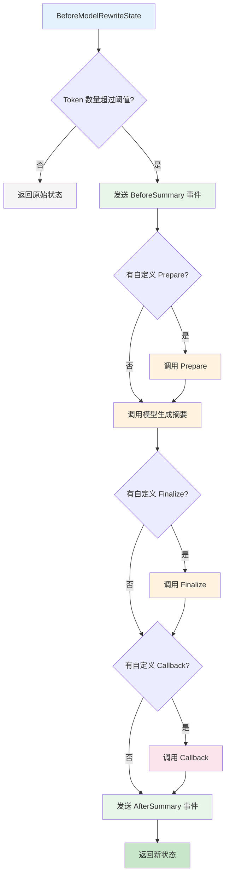

## 概述

Summarization 中间件会在对话的 token 数量超过配置阈值时，自动压缩对话历史。这有助于在长对话中保持上下文连续性，同时控制在模型的 token 限制范围内。

> 💡
> 本中间件在 [alpha/08](https://github.com/cloudwego/eino/releases/tag/v0.8.0-alpha.13) 版本引入。

## 快速开始

```go
import (
    "context"
    "github.com/cloudwego/eino/adk/middlewares/summarization"
)

// 使用最小配置创建中间件
mw, err := summarization.New(ctx, &summarization.Config{
    Model: yourChatModel,  // 必填：用于生成摘要的模型
})
if err != nil {
    // 处理错误
}

// 与 ChatModelAgent 一起使用
agent, err := adk.NewChatModelAgent(ctx, &adk.ChatModelAgentConfig{
    Model:       yourChatModel,
    Middlewares: []adk.ChatModelAgentMiddleware{mw},
})
```

## 配置项

<table>
<tr><td>字段</td><td>类型</td><td>必填</td><td>默认值</td><td>说明</td></tr>
<tr><td>Model</td><td>model.BaseChatModel</td><td>是</td><td><li></li></td><td>用于生成摘要的聊天模型</td></tr>
<tr><td>ModelOptions</td><td>[]model.Option</td><td>否</td><td><li></li></td><td>传递给模型生成摘要时的选项</td></tr>
<tr><td>TokenCounter</td><td>TokenCounterFunc</td><td>否</td><td>约 4 字符/token</td><td>自定义 token 计数函数</td></tr>
<tr><td>Trigger</td><td>*TriggerCondition</td><td>否</td><td>190,000 tokens</td><td>触发摘要的条件</td></tr>
<tr><td>Instruction</td><td>string</td><td>否</td><td>内置 prompt</td><td>自定义摘要指令</td></tr>
<tr><td>TranscriptFilePath</td><td>string</td><td>否</td><td><li></li></td><td>完整对话记录文件路径</td></tr>
<tr><td>Prepare</td><td>PrepareFunc</td><td>否</td><td><li></li></td><td>自定义摘要生成前的预处理函数</td></tr>
<tr><td>Finalize</td><td>FinalizeFunc</td><td>否</td><td><li></li></td><td>自定义最终消息的后处理函数</td></tr>
<tr><td>Callback</td><td>CallbackFunc</td><td>否</td><td><li></li></td><td>在 Finalize 之后调用，用于观察状态变化（只读）</td></tr>
<tr><td>EmitInternalEvents</td><td>bool</td><td>否</td><td>false</td><td>是否发送内部事件</td></tr>
<tr><td>PreserveUserMessages</td><td>*PreserveUserMessages</td><td>否</td><td>Enabled: true</td><td>是否在摘要中保留原始用户消息</td></tr>
</table>

### TriggerCondition 结构

```go
type TriggerCondition struct {
    // ContextTokens 当总 token 数量超过此阈值时触发摘要
    ContextTokens int
}
```

### PreserveUserMessages 结构

```go
type PreserveUserMessages struct {
    // Enabled 是否启用保留用户消息功能
    Enabled bool
    
    // MaxTokens 保留用户消息的最大 token 数
    // 只保留最近的用户消息，直到达到此限制
    // 默认为 TriggerCondition.ContextTokens 的 1/3
    MaxTokens int
}
```

### 配置示例

**自定义 Token 阈值**

```go
mw, err := summarization.New(ctx, &summarization.Config{
    Model: yourChatModel,
    Trigger: &summarization.TriggerCondition{
        ContextTokens: 100000,  // 在 100k tokens 时触发
    },
})
```

**自定义 Token 计数器**

```go
mw, err := summarization.New(ctx, &summarization.Config{
    Model: yourChatModel,
    TokenCounter: func(ctx context.Context, input *summarization.TokenCounterInput) (int, error) {
        // 使用你的 tokenizer
        return yourTokenizer.Count(input.Messages)
    },
})
```

**设置对话记录文件路径**

```go
mw, err := summarization.New(ctx, &summarization.Config{
    Model:              yourChatModel,
    TranscriptFilePath: "/path/to/transcript.txt",
})
```

**自定义 Finalize 函数**

```go
mw, err := summarization.New(ctx, &summarization.Config{
    Model: yourChatModel,
    Finalize: func(ctx context.Context, originalMessages []adk.Message, summary adk.Message) ([]adk.Message, error) {
        // 自定义逻辑构建最终消息
        return []adk.Message{
            schema.SystemMessage("你的系统提示词"),
            summary,
        }, nil
    },
})
```

**使用 Callback 观察状态变化****/存储**

```go
mw, err := summarization.New(ctx, &summarization.Config{
    Model: yourChatModel,
    Callback: func(ctx context.Context, before, after adk.ChatModelAgentState) error {
        log.Printf("Summarization completed: %d messages -> %d messages", 
            len(before.Messages), len(after.Messages))
        return nil
    },
})
```

**控制用户消息保留**

```go
mw, err := summarization.New(ctx, &summarization.Config{
    Model: yourChatModel,
    PreserveUserMessages: &summarization.PreserveUserMessages{
        Enabled:   true,
        MaxTokens: 50000, // 保留最多 50k tokens 的用户消息
    },
})
```

## 工作原理



## 内部事件

当 EmitInternalEvents 设置为 true 时，中间件会在关键节点发送事件：

<table>
<tr><td>事件类型</td><td>触发时机</td><td>携带数据</td></tr>
<tr><td>ActionTypeBeforeSummary</td><td>生成摘要之前</td><td>原始消息列表</td></tr>
<tr><td>ActionTypeAfterSummary</td><td>完成总结之后</td><td>最终消息列表</td></tr>
</table>

**使用示例**

```go
mw, err := summarization.New(ctx, &summarization.Config{
    Model:              yourChatModel,
    EmitInternalEvents: true,
})

// 在你的事件处理器中监听事件
```

## 最佳实践

1. **设置 TranscriptFilePath**：建议始终提供对话记录文件路径，以便模型在需要时可以参考原始对话。
2. **调整 Token 阈值**：根据模型的上下文窗口大小调整 `Trigger.MaxTokens`。一般建议设置为模型限制的 80-90%。
3. **自定义 Token 计数器**：在生产环境中，建议实现与模型 tokenizer 匹配的自定义 `TokenCounter`，以获得准确的计数。
