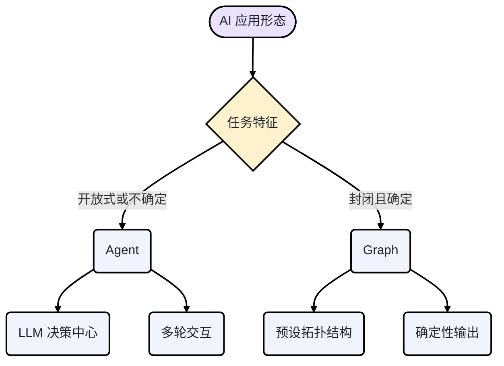
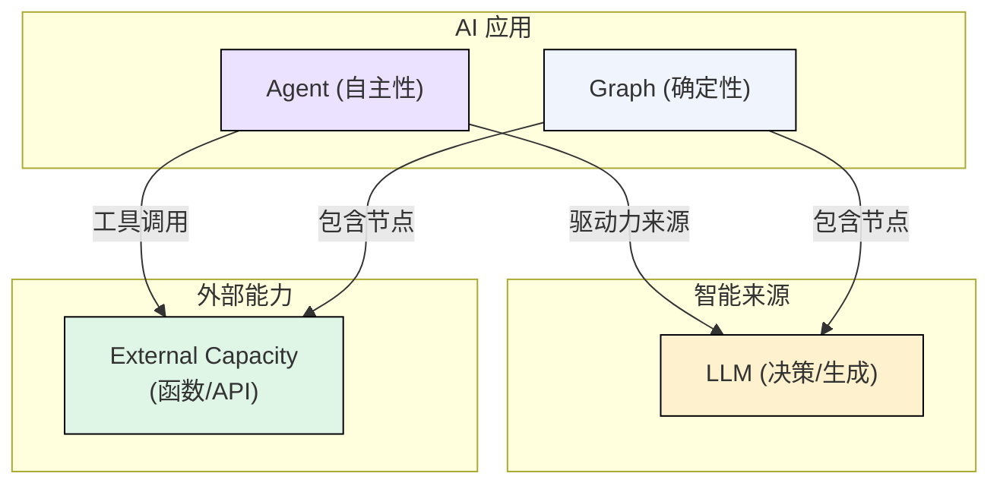
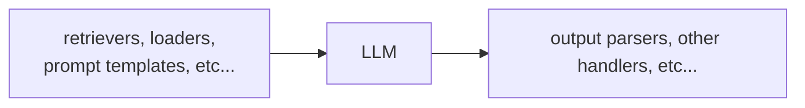
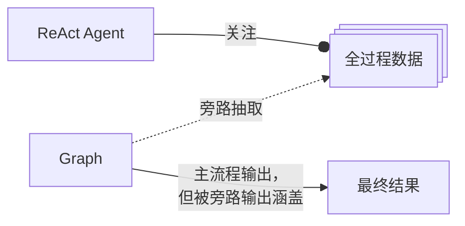
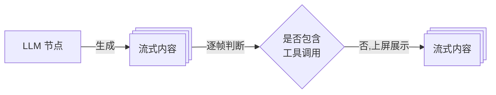
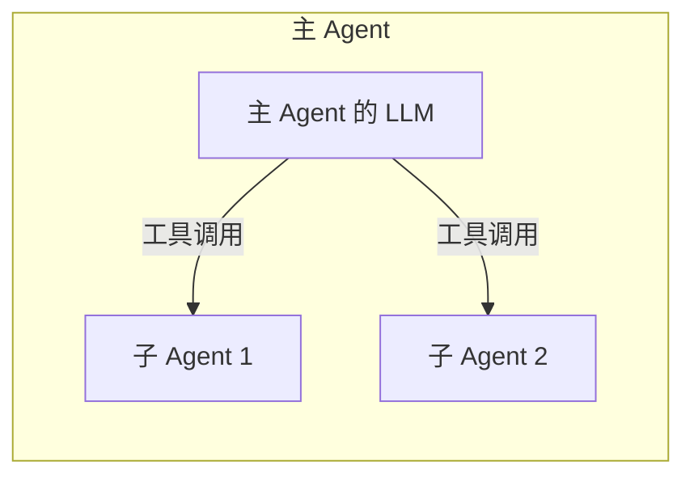
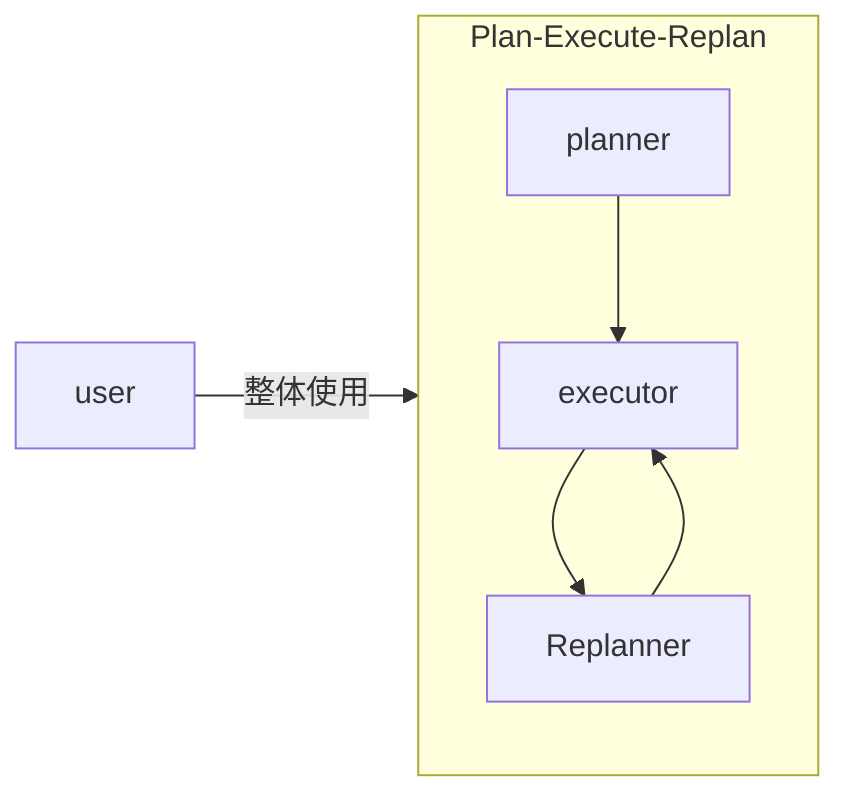
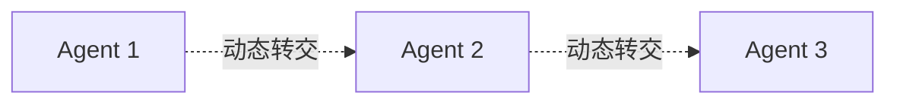
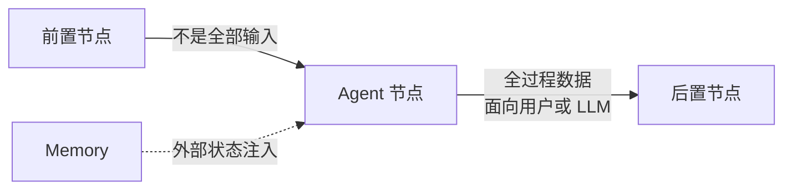
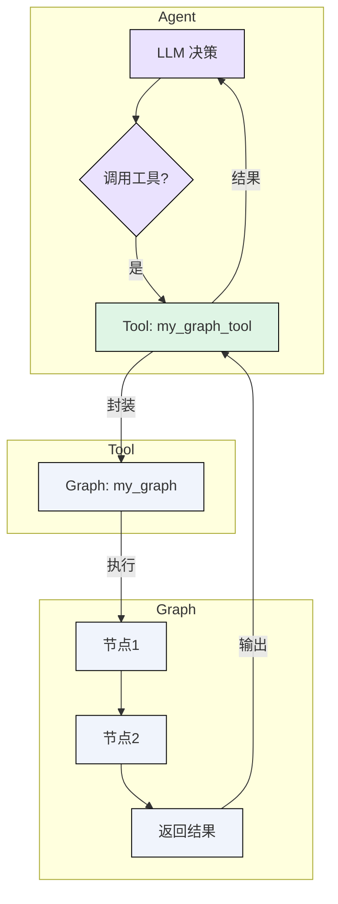

## 引言：两种并存的 AI 交互范式

许多应用程序的界面都集成了不同形态的 AI 功能，如下图所示：

<a href="/img/eino/eino_ai_app_form.png" target="_blank"></a>

这张看似简单的截图，代表了“AI 应用”的两种形态：

- 以“聊天框”为代表性标志的“Agent（智能体）”。**Agent 以 LLM（大语言模型）为决策中心，自主规划并能进行多轮交互**，天然适合处理开放式、持续性的任务，表现为一种“对话”形态。
- 以“按钮”或者“API”为代表性标志的“Graph（流程图）”。比如上面的“录音纪要”这个“按钮”，其背后的 Graph 大概是“录音”-》“LLM 理解并总结” -》“保存录音”这种固定流程。**Graph 的核心在于其流程的确定性与任务的封闭性**，通过预定义的节点和边来完成特定目标，表现为一种“功能”形态。



本文详细探讨了 Agent 和 Graph 两种 AI 应用形态的区别和联系，提出“两者的最佳结合点，在于将 Graph 封装为 Agent 的 Tool（工具）”，并为 [Eino](https://github.com/cloudwego/eino) 开发者给出建议的使用姿势。

## 核心概念辨析

### 基础定义

- **Graph**: 一个由开发者**预先定义**的、具有明确拓扑结构的流程图。它的节点可以是代码函数、API 调用或 LLM，输入和输出通常是结构化的。**核心特征是“确定性”**，即给定相同输入，其执行路径和最终产出是可预测的。
- **Agent**: 一个以 LLM 为核心，能够**自主规划、决策和执行**任务的实体。它通过与环境（Tool、用户、其他 Agent）的**动态交互**来完成目标，其行为具有不确定性。**核心特征是“自主性”**。
- **Tool**: Agent 可以调用的任何外部能力，通常是一个**封装了特定功能的函数或 API**。Tool 本身可以是同步或异步的、有状态或无状态的。它只负责执行，不具备自主决策能力。
- **编排**: **组织和协调多个计算单元（节点、Agent）协同工作**的过程。在本文中，特指通过 Graph 的方式来预定义静态流程。

### 深度对比

<table>
<tr><td>特征维度</td><td>Agent</td><td>Graph</td></tr>
<tr><td><strong>核心驱动力</strong></td><td><strong>LLM 自主决策</strong></td><td><strong>开发者预设流程</strong></td></tr>
<tr><td><strong>输入</strong></td><td><strong>非结构化</strong>的自然语言、图像等</td><td><strong>结构化</strong>的数据</td></tr>
<tr><td><strong>交付物</strong></td><td><strong>过程与结果并重</strong></td><td><strong>聚焦最终结果</strong></td></tr>
<tr><td><strong>状态管理</strong></td><td><strong>长时程、跨执行</strong></td><td><strong>单次执行、stateless</strong></td></tr>
<tr><td><strong>运行模式</strong></td><td>偏向<strong>异步</strong></td><td>偏向<strong>同步</strong></td></tr>
</table>

总结：Agent 可认为是自主的，整体由 LLM 驱动，以 Tool Call 的形式使用外部能力。Graph 是确定性的，以明确拓扑结构串联外部能力，同时在局部利用 LLM 做决策/生成等。



## 历史视角：从确定性走向自主性

当 Langchain 框架在 2022 年首次发布时，LLM 世界的 API 范式还是 OpenAI 的 [Completions API](https://platform.openai.com/docs/guides/completions)，一个简单的“文本进，文本出”的 API。发布之初，Langchain 的口号是“[connect LLMs to external sources of computation and data](https://blog.langchain.com/langchain-second-birthday/)”。典型的“Chain”可能是这样的：



随后，[ReAct](https://react-lm.github.io/)（Reasoning and Acting）范式的提出，首次系统性地展示了如何让 LLM 不仅生成文本，更能通过“思考-行动-观察”的循环来与外部交互，解决复杂问题。这一突破为 Agent 的自主规划能力奠定了理论基础。近乎同时，OpenAI 推出了 [ChatCompletions API](https://platform.openai.com/docs/api-reference/chat)，推动了 LLM 交互能力从“单次的文本输入输出”向“多轮对话”转变。之后 [Function Calling](https://platform.openai.com/docs/guides/function-calling)（函数调用） 能力出现，LLM 具备了标准的与外部函数和 API 交互的能力。至此，我们已经可以搭建出“多轮对话并与可以与外界自主交互”的 LLM 应用场景，即 Agent。在这个背景下，AI 应用框架产生了两个重要发展：

- Langchain 推出了 Langgraph：静态编排由简单的输入输出 Chain 向复杂拓扑结构转变。这类编排框架非常契合“Graph”类型的 AI 应用形态：“任意”的结构化输入，以“最终结果”为核心交付物，将消息历史等状态管理机制与核心编排逻辑解耦，可支持各种拓扑结构的灵活编排能力，以及以 LLM、知识库为代表的各种节点/组件。
- Agent 及 Multi-Agent 框架大量出现：比如 AutoGen，CrewAI，Google ADK 等。这些 Agent 框架的共同点，是尝试解决“LLM 驱动流程”、“上下文传递”、“记忆管理”以及“Multi-Agent 通用模式”等问题，与编排类框架尝试解决的“在复杂流程中连接 LLM 与外部系统”问题并不相同。

即便定位不同，使用编排框架也可以实现 ReAct Agent 或者其他 Multi-Agent 模式，因为“Agent”是“LLM 与外部系统交互”的一种特殊形式，而“LLM 驱动流程”可以通过“静态分支穷举”等方式来实现。然而，这种实现方式本质上是一种“模拟”，就像用 Word 写代码，可以写，但不匹配。编排框架的设计初衷是管理确定性的 Graph，而 Agent 的核心是响应动态变化的‘思考链’。将后者强行适配于前者，必然会在交付物、运行模式等方面产生“错位”。例如，在实际使用中，可能会发现一些痛点：

- 交付物的不匹配：编排出的 ReAct Agent 的输出是“最终结果”，而实际应用往往关注各种中间过程。用 Callback 等方案可以解决，足够完备，但依然属于“补丁”。



- 运行模式的不匹配：由于是同步运行，所以“为了尽快把 LLM 的回复展示给用户”，要求 ReAct Agent 编排内的各节点都尽量“快”，这主要是“在判断 LLM 的输出是否包含 ToolCall”的分支判断逻辑中，要尽可能根据第一个包或者前几个包完成判断。这个分支判断逻辑可以自定义，比如“读流式输出直到看到 Content，才判断为没有 ToolCall”，但有时并不能完全解决问题，只能通过 Callback 这样的“旁路”手动切换“同步”为“异步”。



这些痛点源于两者本质的差异。一个为确定性流程（Graph）设计的框架，很难原生支持一个以动态“思考链”为核心的自主系统（Agent）。

## 融合路径探索：Agent 与 Graph 的关系

Eino 框架的目标是同时支持 Graph 和 Agent 两种场景。我们的演进路径是从 Graph 和编排框架（eino-compose）做起，并在编排框架之外引入了相对独立的 Agent 能力（eino-adk）。这看上去会有些不必要的割裂，似乎“作为编排框架的 Eino”和“作为 Agent 框架的 Eino”是相互独立的，开发经验无法共享。现状确实如此，长期来看“相对独立”的状态会一直持续，但同时也会有局部的深度融合。

下面我们从下列三个角度分析“Agent”和“Graph”两个形态在 Eino 框架中的具体关系：

- Multi-Agent 的编排
- Agent 作为节点
- Graph 作为 Tool

### Multi-Agent 与编排

虽然“Agent”和“Graph”两个形态有本质的差异，那是否存在一些场景，属于两个形态的“交叉融合”，没法非黑即白的做选择呢？一个典型的场景是 Multi-Agent，即多个 Agent 以“某种方式”进行交互，对用户呈现的效果是一个完整的 Agent。这里的“某种交互方式”，可以理解为“Graph 编排”吗？

下面我们依次观察几种主流的协作模式：

- 层级调用（Agent as Tool）：这是最常见的模式（参考 Google ADK 的[定义](https://google.github.io/adk-docs/agents/multi-agents/#c-explicit-invocation-agenttool)和[举例](https://google.github.io/adk-docs/agents/multi-agents/#hierarchical-task-decomposition)）。一个上层 Agent 将特定子任务委托给专门的“Tool Agent”。例如，一个主 Agent 负责与用户交互，当需要执行代码时，它会调用一个“代码执行 Agent”。在这种模式下，子 Agent 通常是无状态的，不与主 Agent 共享记忆，其交互是一个简单的 Function Call。上层 Agent 和子 Agent 只有一种关系：调用与被调用。因此，我们可以得出，Agent as Tool 的 Multi-Agent 模式，不是“Graph 编排”中的“节点流转”关系。



- 预设流程：对于一些成熟的协作模式，如“规划-执行-反思”（Plan-Execute-Replan）（参考 Langchain 的[样例](https://langchain-ai.github.io/langgraph/tutorials/plan-and-execute/plan-and-execute/)），Agent 间的交互顺序和角色是固定的。框架（如 Eino adk）可以将这些模式封装为“预制 Multi-Agent 模式”，开发者可以直接使用，无需关心内部的细节，也不需要手动设置或调整子 Agent 之间的流程关系。因此，我们可以得出，针对成熟的协作模式，“Graph 编排”是封装在预制模式内部的实现细节，开发者不感知。



- 动态协作：在更复杂的场景中，Agent 的协作方式是动态的（参考 Google ADK 的[定义](https://google.github.io/adk-docs/agents/multi-agents/#b-llm-driven-delegation-agent-transfer)和[举例](https://google.github.io/adk-docs/agents/multi-agents/#coordinatordispatcher-pattern)），可能涉及竞价、投票或由一个“协调者 Agent”在运行时决定。这种模式下，Agent 之间的关系是“Agent 流转”，与“Graph 编排”中的“节点流转”有相似之处，都是“控制权”由 A 到 B 的完全转交。但是，这里的“Agent 流转”可以是完全动态的，其动态特性不仅体现在“可以流转到哪些 Agent”，更体现在“如何做出流转到哪个 Agent 的决策”上，都不是由开发者预设的，而是 LLM 的实时动态行为。这与“Graph 编排”的静态确定性形成了鲜明的对比。因此，我们可以得出，动态协作的 Multi-Agent 模式，从本质上与“Graph 编排”完全不同，更适合在 Agent 框架层面给出独立的解决方案。



综上所述，Multi-Agent 的协作问题，或可通过“Agent as Tool”模式降维解决，或可由框架提供固化模式，或是本质上完全动态的协作，其对“编排”的需求与 Graph 的静态的、确定性的流程编排有着本质区别。

### Agent 作为 Graph 的节点

在探讨完“Multi-Agent 与 Graph 编排的关系”后，我们可以从另一个角度提出问题：在 Graph 编排中是否需要使用 Agent？换句话说，Agent 是否可以作为一个“节点”进入到一个 Graph 中？

我们先回忆下 Agent 和 Graph 各自的特点：

- Agent 的输入来源更为多样，除了能接收来自上游节点的结构化数据外，还严重依赖于自身的会话历史（Memory）。这与 Graph 节点严格依赖其上游输出作为唯一输入的特性形成了鲜明对比。
- Agent 的输出是异步的全过程数据。这意味着其他节点很难使用“Agent 节点”的输出。



因此，向 Graph 中加入 Agent 节点，意味着将一个需要多轮交互、长时记忆和异步输出的 Agent 强行嵌入到一个确定性的、同步执行的 Graph 节点中，这通常是不优雅的。Agent 的启动可以被 Graph 编排，但其内部的复杂交互不应阻塞主流程。

实际上，在 Graph 中我们需要的并非一个完整的 Agent 节点，而是一个功能更纯粹的**“LLM 节点”**。该节点负责在确定性流程中，接收特定输入，完成意图识别或内容生成，并产出结构化的输出，从而为流程注入智能。

同时，如果简单的“LLM”节点确实不满足需求，确实需要“Agent”，更合适的做法也许不是把 Agent 塞到静态预定义的 Graph 中，而是给“Agent”增加前置处理、后置处理等各种“插件”，把具体的业务逻辑嵌入到 Agent 内部。

综上所述：将 Agent 简单视为 Graph 的一个节点是**低效**的，更好的方式是使用 LLM 节点，或将业务逻辑作为插件注入 Agent。

### 融合之道：将 Graph 封装为 Agent 的 Tool

既然 Agent 和 Graph 在微观层面（节点）的直接融合存在困难，那么它们是否在宏观层面有更优雅的结合方式呢？答案是肯定的，这座桥梁就是“Tool”。如果观察 Graph 和 Tool 的含义，能发现很多相似之处：

<table>
<tr><td>特征维度</td><td>Graph</td><td>Tool</td></tr>
<tr><td>输入</td><td><strong>结构化的数据</strong></td><td><strong>结构化的数据</strong></td></tr>
<tr><td>交付物</td><td><strong>聚焦最终结果</strong></td><td><strong>聚焦最终结果</strong></td></tr>
<tr><td>状态管理</td><td><strong>单次执行、stateless</strong></td><td><strong>单次执行、stateless</strong></td></tr>
<tr><td>运行模式</td><td><strong>整体是同步</strong></td><td> <strong>LLM 的视角 Tool 是同步的</strong></td></tr>
</table>

这些相似之处，意味着“Graph 在表现形式上，与 Tool 的要求非常匹配，因此将 Graph 封装成 Tool 是直观、简单的”。因此，绝大多数 Graph 都适合通过 Tool 机制加入到 Agent 中，成为 Agent 能力的一部分。这样一来，Agent 可以明确的使用 Graph 的大部分能力，包括对“任意”业务拓扑的高效编排，对大量相关组件的生态集成，以及配套的框架和治理能力（流处理、callback、中断恢复等）。

“Agent”与“Graph”的“路线之争”，实现了对立统一。



Graph-Tool-Agent 关系图

## 结论

Agent 与 Graph 并非路线之争，而是能力互补的两种 AI 应用范式。

- Graph 是构建可靠、确定性 AI 功能的基石。 它擅长将复杂的业务逻辑、数据处理管道和 API 调用编排成可预测、可维护的工作流。当你需要一个“功能按钮”或一个稳定的后端服务时，Graph 是不二之选。
- Agent 是实现通用智能与自主探索的未来。 它以 LLM 为核心，通过动态规划和 Tool 来解决开放式问题。当你需要一个能与人对话、能自主完成复杂任务的“智能助理”时，Agent 是核心方向。

两者的最佳结合点，在于将 Graph 封装为 Agent 的 Tool。

通过这种方式，我们可以充分利用 Graph 在流程编排和生态集成上的强大能力，来扩展 Agent 的 Tool 列表。一个复杂的 Graph 应用（如一套完整的 RAG 流程、一个数据分析管道）可以被简化成 Agent 的一个原子能力，被其在合适的时机动态调用。

对于 Eino 的开发者而言，这意味着：

- 用 eino-compose 编写你的 Graph，将确定性的业务逻辑封装成“功能模块”。
- 用 eino-adk 构建你的 Agent，赋予它思考、规划和与用户交互的能力。
- 将前者作为后者的 Tools，最终实现“1+1 > 2”的效果。

代码示意：

```go
// NewInvokableGraphTool converts ANY Graph to the `InvokableTool` interface.
func NewInvokableGraphTool[I, O any](graph compose.Graph[I, O],
    name, desc string,
    opts ...compose.GraphCompileOption,
) (*InvokableGraphTool[I, O], error) {
    tInfo, err := utils.GoStruct2ToolInfo[I](name, desc)
    if err != nil {
       return nil, err
    }

    return &InvokableGraphTool[I, O]{
       graph:          graph,
       compileOptions: opts,
       tInfo:          tInfo,
    }, nil
}

func (g *InvokableGraphTool[I, O]) InvokableRun(ctx context.Context, input string,
    opts ...tool.Option) (output string, err error) {
    // trigger callbacks where needed
    // compile the graph
    // convert input string to I
    // run the graph
    // handle interrupt
    // convert output O to string
}

func (g *InvokableGraphTool[I, O]) Info(_ context.Context) (*schema.ToolInfo, error) {
    return g.tInfo, nil
}
```
