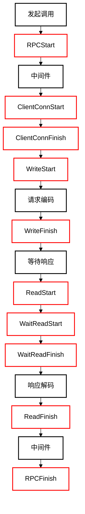
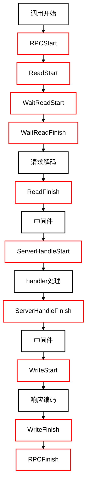

埋点粒度：

1. LevelDisabled 禁用埋点
2. LevelBase 仅启用基本埋点
3. LevelDetailed 启用基本埋点和细粒度埋点

## 埋点策略 & 埋点粒度控制

默认埋点策略：

1. 无 tracer 时，默认 LevelDisabled
2. 有 tracer 时，默认 LevelDetailed

客户端埋点粒度控制：

```go
import "github.com/cloudwego/kitex/client"
import "github.com/cloudwego/kitex/pkg/stats"
...
baseStats := client.WithStatsLevel(stats.LevelBase)
client, err := echo.NewClient("echo", baseStats)
if err != nil {
	log.Fatal(err)
}
```

服务端埋点粒度控制：

```go
import "github.com/cloudwego/kitex/server"
import "github.com/cloudwego/kitex/pkg/stats"
...
baseStats := server.WithStatsLevel(stats.LevelBase)
svr, err := echo.NewServer(baseStats)
if err := svr.Run(); err != nil {
	log.Println("server stopped with error:", err)
} else {
	log.Println("server stopped")
}
```

## 埋点说明

基本埋点：

1. RPCStart，（客户端 / 服务端）RPC 调用开始
2. RPCFinish，（客户端 / 服务端）RPC 调用结束

细粒度埋点（客户端）：

1. ClientConnStart，连接建立开始
2. ClientConnFinish，连接建立结束
3. WriteStart，请求发送（含编码）开始
4. WriteFinish，请求发送（含编码）结束
5. ReadStart，响应接收（含解码）开始
6. WaitReadStart，响应二进制读取开始（仅适用于 `Fast Codec`）
7. WaitReadFinish，响应二进制读取完毕（仅适用于 `Fast Codec`）
8. ReadFinish，响应接收（含解码）完毕

细粒度埋点（服务端）：

1. ReadStart，请求接收（含解码）开始
2. WaitReadStart，请求二进制读取开始（仅适用于 `Fast Codec`）
3. WaitReadFinish，请求二进制读取完毕（仅适用于 `Fast Codec`）
4. ReadFinish，请求接收（含解码）完毕
5. ServerHandleStart，handler 处理开始
6. ServerHandleFinish，handler 处理完毕
7. WriteStart，响应发送（含编码）开始
8. WriteFinish，响应发送（含编码）结束

时序图：

客户端埋点时序图



服务端埋点时序图


